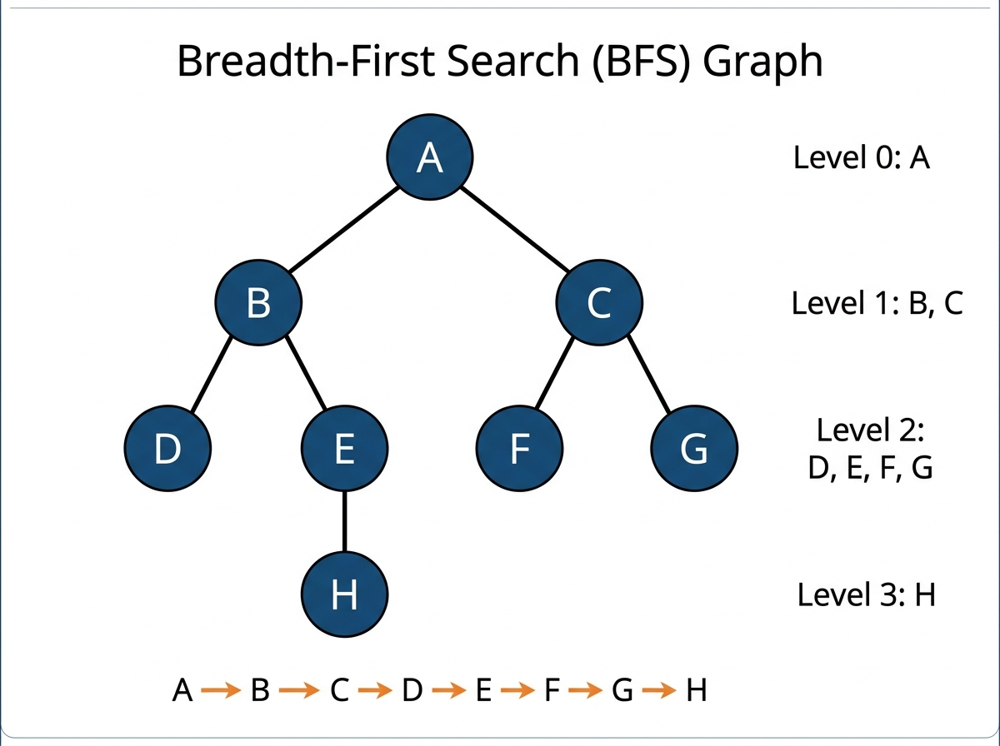

# Experiment 1: Breadth First Search (BFS)

## Aim

To implement the Breadth-First Search (BFS) algorithm to traverse a graph level-by-level using a FIFO queue.

## Algorithm

1. Create an empty queue and a visited set.
2. Enqueue the start node and mark it visited.
3. While the queue is not empty:
   - Dequeue the front node.
   - Record it in traversal order.
   - For each unvisited neighbor, mark visited and enqueue.
4. Return the traversal order.

## Procedure

1. Navigate to the experiment folder.
2. Run: `python bfs.py`
3. The program performs BFS on a predefined undirected graph starting from node `A`.
4. Observe the level-by-level traversal order.

## Source Code

Refer to file: `bfs.py`

## Output




### Graph Structure

```
              (A)
             /   \
           (B)   (C)
          / \   / \
        (D) (E)(F) (G)
              |
             (H)
```

### Edges

```
A --- B    A --- C
B --- D    B --- E
C --- F    C --- G
E --- H
```

### BFS Level-by-Level Traversal

```
Level 0 :  A
Level 1 :  B  C
Level 2 :  D  E  F  G
Level 3 :  H
```

### Queue Progression

```
Step 1: Dequeue A  -> Enqueue B, C       Queue: [B, C]
Step 2: Dequeue B  -> Enqueue D, E       Queue: [C, D, E]
Step 3: Dequeue C  -> Enqueue F, G       Queue: [D, E, F, G]
Step 4: Dequeue D  -> no new neighbors   Queue: [E, F, G]
Step 5: Dequeue E  -> Enqueue H          Queue: [F, G, H]
Step 6: Dequeue F  -> no new neighbors   Queue: [G, H]
Step 7: Dequeue G  -> no new neighbors   Queue: [H]
Step 8: Dequeue H  -> no new neighbors   Queue: []
```

### Traversal Path

```
A -> B -> C -> D -> E -> F -> G -> H
```

### Terminal Output

```
Starting BFS traversal from node 'A'...

BFS Traversal Order:
A -> B -> C -> D -> E -> F -> G -> H
```
