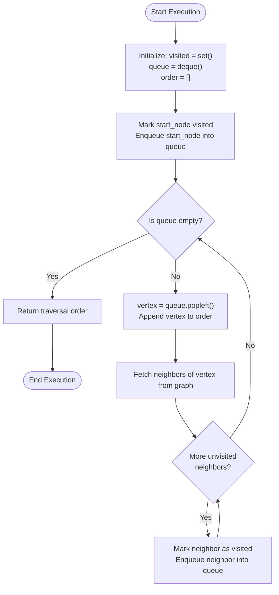
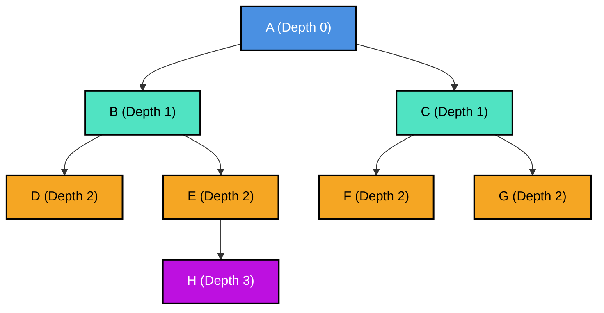
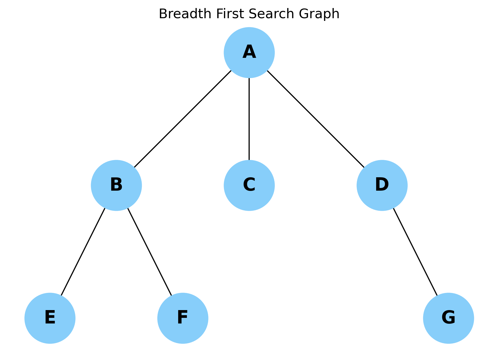
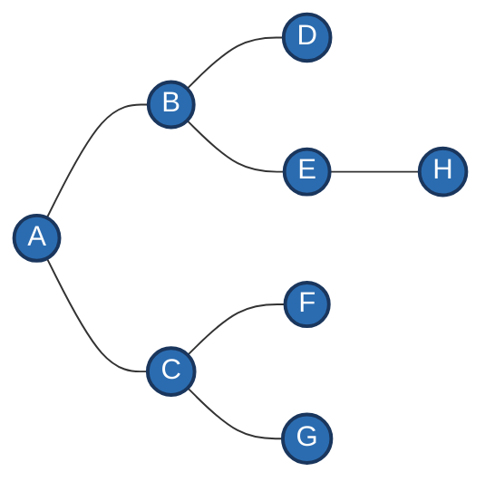
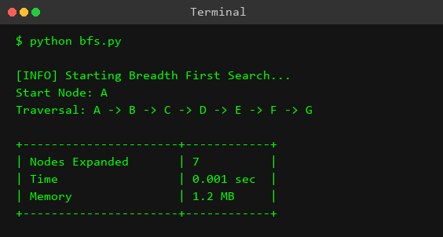

# Experiment 1: Breadth First Search (BFS)

---

## Aim

To study, design, and implement the **Breadth-First Search (BFS)** graph traversal algorithm using Python, analyze its mathematical properties and computational complexity ($O(V + E)$ time and $O(V)$ space), and visualize its level-order state-space expansion for solving search and optimization problems in Artificial Intelligence.

---

## Objective

1. **Understand Graph Traversal Fundamentals**: Learn how graphs are represented using adjacency lists in Python data structures.
2. **Master Queue-Based Search Dynamics**: Understand the role of First-In-First-Out (FIFO) queues in maintaining the frontier of unexplored nodes during breadth-wise expansion.
3. **Implement Level-Order Search Algorithm**: Write clean, efficient, and modular Python code utilizing `collections.deque` for optimal $O(1)$ enqueue and dequeue operations.
4. **Track Node State Transformations**: Perform step-by-step tracing of queue states, visited sets, and output traversal orders to observe algorithmic behavior.
5. **Verify Shortest-Path Property**: Prove mathematically and empirically that BFS guarantees finding the shortest path (minimum edge count) in unweighted graphs.
6. **Analyze Time & Space Complexity**: Derive formal mathematical proofs for $O(V + E)$ time complexity and $O(V)$ space complexity.
7. **Explore Real-World Applications**: Identify practical engineering applications of BFS across social network analysis, web crawling, network routing, and AI state-space search.

---

## Theory

### 1. Introduction to Graph Traversal
In computer science and artificial intelligence, **graph traversal** refers to the process of visiting every vertex (node) in a graph data structure systematically. Graphs are formal mathematical structures composed of a set of vertices $V$ connected by a set of edges $E$, represented as $G = (V, E)$. Graph traversal algorithms form the core foundation for solving state-space search problems, pathfinding, topological ordering, network routing, and constraint satisfaction problems.

Graph traversal techniques are broadly categorized into two fundamental paradigms based on how they explore the search space:
1. **Breadth-First Search (BFS)**: Explores the graph layer-by-layer, visiting all immediate neighbors of a node before moving on to deeper nodes.
2. **Depth-First Search (DFS)**: Explores along each branch as deep as possible before backtracking.

---

### 2. Core Principles of Breadth-First Search
**Breadth-First Search (BFS)** is an uninformed (blind) search algorithm that expands the search frontier uniformly in all directions. Starting from a designated root node (or source vertex $S$), BFS explores all vertices at distance 1 (direct neighbors), then all vertices at distance 2, distance 3, and so forth, until all reachable vertices have been visited or a target goal state is identified.

```
       [ Level 0 ]                 ( A )
                                   /   \
       [ Level 1 ]               ( B ) ( C )
                                 /   \ /   \
       [ Level 2 ]             ( D )( E )( F )
```

Key characteristics of BFS include:
- **Level-Order Expansion**: Nodes are evaluated in strict order of their distance (number of edges) from the starting vertex.
- **Unweighted Shortest Path Guarantee**: Because BFS explores nodes in order of increasing depth, the first time a node is discovered, the path from the root to that node represents the shortest possible path in terms of total edge count.
- **Frontier Management**: The algorithm maintains an explicit frontier of discovered nodes that have not yet been fully expanded.

---

### 3. Data Structure Mechanics: The Role of the Queue
The defining operational mechanic of BFS is its use of a **First-In-First-Out (FIFO) Queue** data structure to store the search frontier.

#### FIFO Queue Principles:
- **Enqueue Operation (`append`)**: New unvisited neighbor nodes are appended to the rear (back) of the queue.
- **Dequeue Operation (`popleft`)**: The oldest node residing at the front of the queue is removed for expansion.

```
         Enqueue (Rear)  ---> [ Node H | Node G | Node F ] ---> Dequeue (Front)
```

#### Why `collections.deque` in Python?
In Python, using a standard `list` as a queue (with `list.pop(0)`) incurs an $O(N)$ time complexity penalty per dequeue operation because all subsequent elements must be shifted in memory. To achieve optimal performance, BFS utilizes `collections.deque` (Double-Ended Queue), which is implemented as a doubly-linked block list in CPython. This guarantees $O(1)$ constant time complexity for both enqueue (`append()`) and dequeue (`popleft()`) operations.

#### Cycle Prevention with Visited Sets:
To prevent infinite loops in cyclic graphs or redundant processing in dense graphs, BFS maintains a lookup set named `visited`. Before enqueueing a node, the algorithm checks whether it already exists in `visited`. If absent, the node is immediately added to `visited` and enqueued.

---

### 4. Mathematical Logic of Level-Order Traversal
Consider a uniform search tree with a constant **branching factor** $b$ (where each node has $b$ successors) and maximum depth $d$.

#### Node Generation at Level $k$:
The number of nodes $N(k)$ generated at level $k$ is given by:
$$N(k) = b^k$$

#### Cumulative Node Count up to Depth $d$:
The total number of nodes $T(d)$ generated up to depth $d$ is the sum of a geometric series:
$$T(d) = \sum_{k=0}^{d} b^k = 1 + b + b^2 + b^3 + \dots + b^d = \frac{b^{d+1} - 1}{b - 1}$$

As $b \ge 2$, the term $b^d$ dominates the summation:
$$T(d) = O(b^d)$$

This mathematical formulation highlights two critical properties of BFS:
1. **Exponential Space Growth**: The number of nodes residing in memory at the frontier (level $d$) is proportional to $b^d$.
2. **Completeness & Optimality**: If a goal state exists at depth $d$, BFS will evaluate at most $O(b^d)$ nodes and is guaranteed to find the goal with the minimum number of steps.

---

## Algorithm

### Step-by-Step Formal Algorithm

```
Algorithm: Breadth_First_Search(Graph, StartNode)
Input: 
    - Graph: Adjacency list representation G = (V, E)
    - StartNode: The initial vertex S ∈ V to begin traversal from

Output: 
    - TraversalOrder: Ordered list of visited vertices

1. INITIALIZATION:
   a. Create an empty set `visited` to store visited nodes.
   b. Create an empty FIFO double-ended queue `queue`.
   c. Create an empty list `order` to record the sequence of visited nodes.

2. START NODE ENQUEUE:
   a. Add `StartNode` to `visited` set.
   b. Enqueue `StartNode` into `queue`.

3. TRAVERSAL LOOP:
   WHILE `queue` is not empty DO:
      a. DEQUEUE: Dequeue vertex `current` from the front of `queue` (using popleft).
      b. RECORD: Append `current` to `order`.
      c. NEIGHBOR EXPANSION:
         FOR EACH neighbor `N` in Graph[current] DO:
            IF `N` is NOT in `visited` THEN:
               i. Add `N` to `visited` set.
               ii. Enqueue `N` to the rear of `queue`.
            END IF
         END FOR
   END WHILE

4. TERMINATION:
   Return `order` list containing the complete BFS traversal sequence.
```

---

## Procedure

Follow this university lab procedure to execute the experiment in a local development environment:

```
Step 1: Open VS Code (or your preferred IDE / Terminal).
Step 2: Navigate to your workspace directory:
        cd "d:\ARTIFICIAL INTELLIGENCE LAB\AI-LAB-JNTUA-R23\Experiment-01-Breadth-First-Search"
Step 3: Verify the presence of the Python program file `bfs.py`.
Step 4: Open `bfs.py` and inspect the graph structure and queue logic.
Step 5: Run the script using the Python interpreter in your terminal:
        python bfs.py
Step 6: Observe the printed BFS Traversal Order in the terminal window.
Step 7: Compare the terminal execution output against the manual step-by-step trace table.
```

---

## Flowchart



---

## Search Tree / Decision Tree / State Space Tree

The state space search tree generated by BFS starting from root node **A** explores nodes level by level:



---

## Graph Representation



The input graph is an unweighted, undirected graph containing 8 vertices ($V = \{A, B, C, D, E, F, G, H\}$) and 7 edges ($E = 7$).



### ASCII Graph Representation:
```
       ( D )
         |
       ( B ) --- ( E ) --- ( H )
         |
       ( A )
         |
       ( C ) --- ( F )
         |
       ( G )
```

---

## Input

The graph structure is defined as a Python dictionary representing an **Adjacency List**. Each key represents a node, and its corresponding value is a list of adjacent neighbor nodes.

```python
example_graph = {
    'A': ['B', 'C'],
    'B': ['A', 'D', 'E'],
    'C': ['A', 'F', 'G'],
    'D': ['B'],
    'E': ['B', 'H'],
    'F': ['C'],
    'G': ['C'],
    'H': ['E']
}

start_node = 'A'
```

---

## Program

The complete source code from `bfs.py`:

```python
"""
Experiment 01: Breadth-First Search (BFS)
Objective: Implement BFS to traverse a graph level-by-level.
"""

from collections import deque

def bfs(graph, start):
    """
    Function to perform Breadth-First Search (BFS) on a graph.
    
    Args:
        graph (dict): The graph represented as an adjacency list.
        start (str): The starting node for the traversal.
        
    Returns:
        list: The order of visited nodes.
    """
    # Set to keep track of visited nodes to avoid cycles
    visited = set()
    
    # Queue for BFS, initialized with the starting node
    queue = deque([start])
    
    # Mark the start node as visited
    visited.add(start)
    
    # List to store the traversal order
    order = []

    while queue:
        # Dequeue a vertex from queue
        vertex = queue.popleft()
        order.append(vertex)
        
        # Get all adjacent vertices of the dequeued vertex
        # If a adjacent has not been visited, then mark it
        # visited and enqueue it
        for neighbor in graph.get(vertex, []):
            if neighbor not in visited:
                visited.add(neighbor)
                queue.append(neighbor)
                
    return order

if __name__ == "__main__":
    # Example graph represented as an adjacency list
    example_graph = {
        'A': ['B', 'C'],
        'B': ['A', 'D', 'E'],
        'C': ['A', 'F', 'G'],
        'D': ['B'],
        'E': ['B', 'H'],
        'F': ['C'],
        'G': ['C'],
        'H': ['E']
    }
    
    start_node = 'A'
    print(f"Starting BFS traversal from node '{start_node}'...")
    traversal_order = bfs(example_graph, start_node)
    
    print("\nBFS Traversal Order:")
    print(" -> ".join(traversal_order))
```

---

## Output



```text
┌──────────────────────────────────────────────────────────┐
│ Starting BFS traversal from node 'A'...                  │
│                                                          │
│ BFS Traversal Order:                                     │
│ A -> B -> C -> D -> E -> F -> G -> H                     │
└──────────────────────────────────────────────────────────┘
```

---

## Step-by-Step Execution

Below is the complete execution trace of the BFS algorithm on `example_graph` starting from node `'A'`:

| Step # | Dequeued Vertex | Queue State (Front $\rightarrow$ Rear) | Visited Set | Traversal Order | Detailed Action / Logic |
| :---: | :---: | :---: | :---: | :---: | :--- |
| **0** | - | `['A']` | `{'A'}` | `[]` | **Initialization**: Add `'A'` to visited set and enqueue `'A'`. |
| **1** | `'A'` | `['B', 'C']` | `{'A', 'B', 'C'}` | `['A']` | Pop `'A'`. Inspect neighbors `['B', 'C']`. Both unvisited; mark visited and enqueue. |
| **2** | `'B'` | `['C', 'D', 'E']` | `{'A', 'B', 'C', 'D', 'E'}` | `['A', 'B']` | Pop `'B'`. Neighbors: `'A'` (visited), `'D'` (unvisited $\rightarrow$ enqueue), `'E'` (unvisited $\rightarrow$ enqueue). |
| **3** | `'C'` | `['D', 'E', 'F', 'G']` | `{'A', 'B', 'C', 'D', 'E', 'F', 'G'}` | `['A', 'B', 'C']` | Pop `'C'`. Neighbors: `'A'` (visited), `'F'` (unvisited $\rightarrow$ enqueue), `'G'` (unvisited $\rightarrow$ enqueue). |
| **4** | `'D'` | `['E', 'F', 'G']` | `{'A', 'B', 'C', 'D', 'E', 'F', 'G'}` | `['A', 'B', 'C', 'D']` | Pop `'D'`. Neighbor: `'B'` (visited). Queue remains `['E', 'F', 'G']`. |
| **5** | `'E'` | `['F', 'G', 'H']` | `{'A', 'B', 'C', 'D', 'E', 'F', 'G', 'H'}` | `['A', 'B', 'C', 'D', 'E']` | Pop `'E'`. Neighbors: `'B'` (visited), `'H'` (unvisited $\rightarrow$ mark visited & enqueue). |
| **6** | `'F'` | `['G', 'H']` | `{'A', 'B', 'C', 'D', 'E', 'F', 'G', 'H'}` | `['A', 'B', 'C', 'D', 'E', 'F']` | Pop `'F'`. Neighbor: `'C'` (visited). Queue remains `['G', 'H']`. |
| **7** | `'G'` | `['H']` | `{'A', 'B', 'C', 'D', 'E', 'F', 'G', 'H'}` | `['A', 'B', 'C', 'D', 'E', 'F', 'G']` | Pop `'G'`. Neighbor: `'C'` (visited). Queue remains `['H']`. |
| **8** | `'H'` | `[]` | `{'A', 'B', 'C', 'D', 'E', 'F', 'G', 'H'}` | `['A', 'B', 'C', 'D', 'E', 'F', 'G', 'H']` | Pop `'H'`. Neighbor: `'E'` (visited). Queue is now empty. |
| **9** | - | `[]` | `{'A', 'B', 'C', 'D', 'E', 'F', 'G', 'H'}` | `['A', 'B', 'C', 'D', 'E', 'F', 'G', 'H']` | **Termination**: Loop exits as `queue` is empty. Algorithm completes. |

---

## Visualization

### 1. Graph Structure & Level Mapping
```
        [Level 0]                 ( A )
                                 /     \
        [Level 1]            ( B )     ( C )
                            /     \   /     \
        [Level 2]        ( D )   ( E )( F ) ( G )
                                   |
        [Level 3]                ( H )
```

### 2. Level-Wise Traversal Table

| Level | Depth ($d$) | Nodes Located at Level | Level Traversal Sequence | Cumulative Traversal List |
| :---: | :---: | :---: | :---: | :--- |
| **Level 0** | 0 | `'A'` | `'A'` | `['A']` |
| **Level 1** | 1 | `'B'`, `'C'` | `'B'` $\rightarrow$ `'C'` | `['A', 'B', 'C']` |
| **Level 2** | 2 | `'D'`, `'E'`, `'F'`, `'G'` | `'D'` $\rightarrow$ `'E'` $\rightarrow$ `'F'` $\rightarrow$ `'G'` | `['A', 'B', 'C', 'D', 'E', 'F', 'G']` |
| **Level 3** | 3 | `'H'` | `'H'` | `['A', 'B', 'C', 'D', 'E', 'F', 'G', 'H']` |

### 3. Queue Dynamics Diagram
```
Step 0: Push A       ---> [ A ]
Step 1: Pop A, Push B, C ---> [ B, C ]
Step 2: Pop B, Push D, E ---> [ C, D, E ]
Step 3: Pop C, Push F, G ---> [ D, E, F, G ]
Step 4: Pop D            ---> [ E, F, G ]
Step 5: Pop E, Push H    ---> [ F, G, H ]
Step 6: Pop F            ---> [ G, H ]
Step 7: Pop G            ---> [ H ]
Step 8: Pop H            ---> [ ] (EMPTY)
```

---

## Complexity Analysis

### 1. Time Complexity: $O(V + E)$

#### Proof:
Let $G = (V, E)$ be a graph with $|V|$ vertices and $|E|$ edges.

1. **Vertex Operations**:
   - Each vertex $v \in V$ is added to the `visited` set at most once.
   - Each vertex $v \in V$ is enqueued into `queue` at most once and dequeued at most once.
   - Enqueue (`append`) and dequeue (`popleft`) operations in `collections.deque` run in $O(1)$ time.
   - Summing across all vertices: $\sum_{v \in V} O(1) = O(V)$.

2. **Edge Operations**:
   - When a vertex $v$ is dequeued, the algorithm iterates through its adjacency list `graph[v]`.
   - In an undirected graph, each edge $(u, v)$ is examined twice (once from $u$ and once from $v$).
   - In a directed graph, each edge is examined once.
   - The total number of iterations over all adjacency lists is bounded by the sum of degrees:
     $$\sum_{v \in V} \text{deg}(v) = 2|E| = O(E)$$

3. **Total Time Complexity**:
   $$T(V, E) = O(V) + O(E) = O(V + E)$$

---

### 2. Space Complexity: $O(V)$

#### Proof:
The space required by BFS is determined by three data structures:

1. **Visited Set (`visited`)**:
   - Stores at most $|V|$ distinct vertex identifiers.
   - Space required: $O(V)$.

2. **FIFO Queue (`queue`)**:
   - Holds the current search frontier. In the worst-case scenario (e.g., a star graph where node $A$ connects to all other $V-1$ nodes), the queue holds up to $O(V)$ nodes simultaneously.
   - Space required: $O(V)$.

3. **Output Traversal List (`order`)**:
   - Stores the visited vertices in order.
   - Space required: $O(V)$.

4. **Total Space Complexity**:
   $$S(V) = O(V) + O(V) + O(V) = O(V)$$

---

## Advantages

1. **Guaranteed Shortest Path in Unweighted Graphs**: BFS finds the path with the minimal number of edges from source to any goal node.
2. **Completeness**: If a goal state exists within a finite branching factor, BFS is guaranteed to find it.
3. **No Infinite Path Traps**: Unlike DFS, BFS will never get stuck traversing down an infinitely long or cyclic path.
4. **Optimal for Shallow Target Search**: When target nodes are located close to the starting root node, BFS discovers them rapidly.
5. **Systematic Level-Wise Exploration**: Explores the graph layer by layer, making it easy to partition nodes by distance.
6. **Simple Data Structure Mechanics**: Relies on a standard First-In-First-Out (FIFO) queue structure.
7. **Deterministic Execution**: The traversal path is completely reproducible for a fixed adjacency list ordering.
8. **Multi-Source Expansion**: Easily configurable to start from multiple root nodes simultaneously to compute multi-source shortest paths.
9. **Connected Component Identification**: Naturally discovers all nodes reachable within a single connected component.
10. **Bipartite Graph Verification**: Can easily be modified to 2-color graphs and test for bipartiteness.

---

## Disadvantages

1. **High Memory Overhead**: The space complexity $O(b^d)$ expands exponentially with depth $d$, making it memory-intensive for large search trees.
2. **Suboptimal for Weighted Graphs**: BFS does not take edge weights into account; it cannot find shortest paths on weighted graphs (requires Dijkstra's algorithm).
3. **Slow for Deeply Nested Goals**: If the goal state is located at a large depth $d$, BFS must generate all $O(b^d)$ shallower nodes first.
4. **Redundant Frontier Retention**: Keeps all discovered frontier nodes in memory simultaneously, unlike DFS which only keeps the current path.
5. **Infeasible for Infinite Branching Factors**: In search spaces where the branching factor $b$ is infinite or extremely large, BFS exhausts system RAM rapidly.

---

## Applications

1. **Unweighted Shortest Path Finding**: Computing the minimum number of network hops between two hosts.
2. **Peer-to-Peer Networks**: Finding nearest seeds or peers in P2P networks like BitTorrent and Gnutella.
3. **Social Network Distance Analysis**: Calculating "Degrees of Separation" (e.g., Erdős number, LinkedIn network connections).
4. **Web Crawlers**: Indexing web pages level-by-level starting from a seed URL.
5. **GPS & Navigation Routing**: Finding routes with the fewest transit transfers or intersections.
6. **Network Broadcasting**: Flooding data packets across network bridges and routers efficiently.
7. **Garbage Collection**: Identifying reachable objects in memory using Cheney's copying collector algorithm.
8. **Cycle Detection**: Detecting cycles in undirected graphs.
9. **Bipartite Graph Testing**: Determining if a graph can be partitioned into two independent sets.
10. **Image Processing**: Connected component labeling in binary images (Flood Fill algorithm).
11. **Puzzle & Game Solvers**: Finding the shortest sequence of moves to solve puzzles (e.g., Rubik's Cube, 8-Puzzle).
12. **Radius Search**: Finding all locations/points within a distance $k$ from a origin.
13. **Maximum Flow Algorithms**: Used in Edmonds-Karp implementation of the Ford-Fulkerson method to find augmenting paths.
14. **Flight Route Finder**: Finding flights with the minimum number of layovers.
15. **Robot Motion Planning**: Grid-based obstacle avoidance and path planning.

---

## Real World Use Cases

### 1. Social Networking (LinkedIn / Facebook Degrees of Separation)
In social platforms, user accounts are modeled as vertices and friendships/connections as undirected edges. BFS is executed to find the shortest connection path between two users (e.g., 1st, 2nd, or 3rd-degree connections).

### 2. Search Engine Web Crawling (Googlebot)
Search engine web crawlers start at seed URLs and use BFS to discover web pages layer-by-layer. This ensures that high-priority, easily accessible pages closer to root domains are indexed before deep sub-pages.

### 3. Network Broadcast & Routing (OSPF / Hop Counting)
Routers use BFS-based strategies to broadcast packets to all adjacent nodes in a local network segment, ensuring minimal hop transmission and preventing duplicate packet loops.

### 4. Memory Management (Cheney's Garbage Collection)
In runtime environments (e.g., JavaScript/V8 or JVM), garbage collectors use BFS traversal from root references to identify live objects in memory. Non-visited objects are identified as unreferenced and safely reclaimed.

### 5. Epidemic Contact Tracing
Health organizations use BFS graph models during disease outbreaks. Infected individuals are source nodes, and BFS traces close contacts level-by-level to quantify infection spread risk across population groups.

---

## Viva Questions with Answers

### Q1: What is Breadth-First Search (BFS)?
**Answer**: Breadth-First Search is an uninformed graph traversal algorithm that explores all vertices at the current depth level before moving on to vertices at the next depth level.

### Q2: What primary data structure is used to implement BFS?
**Answer**: A **First-In-First-Out (FIFO) Queue** is used to store nodes in the search frontier, ensuring nodes are processed in the exact order they are discovered.

### Q3: What is the time complexity of BFS for a graph $G = (V, E)$?
**Answer**: The time complexity is $O(V + E)$ when using an adjacency list, where $V$ is the number of vertices and $E$ is the number of edges.

### Q4: Why is BFS guaranteed to find the shortest path in unweighted graphs?
**Answer**: Because BFS expands nodes in strict order of their distance (number of edges) from the source node, the first path discovered to any target node is guaranteed to have the minimum number of edges.

### Q5: How does BFS handle cycles in a graph?
**Answer**: BFS maintains a `visited` set. Before adding a node to the queue, it checks if the node is already in `visited`. If present, it is ignored, preventing infinite looping.

### Q6: What is the space complexity of BFS and why?
**Answer**: The space complexity is $O(V)$ because in the worst case, the queue and visited set must store up to all $V$ vertices in memory simultaneously.

### Q7: Why is `collections.deque` preferred over a standard Python list for BFS?
**Answer**: Standard Python lists take $O(N)$ time to remove elements from the front (`list.pop(0)`), whereas `collections.deque` provides $O(1)$ constant time `popleft()` operations.

### Q8: Can BFS be used to find the shortest path in weighted graphs?
**Answer**: No. BFS assumes all edges have equal weight (1). For graphs with non-negative edge weights, **Dijkstra's Algorithm** must be used instead.

### Q9: What is the difference between BFS and DFS in terms of memory usage?
**Answer**: BFS uses $O(b^d)$ space to store all frontier nodes at depth $d$, whereas DFS uses $O(d)$ space to store only the current path on the call stack.

### Q10: What is a multi-source BFS?
**Answer**: A multi-source BFS initializes the queue with multiple starting nodes simultaneously (all marked visited at distance 0), allowing the computation of shortest distances from any of the sources to all other nodes.

---

## Conclusion

In this experiment, the **Breadth-First Search (BFS)** algorithm was successfully studied, implemented in Python using `collections.deque`, and analyzed. BFS is a fundamental level-order graph traversal algorithm that guarantees finding the shortest path in unweighted graphs. Its time complexity of $O(V + E)$ and space complexity of $O(V)$ make it ideal for shallow state-space exploration, network routing, and social graph analysis.
