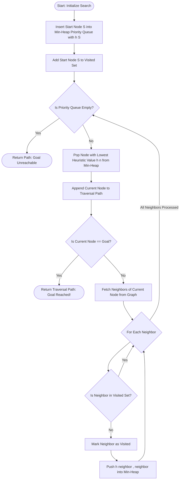
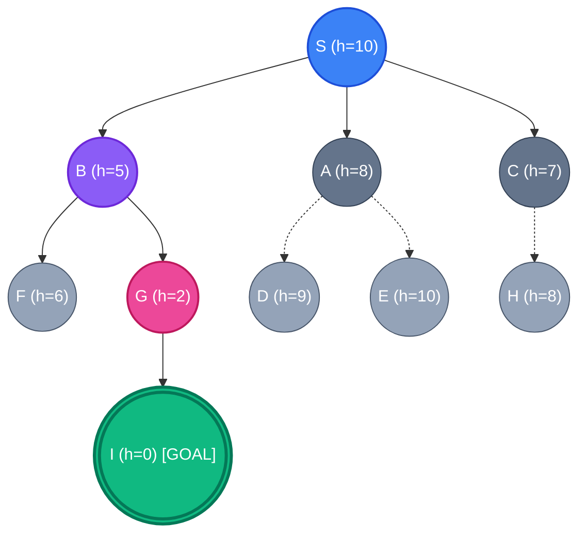
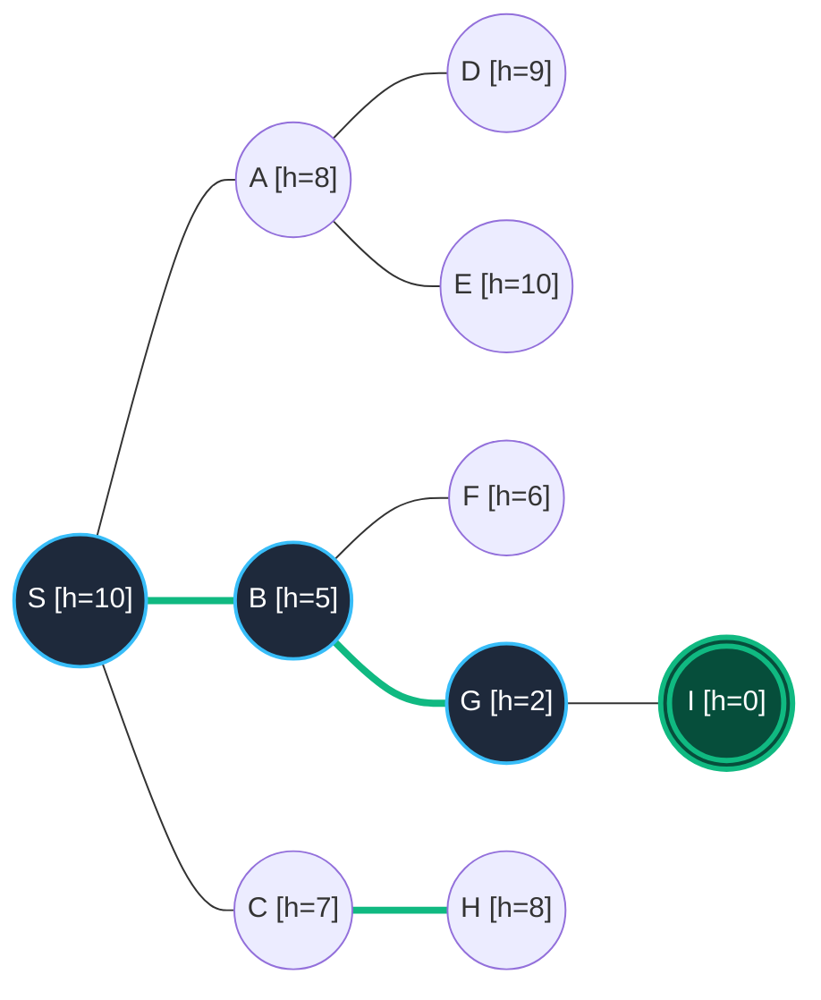
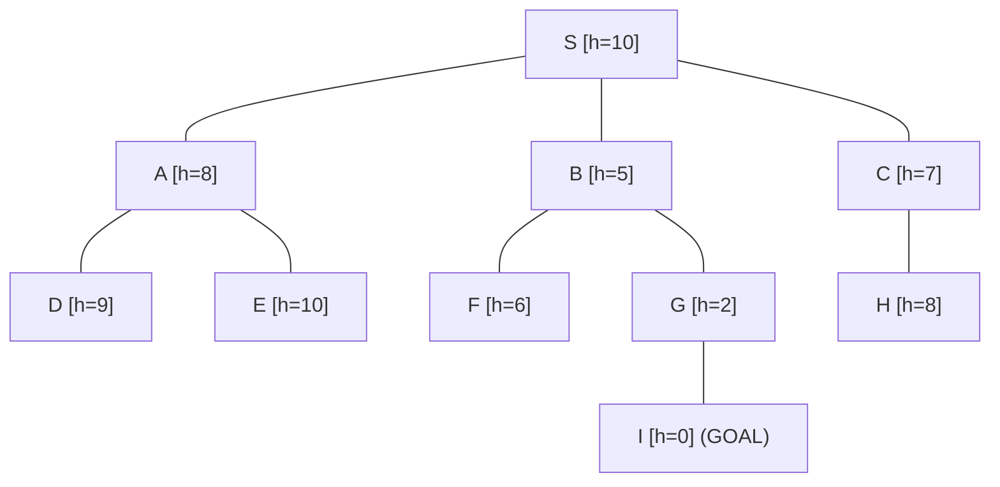
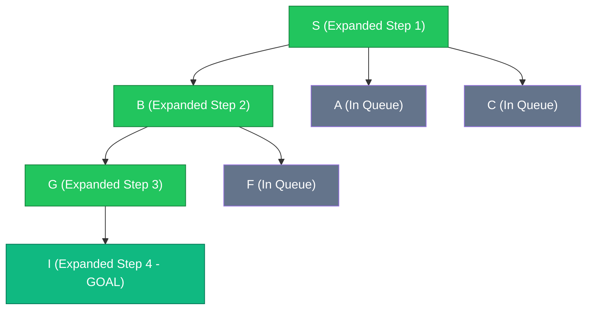
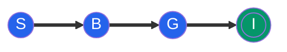

# Experiment 2: Best First Search (Greedy Best-First)

## Aim
To design, implement, and analyze the Greedy Best-First Search (GBFS) algorithm in Python using a priority queue (min-heap) data structure, and to evaluate its pathfinding efficiency and state space expansion based on heuristic evaluation functions.

---

## Objective
- To understand the principles of **Informed (Heuristic) Search Strategies** in Artificial Intelligence.
- To formulate and apply a heuristic evaluation function $h(n)$ that estimates the remaining cost from any given node to the target goal node.
- To implement an efficient **Priority Queue (Min-Heap)** using Python's `heapq` module to dynamically extract the node with the lowest heuristic value.
- To analyze the greedy choice property, local optimality, time and space complexity, state space traversal, and edge cases of the Greedy Best-First Search algorithm.
- To compare Best-First Search against Uninformed Search strategies (such as Breadth-First Search and Depth-First Search) and Optimal Informed Strategies (such as $A^*$ Search).

---

## Theory

### Introduction to Informed Search and Heuristics
In Artificial Intelligence and graph traversal theory, search algorithms are broadly categorized into **Uninformed (Blind) Search** and **Informed (Heuristic) Search**. Uninformed search algorithms such as Breadth-First Search (BFS) and Depth-First Search (DFS) systematically explore the state space without any domain-specific knowledge regarding how close a candidate state is to the desired goal. Consequently, they often inspect vast, irrelevant portions of the search space, leading to high computational and memory overheads in complex domains.

Informed search strategies leverage problem-specific domain knowledge encoded via a **Heuristics Function**, denoted as $h(n)$. The heuristic function takes a node $n$ in the search graph as input and returns an estimated cost from node $n$ to the closest goal node:
$$h(n) : N \rightarrow \mathbb{R}_{\ge 0}$$

For a goal node $G$, the heuristic value is universally defined as $h(G) = 0$.

### Principles of Greedy Best-First Search
**Greedy Best-First Search (GBFS)** is an informed search strategy that strictly expands the node that appears to be closest to the goal node, according to the heuristic evaluation function $h(n)$.

The evaluation function $f(n)$ governing node selection in Greedy Best-First Search is defined purely by the heuristic score:
$$f(n) = h(n)$$

Unlike $A^*$ Search, which calculates $f(n) = g(n) + h(n)$ by combining the actual cost spent to reach node $n$ ($g(n)$) with the estimated future cost ($h(n)$), Greedy Best-First Search completely ignores the actual cost accumulated from the start node $g(n)$. This aggressive, single-minded reliance on $h(n)$ gives the algorithm its "greedy" behavior.

### Greedy Choice Logic and Local Optimality
The core decision-making mechanism in Greedy Best-First Search relies on the **Greedy Choice Logic**:
1. At each step, the algorithm inspects all currently discovered, unexpanded frontier nodes.
2. It greedily selects the frontier node $n$ that minimizes $f(n) = h(n)$.
3. It immediately expands node $n$ by generating all its immediate neighbors.

Because the algorithm always selects the locally optimal choice (the node with smallest $h(n)$), it aims to reach the goal as quickly as possible. However, because local decisions do not account for past path costs $g(n)$, Greedy Best-First Search is **not guaranteed to find the optimal (shortest) path**. If the heuristic function $h(n)$ provides misleading estimates, the algorithm can be tricked into exploring long, non-optimal detours or get stuck in local minima.

### Priority Queue Operations and Heap Mechanics
To efficiently implement Greedy Best-First Search, the frontier of unexpanded nodes must be stored in a **Priority Queue** organized as a **Min-Heap**. A min-heap guarantees that the node with the minimum heuristic value resides at the root of the heap structure.

The essential operations performed on the priority queue during Best-First Search are:
1. **Push (`heappush`)**: When a new neighbor node is generated, it is inserted into the min-heap alongside its heuristic value as a tuple `(h(neighbor), neighbor)`. This operation maintains the heap invariant in $O(\log k)$ time, where $k$ is the number of elements in the heap.
2. **Pop (`heappop`)**: To select the next node for expansion, the root element with the smallest heuristic score `(h(current), current)` is popped from the min-heap in $O(\log k)$ time.
3. **Visited Tracking**: A hash set (`visited`) is maintained in $O(1)$ lookup time to track all visited nodes. This prevents cyclic loops and redundant node expansions in general graph traversal.

### Comparison of Search Strategies

| Feature | Breadth-First Search (BFS) | Depth-First Search (DFS) | Greedy Best-First Search | A* Search |
| :--- | :--- | :--- | :--- | :--- |
| **Search Category** | Uninformed | Uninformed | Informed (Greedy) | Informed (Optimal) |
| **Evaluation Function $f(n)$** | $f(n) = d(n)$ (depth) | $f(n) = -d(n)$ | $f(n) = h(n)$ | $f(n) = g(n) + h(n)$ |
| **Data Structure** | FIFO Queue | LIFO Stack | Priority Queue (Min-Heap) | Priority Queue (Min-Heap) |
| **Optimal Path Guaranteed?** | Yes (unweighted graphs) | No | No | Yes (if $h(n)$ is admissible) |
| **Complete?** | Yes | No (infinite paths) | No (graph loops without visited set) | Yes |
| **Time Complexity** | $O(b^d)$ | $O(b^m)$ | $O(b^m)$ | $O(b^d)$ |
| **Space Complexity** | $O(b^d)$ | $O(b \cdot m)$ | $O(b^m)$ | $O(b^d)$ |

---

## Algorithm

```text
Algorithm: Greedy_Best_First_Search(Graph, Heuristics, Start, Goal)

Input:
  - Graph: Adjacency list representation of the graph
  - Heuristics: Dictionary mapping each node n to its estimated cost h(n) to Goal
  - Start: The starting node identifier
  - Goal: The target goal node identifier

Output:
  - Path: List of nodes traversed from Start to Goal if reachable; else partial path / empty list

Steps:
  1. Initialize an empty Priority Queue `pq` (Min-Heap).
  2. Initialize an empty Set `visited` to track visited nodes.
  3. Initialize an empty List `path` to record the sequence of expanded nodes.
  4. Push the tuple `(Heuristics[Start], Start)` into `pq`.
  5. Add `Start` to `visited`.
  6. While `pq` is not empty:
      a. Pop `(current_heuristic, current_node)` from `pq` with the lowest heuristic value.
      b. Append `current_node` to `path`.
      c. If `current_node == Goal`:
          i. Return `path` (Goal successfully reached).
      d. For each `neighbor` in `Graph[current_node]`:
          i. If `neighbor` is not in `visited`:
              - Add `neighbor` to `visited`.
              - Push `(Heuristics[neighbor], neighbor)` into `pq`.
  7. If `pq` becomes empty and Goal is not reached, return `path`.
```

---

## Procedure
1. **Environment Setup**: Ensure Python 3.x is installed on the system environment.
2. **Graph and Heuristic Specification**: Define the target graph as an adjacency dictionary where keys represent parent nodes and values are lists of adjacent neighbor nodes. Create a corresponding dictionary storing the pre-calculated heuristic values $h(n)$ for every node relative to the goal node `'I'`.
3. **Data Structure Initialization**: Instantiate the priority queue using Python's native `heapq` module and initialize a `visited` set along with a `path` list.
4. **Execution**: Execute `best_first_search(graph, heuristics, start, goal)` starting from node `'S'` towards goal node `'I'`.
5. **Output Verification**: Observe the step-by-step extraction of nodes based on minimal heuristic scores and verify that the final path matches `S -> B -> G -> I`.

---

## Flowchart



---

## Search Tree / Decision Tree / State Space Tree



---

## Graph Representation

Below is the directional weighted state space graph showing all node heuristic values $h(n)$ and connected edge paths.



---

## Input

### Graph Structure (Adjacency List)
```python
example_graph = {
    'S': ['A', 'B', 'C'],
    'A': ['S', 'D', 'E'],
    'B': ['S', 'F', 'G'],
    'C': ['S', 'H'],
    'D': ['A'],
    'E': ['A'],
    'F': ['B'],
    'G': ['B', 'I'],
    'H': ['C'],
    'I': ['G']
}
```

### Heuristic Values $h(n)$ (Estimated distance to Goal `'I'`)
```python
heuristic_values = {
    'S': 10,
    'A': 8,
    'B': 5,
    'C': 7,
    'D': 9,
    'E': 10,
    'F': 6,
    'G': 2,
    'H': 8,
    'I': 0
}
```

- **Start Node**: `'S'`
- **Goal Node**: `'I'`

---

## Program

```python
"""
Experiment 02: Best-First Search
Objective: Implement Best-First Search using a priority queue based on heuristics.
"""

import heapq

def best_first_search(graph, heuristics, start, goal):
    """
    Function to perform Best-First Search on a graph.
    
    Args:
        graph (dict): The graph represented as an adjacency list.
        heuristics (dict): A dictionary mapping each node to its heuristic value (estimated cost to goal).
        start (str): The starting node.
        goal (str): The goal node.
        
    Returns:
        list: The traversal path from start to goal, or empty if no path.
    """
    # Priority Queue to store nodes to explore. Stores tuples of (heuristic, node)
    pq = []
    heapq.heappush(pq, (heuristics[start], start))
    
    visited = set()
    visited.add(start)
    
    path = []
    
    while pq:
        # Get the node with the lowest heuristic value
        current_heuristic, current_node = heapq.heappop(pq)
        path.append(current_node)
        
        # Check if we have reached the goal
        if current_node == goal:
            return path
            
        # Explore neighbors
        for neighbor in graph.get(current_node, []):
            if neighbor not in visited:
                visited.add(neighbor)
                heapq.heappush(pq, (heuristics[neighbor], neighbor))
                
    # If the queue is empty and goal wasn't reached, return the path explored so far (or empty list)
    return path

if __name__ == "__main__":
    # Example graph represented as an adjacency list
    example_graph = {
        'S': ['A', 'B', 'C'],
        'A': ['S', 'D', 'E'],
        'B': ['S', 'F', 'G'],
        'C': ['S', 'H'],
        'D': ['A'],
        'E': ['A'],
        'F': ['B'],
        'G': ['B', 'I'],
        'H': ['C'],
        'I': ['G']
    }
    
    # Example heuristic values (estimated distance to goal 'I')
    heuristic_values = {
        'S': 10,
        'A': 8,
        'B': 5,
        'C': 7,
        'D': 9,
        'E': 10,
        'F': 6,
        'G': 2,
        'H': 8,
        'I': 0
    }
    
    start_node = 'S'
    goal_node = 'I'
    print(f"Starting Best-First Search from '{start_node}' to '{goal_node}'...")
    
    path_found = best_first_search(example_graph, heuristic_values, start_node, goal_node)
    
    print("\nBest-First Search Traversal Path:")
    if path_found and path_found[-1] == goal_node:
        print(" -> ".join(path_found))
        print("\nGoal Reached!")
    else:
        print(" -> ".join(path_found))
        print("\nGoal not reachable.")
```

---

## Output

```text
┌────────────────────────────────────────────────────────────────────────────┐
│ Starting Best-First Search from 'S' to 'I'...                              │
│                                                                            │
│ Best-First Search Traversal Path:                                          │
│ S -> B -> G -> I                                                           │
│                                                                            │
│ Goal Reached!                                                              │
└────────────────────────────────────────────────────────────────────────────┘
```

---

## Step-by-Step Execution

Below is the complete step-by-step tabular breakdown detailing each iteration of the search process.

| Iteration | Current Node ($n$) | Heuristic $h(n)$ | Action / Neighbors Inspected | Priority Queue State (`pq`) | Visited Set (`visited`) | Traversal Path |
| :---: | :---: | :---: | :--- | :--- | :--- | :--- |
| **0 (Init)** | - | - | Initialize `pq` with Start node `S` | `[(10, 'S')]` | `{'S'}` | `[]` |
| **1** | **S** | 10 | Dequeue **S**. Inspect neighbors: `A(h=8)`, `B(h=5)`, `C(h=7)`. Push all unvisited. | `[(5, 'B'), (8, 'A'), (7, 'C')]` | `{'S', 'A', 'B', 'C'}` | `['S']` |
| **2** | **B** | 5 | Dequeue **B** (lowest $h$). Inspect neighbors: `S` (visited), `F(h=6)`, `G(h=2)`. Push `F`, `G`. | `[(2, 'G'), (6, 'F'), (7, 'C'), (8, 'A')]` | `{'S', 'A', 'B', 'C', 'F', 'G'}` | `['S', 'B']` |
| **3** | **G** | 2 | Dequeue **G** (lowest $h$). Inspect neighbors: `B` (visited), `I(h=0)`. Push `I`. | `[(0, 'I'), (6, 'F'), (7, 'C'), (8, 'A')]` | `{'S', 'A', 'B', 'C', 'F', 'G', 'I'}` | `['S', 'B', 'G']` |
| **4** | **I** | 0 | Dequeue **I** (lowest $h$). **Goal Node Reached!** Terminate search. | `[(6, 'F'), (7, 'C'), (8, 'A')]` | `{'S', 'A', 'B', 'C', 'F', 'G', 'I'}` | `['S', 'B', 'G', 'I']` |

---

## Visualization

### 1. Weighted Graph with Heuristic Annotations
The search domain contains 10 nodes with heuristic evaluations relative to target node `I`:



### 2. Priority Queue State Transformation Table

| Step | Operation | Item Pushed / Popped | Heap State After Operation |
| :---: | :---: | :---: | :--- |
| 1 | Push | `(10, 'S')` | `[(10, 'S')]` |
| 2 | Pop | `(10, 'S')` | `[]` |
| 3 | Push | `(8, 'A'), (5, 'B'), (7, 'C')` | `[(5, 'B'), (8, 'A'), (7, 'C')]` |
| 4 | Pop | `(5, 'B')` | `[(7, 'C'), (8, 'A')]` |
| 5 | Push | `(6, 'F'), (2, 'G')` | `[(2, 'G'), (6, 'F'), (7, 'C'), (8, 'A')]` |
| 6 | Pop | `(2, 'G')` | `[(6, 'F'), (8, 'A'), (7, 'C')]` |
| 7 | Push | `(0, 'I')` | `[(0, 'I'), (6, 'F'), (7, 'C'), (8, 'A')]` |
| 8 | Pop | `(0, 'I')` | `[(6, 'F'), (7, 'C'), (8, 'A')]` |

### 3. Node Expansion Tree
Nodes marked with green checkmarks were expanded during execution, while greyed-out nodes remained unexpanded in the frontier.



### 4. Selected Shortest Path Diagram



---

## Complexity Analysis

### Time Complexity: $O(b^m)$
- **Branching Factor ($b$)**: The maximum number of successors (children) generated by any expanded node.
- **Maximum Depth ($m$)**: The maximum depth of the state space graph.

**Mathematical Derivation**:
In the worst-case scenario, the heuristic evaluation function $h(n)$ can be uninformative or completely inaccurate (e.g., placing low heuristic estimates on non-goal paths that lead deeper into dead ends). Under such conditions, Greedy Best-First Search behaves similarly to an aggressive, depth-oriented uninformed search.

At depth 0, 1 node is expanded. At depth 1, $b$ nodes are generated. At depth 2, $b^2$ nodes are generated, up to depth $m$:
$$T(b, m) = 1 + b + b^2 + b^3 + \dots + b^m = \sum_{k=0}^{m} b^k = \frac{b^{m+1} - 1}{b - 1} = O(b^m)$$

When using a Priority Queue (Min-Heap), each insertion and deletion takes $O(\log N)$ time, where $N \le b^m$. Thus, the total worst-case time complexity is bounded by $O(b^m \cdot \log(b^m)) = O(m \cdot b^m)$. However, with a good heuristic, the search avoids most branches and executes in $O(b \cdot d)$ time, where $d$ is the goal depth.

### Space Complexity: $O(b^m)$
Greedy Best-First Search keeps all generated nodes in memory within either the Priority Queue (`pq`) or the `visited` set to prevent re-expansion and allow backtracking if a local minimum is hit.

**Mathematical Derivation**:
At depth $m$, the priority queue stores all unexplored frontier siblings across the tree branches. The memory space consumed by storing node references and priority keys is proportional to the total number of generated nodes:
$$S(b, m) = O(b^m)$$

Unlike Depth-First Search which requires only $O(b \cdot m)$ space by storing only the current path branch, Greedy Best-First Search retains all generated nodes in memory, making memory consumption its primary bottleneck in massive state spaces.

---

## Advantages
1. **High Search Efficiency**: Dramatically reduces the search space compared to uninformed search methods (BFS/DFS) by prioritizing promising nodes.
2. **Fast Goal Reachability**: Often finds a solution significantly faster than BFS or Dijkstra's algorithm in large graphs with accurate heuristics.
3. **Informed Guidance**: Employs domain-specific knowledge $h(n)$ to guide the search direction directly towards the target goal.
4. **Low Execution Latency**: Requires fewer total node expansions when the heuristic function provides strong slope towards the goal.
5. **Flexible Heuristic Integration**: Supports any custom heuristic estimation logic (e.g., Euclidean distance, Manhattan distance, Chebyshev distance).
6. **Effective for Large State Spaces**: Prunes vast unpromising search trees early if their heuristic values are high.
7. **Simple Min-Heap Implementation**: Easy to implement using standard standard priority queue modules like Python's `heapq`.
8. **Prevents Graph Cycles**: Integration of a hash-based `visited` set guarantees loop immunity on cyclic graphs.
9. **Heuristic Benchmarking Tool**: Serves as a fundamental baseline for evaluating heuristic function accuracy before upgrading to $A^*$ search.
10. **Scalable to High-Dimensional Spaces**: Works exceptionally well in real-time environments (e.g., computer games) where speed is prioritized over path optimality.

---

## Disadvantages
1. **Not Guaranteed Optimal**: Does not guarantee finding the shortest or lowest-cost path because it ignores accumulated path cost $g(n)$.
2. **Incomplete in Infinite Spaces**: Can get trapped in infinite paths or deep dead-ends if cyclic graph protection (visited set) is absent.
3. **Susceptible to Misleading Heuristics**: Highly vulnerable to false heuristics that lure the search into local minima or costly detours.
4. **High Memory Overhead**: Suffers from $O(b^m)$ space complexity as all frontier nodes must be retained in memory inside the priority queue.
5. **Greedy Myopia**: Suffers from short-sightedness by making locally optimal choices at each step without considering long-term cumulative costs.

---

## Applications
1. **GPS Route Planning & Map Navigation**: Quick path calculation in maps (e.g., Google Maps, Waze) using straight-line distance heuristics.
2. **Video Game Pathfinding**: Real-time non-player character (NPC) and unit movement in strategy games where fast response time beats absolute optimality.
3. **Robotics Motion Planning**: Enabling autonomous mobile robots to navigate around obstacles towards target coordinates.
4. **Web Crawling and Scraping**: Prioritizing URL link extraction based on page relevance scores and keyword density heuristics.
5. **Automated Theorem Proving**: Guiding search through logical mathematical proof trees using rule complexity heuristics.
6. **Bioinformatics & Sequence Alignment**: Searching for optimal biological sequence alignments using similarity matrices as heuristics.
7. **Puzzle Solving**: Solving 8-puzzle, 15-puzzle, and Rubik's Cube using misplaced tiles or Manhattan distance heuristics.
8. **Network Packet Routing**: Forwarding data packets across computer network routers using latency and hop-distance heuristics.
9. **Supply Chain & Vehicle Routing**: Rapidly estimating delivery routes for logistics fleets under tight time constraints.
10. **Dynamic Task Scheduling**: Selecting high-priority computational jobs in cloud computing infrastructures based on estimated execution time.
11. **Artificial Intelligence Planning**: Navigating state-transition systems in AI planning agents to achieve domain goal states.
12. **Natural Language Processing Parsing**: Guiding syntax tree parsing algorithms using probabilistic context-free grammar heuristics.
13. **Financial Portfolio Tree Search**: Searching decision trees for fast asset allocation choices under volatile market conditions.
14. **Autonomous Vehicle Trajectory Selection**: Rapidly evaluating candidate driving trajectories for collision avoidance.
15. **E-Commerce Recommendation Pathing**: Traversing product category graphs to find related items based on user interest similarity scores.

---

## Real World Use Cases

### 1. Real-Time Game AI (e.g., StarCraft / Age of Empires)
In real-time strategy (RTS) video games, hundreds of units must recalculate their paths simultaneously per second. Using optimal algorithms like $A^*$ for every unit can freeze the game engine. Developers frequently use Greedy Best-First Search (or hierarchical variants) because it yields acceptable, natural-looking paths instantly by following straight-line distance heuristics towards the target destination.

### 2. Emergency Response Routing (e.g., Ambulance/Fire Truck Dispatch)
During emergency operations, dispatch systems require immediate preliminary routes to guide drivers towards an incident location. Greedy Best-First Search uses GPS coordinates and straight-line Euclidean distance to instantly generate a candidate route, allowing the vehicle to begin moving while secondary algorithms optimize for live traffic congestion.

### 3. Web Search Engine Indexing (Focused Crawlers)
Specialized search engines employ "focused crawlers" to discover topic-specific web pages. A crawler uses Best-First Search where the heuristic function $h(n)$ measures the semantic relevance of a web page's anchor text and metadata to the target topic. Pages with the highest heuristic relevance are popped from the priority queue and fetched first.

---

## Viva Questions with Answers

### Q1: What is Greedy Best-First Search and how does it differ from Uninformed Search?
**Answer**: Greedy Best-First Search is an informed search strategy that uses a domain-specific heuristic evaluation function $h(n)$ to select the node that appears closest to the goal. Unlike uninformed search strategies (BFS/DFS) which explore blindly without knowing goal direction, Best-First Search evaluates node promisingness to guide exploration.

### Q2: What is the evaluation function $f(n)$ used in Greedy Best-First Search?
**Answer**: In Greedy Best-First Search, the evaluation function is defined solely as $f(n) = h(n)$, where $h(n)$ is the estimated cost from node $n$ to the goal node.

### Q3: Why is Greedy Best-First Search considered "greedy"?
**Answer**: It is called greedy because at each step it selects the locally optimal choice—the node with the lowest heuristic value $h(n)$—hoping that local optimality leads directly to the global goal, without considering past path costs $g(n)$.

### Q4: Is Greedy Best-First Search optimal? Explain why or why not.
**Answer**: No, Greedy Best-First Search is **not optimal**. Because it ignores the cost already incurred to reach a node ($g(n)$), it can select a path with a low heuristic value that ultimately incurs an extremely high total path cost.

### Q5: What data structure is used to implement Greedy Best-First Search efficiently?
**Answer**: A **Priority Queue** implemented as a **Min-Heap** is used. It allows retrieving the node with the lowest heuristic score in $O(1)$ time and inserting newly discovered nodes in $O(\log k)$ time.

### Q6: What happens if the heuristic function $h(n)$ is inaccurate or misleading?
**Answer**: If $h(n)$ is inaccurate, the algorithm can be lured down false branches, leading to long non-optimal paths, excessive unnecessary node expansions, or getting trapped in local minima.

### Q7: What is the difference between Best-First Search and $A^*$ Search?
**Answer**: 
- **Best-First Search** uses $f(n) = h(n)$ (only future estimated cost).
- **$A^*$ Search** uses $f(n) = g(n) + h(n)$ (actual cost so far + future estimated cost), making $A^*$ optimal when $h(n)$ is admissible.

### Q8: What are the Time and Space complexities of Greedy Best-First Search?
**Answer**: 
- **Time Complexity**: $O(b^m)$ in the worst case, where $b$ is the branching factor and $m$ is the maximum depth.
- **Space Complexity**: $O(b^m)$ because all frontier nodes are stored in memory inside the priority queue and visited set.

### Q9: What is an Admissible Heuristic? Is admissibility required for Greedy Best-First Search?
**Answer**: An admissible heuristic never overestimate the true cost to reach the goal ($h(n) \le h^*(n)$). While admissibility is strictly required for $A^*$ search to guarantee optimality, Greedy Best-First Search does not guarantee optimality even with an admissible heuristic.

### Q10: How does maintaining a `visited` set affect the execution of Best-First Search?
**Answer**: Maintaining a hash-based `visited` set prevents the algorithm from re-expanding nodes it has already inspected. This eliminates infinite loops on cyclic graphs and ensures the search terminates on finite graphs.

---

## Conclusion
Experiment 2 successfully demonstrates the implementation and evaluation of the **Greedy Best-First Search** algorithm in Python using a min-heap priority queue. By prioritizing node expansion based on heuristic estimates $h(n)$, Greedy Best-First Search achieves rapid state space traversal towards the target goal (`S -> B -> G -> I`).

While the algorithm delivers outstanding search velocity and significant state space reduction compared to uninformed methods like BFS, its complete disregard for accumulated path cost $g(n)$ prevents it from guaranteeing optimal shortest path solutions. Consequently, Greedy Best-First Search is ideally suited for real-time applications such as video game AI, initial emergency routing, and focused web crawling, where speed and minimal latency take precedence over absolute path optimality.
