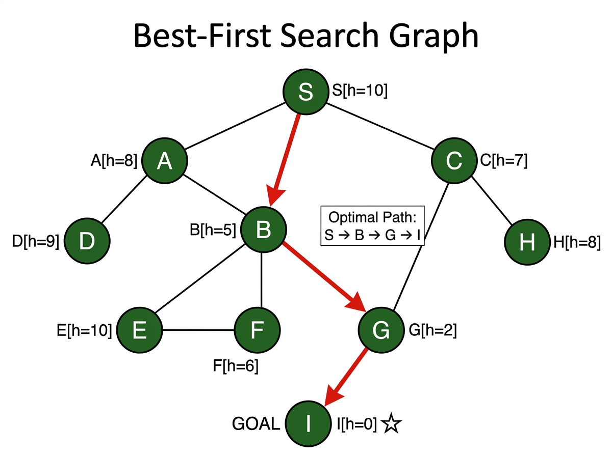

# Experiment 2: Best-First Search

## Aim

To implement the Best-First Search algorithm using a priority queue based on heuristic values h(n) to find the path from a source to a goal node.

## Algorithm

1. Push start node into a min-heap keyed on h(n).
2. Mark start as visited.
3. While heap is not empty:
   - Pop node with lowest h(n).
   - Add to path. If it is the goal, return path.
   - Push each unvisited neighbor with its h(n).
4. Return failure if goal not reached.

## Procedure

1. Navigate to the experiment folder.
2. Run: `python best_first_search.py`
3. The program finds the path from node `S` to node `I`.
4. Observe greedy selection by lowest heuristic value.

## Source Code

Refer to file: `best_first_search.py`

## Output




### Graph with Heuristic Values h(n)

```
               S [h=10]
             / | \
           /   |   \
     [h=8]A    |    C[h=7]
          |\   |    |
   [h=9]D | E[h=10] H[h=8]
             \
              B [h=5]
             / \
       [h=6]F   G[h=2]
                |
                I [h=0]  <-- GOAL
```

### Priority Queue Steps

```
Step 1: Pop S  (h=10)  -> Push A(8), B(5), C(7)   PQ: [(5,B),(7,C),(8,A)]
Step 2: Pop B  (h=5)   -> Push F(6), G(2)          PQ: [(2,G),(6,F),(7,C),(8,A)]
Step 3: Pop G  (h=2)   -> Push I(0)                PQ: [(0,I),(6,F),(7,C),(8,A)]
Step 4: Pop I  (h=0)   -> GOAL REACHED!
```

### Path Found

```
S -> B -> G -> I
```

### Terminal Output

```
Starting Best-First Search from 'S' to 'I'...

Best-First Search Traversal Path:
S -> B -> G -> I

Goal Reached!
```
