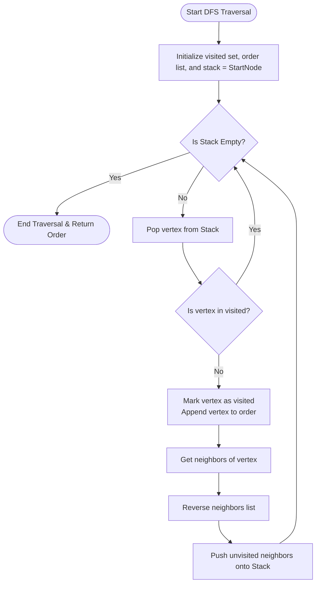
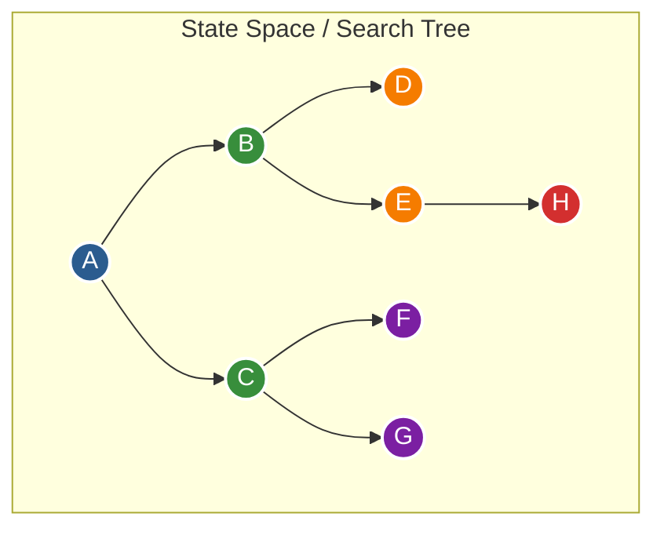
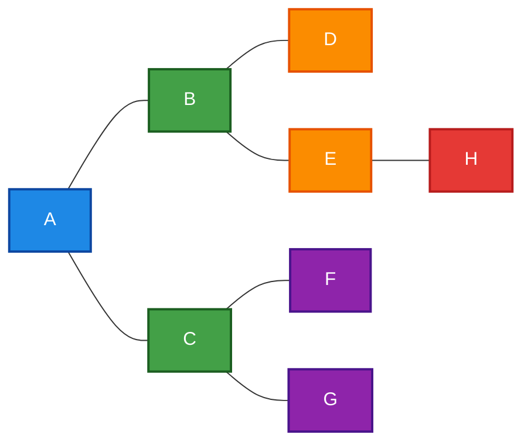

# Experiment 3: Depth First Search (DFS)

## Aim
To design, implement, and analyze the **Depth-First Search (DFS)** graph traversal algorithm in Python, exploring graph state spaces along deep pathways using the Last-In, First-Out (LIFO) stack mechanism, and evaluating its efficiency, memory management, and practical applications.

## Objective
- To understand the fundamental concepts of graph traversal and state space search principles.
- To implement Depth-First Search using both iterative (explicit LIFO stack) and recursive (implicit call stack) methodologies.
- To analyze visited state tracking mechanisms (`visited` set) for preventing infinite loops in cyclic and undirected graphs.
- To trace stack state transitions, node expansions, and explicit backtracking events during execution.
- To rigorously prove the time complexity $O(|V| + |E|)$ and auxiliary space complexity $O(|V|)$.
- To evaluate the real-world applications of DFS including cycle detection, topological sorting, connected component analysis, and maze solving.

## Theory

### 1. Fundamentals of Graph Traversal
In computer science and artificial intelligence, graph traversal is the systematic process of visiting (checking, updating, or expanding) every vertex (node) in a graph $G = (V, E)$. Graphs consist of a non-empty set of vertices $V$ connected by a set of edges $E$. Unlike linear data structures such as arrays, stacks, or linked lists, graphs permit non-linear connectivity, multiple branches, arbitrary cycles, and disconnected subgraphs.

Search algorithms in graph theory generally fall into two primary categories: **Uninformed (Blind) Search** and **Informed (Heuristic) Search**. Depth-First Search (DFS) is a classical uninformed search algorithm. It traverses a graph by systematically exploring as deep as possible along each branch before backtracking to explore alternative branches.

### 2. Core Mechanics of Depth-First Search & LIFO Principle
DFS operates on the **Last-In, First-Out (LIFO)** policy. When starting at a source node, DFS selects an adjacent, unvisited neighbor and transitions deeper into the graph along that path. It continues this linear penetration down a single branch until it encounters one of two terminal conditions:
1. A node with no outgoing edges (a leaf node or dead-end).
2. A node whose adjacent neighbors have all already been visited.

Upon reaching a terminal condition, the search **backtracks** to the most recently visited node that still possesses unexplored adjacent edges. This LIFO operational pattern is naturally modeled using a **Stack** data structure.

### 3. Call-Stack Logic: Recursive vs. Iterative DFS
Depth-First Search can be implemented using two distinct computational approaches:

#### A. Recursive DFS (Implicit System Call Stack)
In recursive DFS, the algorithm relies on the programming language's runtime function call stack. Each recursive invocation `dfs(u)` creates a new stack frame in system memory storing local variables, return addresses, and parameter bindings.
- **Advantages**: Exceptionally elegant, minimal code syntax, intuitive mapping to mathematical inductive definitions.
- **Disadvantages**: High memory overhead per stack frame. Vulnerable to stack overflow (`RecursionError` in Python) when exploring deep graphs (e.g., a line graph with thousands of nodes exceeding Python's default stack limit of 1000).

#### B. Iterative DFS (Explicit User-Defined Stack)
In iterative DFS, the programmer explicitly manages a stack data structure (such as Python's native `list` using `.append()` and `.pop()`).
- **Advantages**: Highly scalable. Operates within main heap memory rather than limiting system runtime stack frames. Eliminates recursion overflow risks and provides fine-grained control over neighbor expansion ordering.
- **Disadvantages**: Requires explicit loop logic and state management. Node visitation checks must be handled carefully to avoid pushing redundant duplicate neighbors onto the stack.

### 4. Graph Traversal Principles & Visited Set Management
To guarantee termination in cyclic or undirected graphs, DFS maintains a lookup data structure—typically a hash set `visited` operating in $O(1)$ average time complexity. Whenever a vertex $u$ is processed, it is inserted into `visited`. Any subsequent attempt to re-process $u$ is suppressed.

Without a `visited` collection, DFS on an undirected edge $(A, B)$ would infinitely oscillate between $A \to B \to A \to B \dots$, resulting in non-termination and memory exhaustion.

### 5. Edge Classification in DFS Trees
During DFS traversal, edges in a graph $G$ can be categorized relative to the generated DFS search tree/forest:
1. **Tree Edges**: Edges leading to previously unvisited nodes that are incorporated into the DFS tree.
2. **Back Edges**: Edges pointing from a descendant node to an ancestor node in the DFS tree. The presence of a back edge indicates a **cycle** in the graph.
3. **Forward Edges**: Non-tree edges pointing from an ancestor node to a non-child descendant node.
4. **Cross Edges**: Edges connecting nodes that do not have an ancestor/descendant relationship in the DFS tree.

## Algorithm

### Iterative Depth-First Search Algorithm
```text
Algorithm Iterative_DFS(Graph, StartNode):
    Input: Adjacency list representation of Graph G=(V,E), starting node StartNode
    Output: List representing the DFS traversal order of vertices

    1. Initialize an empty hash set 'visited'
    2. Initialize an empty list 'order'
    3. Initialize an empty stack 'stack'
    
    4. Push StartNode onto 'stack'
    
    5. While 'stack' is not empty:
        a. Pop the top element 'vertex' from 'stack'
        b. If 'vertex' is NOT in 'visited':
            i.   Add 'vertex' to 'visited'
            ii.  Append 'vertex' to 'order'
            iii. Retrieve neighbors of 'vertex' from Graph[vertex]
            iv.  Reverse the neighbors list (to preserve natural left-to-right branch exploration)
            v.   For each 'neighbor' in reversed neighbors:
                    If 'neighbor' is NOT in 'visited':
                        Push 'neighbor' onto 'stack'
                        
    6. Return 'order'
```

### Recursive Depth-First Search Algorithm (For Comparison)
```text
Algorithm Recursive_DFS(Graph, CurrentNode, Visited, Order):
    1. Add CurrentNode to Visited set
    2. Append CurrentNode to Order list
    3. For each Neighbor of CurrentNode in Graph[CurrentNode]:
        a. If Neighbor is NOT in Visited:
            Recursive_DFS(Graph, Neighbor, Visited, Order)
    4. Return Order
```

## Procedure
1. **Environment Setup**: Open a Python 3 environment or terminal editor.
2. **Data Structure Definition**: Define the graph as an adjacency list dictionary where dictionary keys are vertex labels and dictionary values are lists of neighbor vertex labels.
3. **Stack & State Initialization**: Instantiate an explicit `stack` list containing the initial `start_node`, an empty `visited` set, and an empty `order` output list.
4. **Iterative Traversal Loop**: Execute a `while stack:` loop that pops the top node, checks if it has been visited, marks it visited if unvisited, appends it to the order, and pushes its unvisited neighbors in reverse order onto the stack.
5. **Backtracking Execution**: Observe automatic backtracking as branch ends are reached and the stack pops previously stored alternative branch nodes.
6. **Output Generation**: Format and display the resulting node sequence string using `" -> ".join(order)`.

## Flowchart



## Search Tree / Decision Tree / State Space Tree



## Graph Representation

The graph tested in `dfs.py` is an undirected connected graph with 8 nodes ($A$ through $H$).



## Input

The graph is provided as an adjacency list represented by a Python dictionary, along with a specified starting node `start_node = 'A'`:

```python
example_graph = {
    'A': ['B', 'C'],
    'B': ['A', 'D', 'E'],
    'C': ['A', 'F', 'G'],
    'D': ['B'],
    'E': ['B', 'H'],
    'F': ['C'],
    'G': ['C'],
    'H': ['E']
}
start_node = 'A'
```

## Program

Below is the complete implementation from [dfs.py](file:///d:/ARTIFICIAL%20INTELLIGENCE%20LAB/AI-LAB-JNTUA-R23/Experiment-03-Depth-First-Search/dfs.py):

```python
"""
Experiment 03: Depth-First Search (DFS)
Objective: Implement DFS to traverse a graph exploring as far as possible along each branch before backtracking.
"""

def dfs(graph, start):
    """
    Function to perform Depth-First Search (DFS) on a graph.
    
    Args:
        graph (dict): The graph represented as an adjacency list.
        start (str): The starting node for the traversal.
        
    Returns:
        list: The order of visited nodes.
    """
    visited = set()
    order = []
    
    # We use an iterative approach with a stack
    stack = [start]
    
    while stack:
        vertex = stack.pop()
        
        if vertex not in visited:
            visited.add(vertex)
            order.append(vertex)
            
            # Add neighbors to stack
            # We reverse the neighbors to visit them in alphabetical/numerical order 
            # if that's how they are stored in the adjacency list.
            # (Because it's a stack, pushing A then B means popping B then A).
            for neighbor in reversed(graph.get(vertex, [])):
                if neighbor not in visited:
                    stack.append(neighbor)
                    
    return order

if __name__ == "__main__":
    # Example graph represented as an adjacency list
    example_graph = {
        'A': ['B', 'C'],
        'B': ['A', 'D', 'E'],
        'C': ['A', 'F', 'G'],
        'D': ['B'],
        'E': ['B', 'H'],
        'F': ['C'],
        'G': ['C'],
        'H': ['E']
    }
    
    start_node = 'A'
    print(f"Starting DFS traversal from node '{start_node}'...")
    traversal_order = dfs(example_graph, start_node)
    
    print("\nDFS Traversal Order:")
    print(" -> ".join(traversal_order))
```

## Output

```text
┌────────────────────────────────────────────────────────┐
│               DFS TRAVERSAL EXECUTION                  │
├────────────────────────────────────────────────────────┤
│ Starting DFS traversal from node 'A'...                │
│                                                        │
│ DFS Traversal Order:                                   │
│ A -> B -> D -> E -> H -> C -> F -> G                   │
└────────────────────────────────────────────────────────┘
```

## Step-by-Step Execution

Below is the step-by-step trace of `dfs(example_graph, 'A')`:

| Step # | Action / Operation | Current Vertex | Stack Contents (LIFO, Top on Right) | Visited Array / Set | Backtrack Event? | Traversal Order |
|---|---|---|---|---|---|---|
| **0** | Initialize DFS | - | `['A']` | `{}` | No | `[]` |
| **1** | Pop `'A'`, mark visited, push `['C', 'B']` | `A` | `['C', 'B']` | `{'A'}` | No | `['A']` |
| **2** | Pop `'B'`, mark visited, push `['E', 'D']` | `B` | `['C', 'E', 'D']` | `{'A', 'B'}` | No | `['A', 'B']` |
| **3** | Pop `'D'`, mark visited (neighbors `['B']` visited) | `D` | `['C', 'E']` | `{'A', 'B', 'D'}` | **Yes (Dead End)** | `['A', 'B', 'D']` |
| **4** | Pop `'E'`, mark visited, push `['H']` | `E` | `['C', 'H']` | `{'A', 'B', 'D', 'E'}` | No | `['A', 'B', 'D', 'E']` |
| **5** | Pop `'H'`, mark visited (neighbors `['E']` visited) | `H` | `['C']` | `{'A', 'B', 'D', 'E', 'H'}` | **Yes (Dead End)** | `['A', 'B', 'D', 'E', 'H']` |
| **6** | Pop `'C'`, mark visited, push `['G', 'F']` | `C` | `['G', 'F']` | `{'A', 'B', 'C', 'D', 'E', 'H'}` | No | `['A', 'B', 'D', 'E', 'H', 'C']` |
| **7** | Pop `'F'`, mark visited (neighbors `['C']` visited) | `F` | `['G']` | `{'A', 'B', 'C', 'D', 'E', 'H', 'F'}` | **Yes (Dead End)** | `['A', 'B', 'D', 'E', 'H', 'C', 'F']` |
| **8** | Pop `'G'`, mark visited (neighbors `['C']` visited) | `G` | `[]` | `{'A', 'B', 'C', 'D', 'E', 'H', 'F', 'G'}` | **Yes (Dead End)** | `['A', 'B', 'D', 'E', 'H', 'C', 'F', 'G']` |
| **9** | Stack empty -> Termination | - | `[]` | `{'A', 'B', 'C', 'D', 'E', 'H', 'F', 'G'}` | Completed | Final Order returned |

## Visualization

### 1. DFS Spanning Tree
```text
         [A]  (Step 1)
        /   \
       /     \
   (Step 2) (Step 6)
    [B]       [C]
   /   \     /   \
  /     \   /     \
(Step 3)(Step 4)(Step 7)(Step 8)
 [D]    [E]   [F]     [G]
         |
      (Step 5)
        [H]
```

### 2. Stack Visualization Table
```text
Initial State:  [ A ]
Step 1:         [ C | B ]           <-- Pop A, Push C, B
Step 2:         [ C | E | D ]       <-- Pop B, Push E, D
Step 3:         [ C | E ]           <-- Pop D (no unvisited neighbors)
Step 4:         [ C | H ]           <-- Pop E, Push H
Step 5:         [ C ]               <-- Pop H (no unvisited neighbors)
Step 6:         [ G | F ]           <-- Pop C, Push G, F
Step 7:         [ G ]               <-- Pop F (no unvisited neighbors)
Step 8:         [ ]                 <-- Pop G (empty stack -> terminate)
```

### 3. Recursive Traversal Stack Frame Diagram
```text
+-------------------------------------------------------------+
| Call Stack Depth Progression (Recursive Mental Model)       |
+-------------------------------------------------------------+
| Frame 1: dfs(A)                                             |
|   ├── Frame 2: dfs(B)                                       |
|   │     ├── Frame 3: dfs(D)  --> (Return/Backtrack to B)    |
|   │     └── Frame 4: dfs(E)                                 |
|   │           └── Frame 5: dfs(H) --> (Return/Backtrack to E)|
|   │           (Return/Backtrack to B -> Return to A)        |
|   └── Frame 6: dfs(C)                                       |
|         ├── Frame 7: dfs(F)  --> (Return/Backtrack to C)    |
|         └── Frame 8: dfs(G)  --> (Return/Backtrack to C)    |
|         (Return to A -> Traversal Complete)                 |
+-------------------------------------------------------------+
```

### 4. Backtracking Illustration Diagram
```text
  Branch 1 Exploration: A ──► B ──► D (Dead End!)
                                    │
                                    └─► [BACKTRACK to B] ──► E ──► H (Dead End!)
                                                                   │
                                                                   └─► [BACKTRACK to E ──► B ──► A]
  
  Branch 2 Exploration: A ──► C ──► F (Dead End!)
                                    │
                                    └─► [BACKTRACK to C] ──► G (Dead End!)
                                                                   │
                                                                   └─► [BACKTRACK to C ──► A] (FINISH)
```

## Complexity Analysis

### 1. Time Complexity Proof
Let $G = (V, E)$ be an unweighted graph where $|V|$ is the number of vertices and $|E|$ is the number of edges.

- **Vertex Processing**: Every node $v \in V$ is pushed onto the stack at most $deg(v)$ times and popped from the stack. The `if vertex not in visited` check ensures that each node is marked as visited and inserted into the `order` array exactly once. Thus, vertex operations take $O(|V|)$ time.
- **Edge Traversal**: For each visited vertex $v$, we iterate over all its outgoing edges in `graph[v]`. In an undirected graph, every edge $(u, v)$ is inspected twice (once from $u$ and once from $v$). In a directed graph, each edge is inspected once. Thus, edge processing across all vertices takes $\sum_{v \in V} deg(v) = 2|E| = O(|E|)$ time.

Combining both components yields the total time complexity:
$$\text{Total Time Complexity} = O(|V| + |E|)$$

### 2. Space Complexity Proof
The auxiliary space required by DFS consists of three components:
1. **Visited Set (`visited`)**: Stores at most $|V|$ vertex identifiers. Space = $O(|V|)$.
2. **Output Order (`order`)**: Stores at most $|V|$ vertex identifiers. Space = $O(|V|)$.
3. **Explicit/Implicit Stack (`stack`)**: In the worst-case scenario (a long linear chain or path graph $A \to B \to C \dots$), the stack contains at most $|V|$ vertices simultaneously. Space = $O(|V|)$.

Therefore, total space complexity is bounded by:
$$\text{Total Space Complexity} = O(|V|)$$

## Advantages

1. **Memory Efficiency on Deep Trees**: Requires lower auxiliary memory $O(h)$ (where $h$ is maximum tree depth) compared to BFS $O(b^d)$ when the branching factor $b$ is high.
2. **Cycle Detection**: Provides a simple, robust mechanism to detect cycles in directed and undirected graphs via back-edges.
3. **Pathfinding to Deep Solutions**: Highly efficient when target goal nodes are known to reside deep within search trees.
4. **Topological Sorting Baseline**: Serves as the foundation for computing topological orderings in Directed Acyclic Graphs (DAGs).
5. **Connected Components Discovery**: Effortlessly identifies isolated connected components in undirected graphs.
6. **Strongly Connected Components (SCC)**: Backbone of Tarjan's and Kosaraju's linear-time algorithms for discovering SCCs.
7. **Maze & Puzzle Solving**: Mimics human physical maze solving by following a path to its terminus and systematically backtracking.
8. **Minimal Data Structure Overhead**: Can be implemented recursively using system function call frames without declaring external classes.
9. **Exhaustive Decision Tree Search**: Extremely suitable for game-tree evaluation (e.g., Minimax algorithm with Alpha-Beta pruning).
10. **Bipartite Graph Verification**: Easily adapted via 2-coloring to determine if a graph is bipartite.

## Disadvantages

1. **Non-Optimal Pathfinding**: Does NOT guarantee finding the shortest path in unweighted graphs (unlike BFS).
2. **Infinite Loop Vulnerability**: Can fall into infinite loops in cyclic graphs if visited tracking is omitted.
3. **Unbounded Depths Hazard**: Risks getting trapped along infinitely deep branches, failing to locate shallow goal nodes on adjacent branches.
4. **Recursion Stack Overflow**: Recursive implementations in languages like Python risk throwing `RecursionError` on large input instances.
5. **Sensitivity to Neighbor Expansion Order**: Exploration path and order depend heavily on the arbitrary order of neighbors in adjacency lists.

## Applications

1. **Topological Sorting** in build systems (e.g., Makefiles, Maven, Gradle, Webpack).
2. **Finding Connected Components** in social network graph mining.
3. **Detecting Cycles** in operating system resource allocation graphs (Deadlock detection).
4. **Solving Mazes and Constraint Puzzles** (e.g., Sudoku, N-Queens, 8-puzzle).
5. **Pathfinding in Video Games** (exploring map layouts and dungeons).
6. **Tarjan's & Kosaraju's Algorithms** for finding strongly connected components.
7. **Bipartite Matching Algorithms** (Hopcroft-Karp initial exploration).
8. **Syntax Tree Analysis & Parsing** in compiler design.
9. **Planarity Testing** of graphs in VLSI circuit design.
10. **Garbage Collection** (Mark-and-Sweep algorithm for tracing reachable objects).
11. **Network Connectivity & Reachability Analysis** in telecommunications.
12. **Finding Articulation Points & Bridges** in network fault tolerance.
13. **Spanning Tree Construction** (DFS Spanning Forest).
14. **Game Tree Searching** (Minimax with Alpha-Beta pruning).
15. **Web Crawling** for deep link archival and single-domain mapping.

## Real World Use Cases

### 1. Build Systems & Dependency Resolution
Modern build engines such as Bazel, Webpack, and `npm` construct Dependency Graphs of software modules. DFS is utilized to detect circular dependencies (cycles) and compute valid execution sequences (topological sort) for parallel compilation.

### 2. Memory Management (Mark-and-Sweep Garbage Collection)
Java JVM and V8 JavaScript engines employ DFS-based Mark-and-Sweep garbage collection. Starting from "GC Roots", DFS traverses object reference graphs to mark all reachable memory objects; unvisited objects are subsequently swept from memory.

### 3. Maze Generation & Robotic Navigation
Autonomous mobile robots use DFS-based wall-following algorithms to navigate unknown environments, build spatial occupancy maps, and backtrack when encountering physical obstacles.

### 4. Deadlock Detection in Database Systems
Relational database management systems maintain Wait-For-Graphs (WFG) where nodes represent active transactions and edges represent resource locks. DFS runs periodically to detect cycles, identifying deadlocked transactions to terminate.

### 5. Automated Theorem Proving & AI Game Engines
Chess and Go AI engines employ DFS variants (Minimax search, Monte Carlo Tree Search extensions) to explore game decision trees, evaluating prospective moves up to a fixed depth horizon.

## Viva Questions with Answers

### Q1: What is Depth-First Search (DFS) and what fundamental data structure does it use?
**Answer**: DFS is an uninformed graph traversal algorithm that explores as deep as possible along each branch before backtracking. It fundamentally relies on a **Last-In, First-Out (LIFO) Stack** (either an explicit user stack or the system call stack via recursion).

### Q2: How does DFS differ from Breadth-First Search (BFS)?
**Answer**:
- **DFS** uses a Stack (LIFO), explores deep branches first, uses $O(h)$ memory, and does NOT guarantee the shortest path.
- **BFS** uses a Queue (FIFO), explores level-by-level, uses $O(w)$ memory (where $w$ is max width), and guarantees the shortest path in unweighted graphs.

### Q3: Why is a `visited` set necessary during DFS graph traversal?
**Answer**: To prevent infinite loops and redundant processing in cyclic or undirected graphs. Without tracking visited nodes, DFS would continuously revisit adjacent nodes (e.g., oscillating between $A \to B \to A$).

### Q4: What is the Time Complexity of DFS when represented as an Adjacency List versus an Adjacency Matrix?
**Answer**:
- **Adjacency List**: $O(|V| + |E|)$ because every node and edge is processed.
- **Adjacency Matrix**: $O(|V|^2)$ because for every vertex, searching for adjacent neighbors requires scanning an entire matrix row of size $|V|$.

### Q5: What is backtracking in DFS?
**Answer**: Backtracking occurs when DFS reaches a node with no unvisited adjacent neighbors (a dead-end). The algorithm pops the current node off the stack and returns to the preceding decision node to explore remaining unvisited paths.

### Q6: Can DFS be used to detect cycles in a graph? How?
**Answer**: Yes. In a directed graph, if DFS encounters an edge leading to a node that is currently in the active recursion stack (a **Back Edge**), a cycle exists. In an undirected graph, encountering an already visited node that is not the direct parent indicates a cycle.

### Q7: What are the risks of using recursive DFS in Python?
**Answer**: Recursive DFS creates a system stack frame for every recursive call. In deep graphs (e.g., $1000+$ sequential nodes), it exceeds Python's default stack recursion limit (`sys.getrecursionlimit()`), triggering a `RecursionError`.

### Q8: How does iterative DFS avoid stack overflow issues?
**Answer**: Iterative DFS replaces system call stack frames with an explicit heap-allocated list/stack object, which is constrained only by available physical RAM rather than call-stack limit settings.

### Q9: What is Topological Sorting and how is DFS used to compute it?
**Answer**: Topological Sorting is a linear ordering of vertices in a Directed Acyclic Graph (DAG) such that for every directed edge $u \to v$, vertex $u$ comes before $v$. DFS computes it by pushing nodes onto a stack *after* all their child subtrees have been completely traversed (post-order traversal), then popping the stack.

### Q10: Does DFS always guarantee finding a solution if one exists?
**Answer**: In finite graphs, yes (if visited state is tracked). However, in infinite search spaces, standard DFS may get trapped in an infinite branch and fail to terminate unless bounded depth constraints (such as Depth-Limited Search or Iterative Deepening DFS) are enforced.

## Conclusion
In this experiment, Depth-First Search (DFS) was successfully implemented and evaluated in Python. The experiment demonstrated the LIFO operational logic using an explicit stack structure, traced visited state tracking to prevent cyclic infinite loops, and confirmed the time complexity of $O(|V| + |E|)$ and space complexity of $O(|V|)$. The step-by-step trace and visual diagrams clearly illustrated how DFS systematically explores deep graph pathways and executes automated backtracking upon encountering dead ends.
