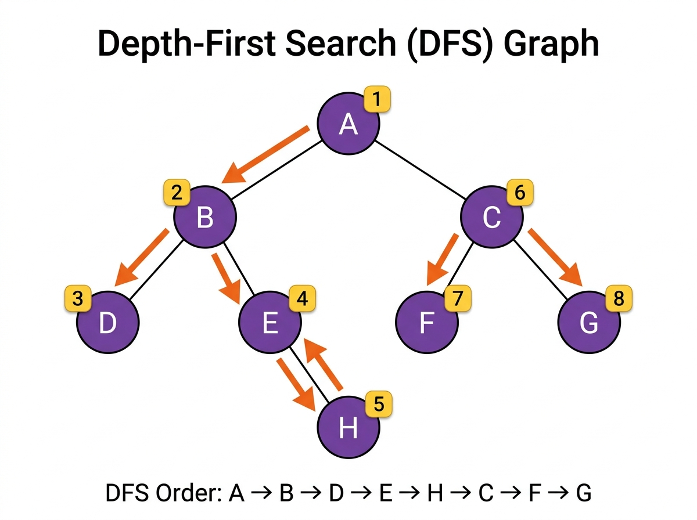

# Experiment 3: Depth First Search (DFS)

## Aim

To implement the Depth-First Search (DFS) algorithm to traverse a graph by exploring as far as possible along each branch before backtracking, using an explicit stack.

## Algorithm

1. Push start node onto a stack.
2. While stack is not empty:
   - Pop top node.
   - If not visited: mark visited, record in order.
   - Push unvisited neighbors in reverse order.
3. Return traversal order.

## Procedure

1. Navigate to the experiment folder.
2. Run: `python dfs.py`
3. The program performs DFS on a predefined graph starting from node `A`.
4. Observe the branch-by-branch traversal order.

## Source Code

Refer to file: `dfs.py`

## Output




### Graph Structure

```
              (A)
             /   \
           (B)   (C)
          / \   / \
        (D) (E)(F) (G)
              |
             (H)
```

### DFS Stack Trace

```
Start   Stack: [A]
Step 1: Pop A -> visit A   Stack: [C, B]
Step 2: Pop B -> visit B   Stack: [C, E, D]
Step 3: Pop D -> visit D   Stack: [C, E]
Step 4: Pop E -> visit E   Stack: [C, H]
Step 5: Pop H -> visit H   Stack: [C]
Step 6: Pop C -> visit C   Stack: [G, F]
Step 7: Pop F -> visit F   Stack: [G]
Step 8: Pop G -> visit G   Stack: []
```

### DFS Tree (Branch exploration)

```
     (A)
    /    \
  (B)    (C)      <- Branch B explored fully first
  / \
(D) (E)
      \
      (H)         <- Then branch C
        \
        (F)
          \
          (G)
```

### Traversal Path

```
A -> B -> D -> E -> H -> C -> F -> G
```

### Terminal Output

```
Starting DFS traversal from node 'A'...

DFS Traversal Order:
A -> B -> D -> E -> H -> C -> F -> G
```
