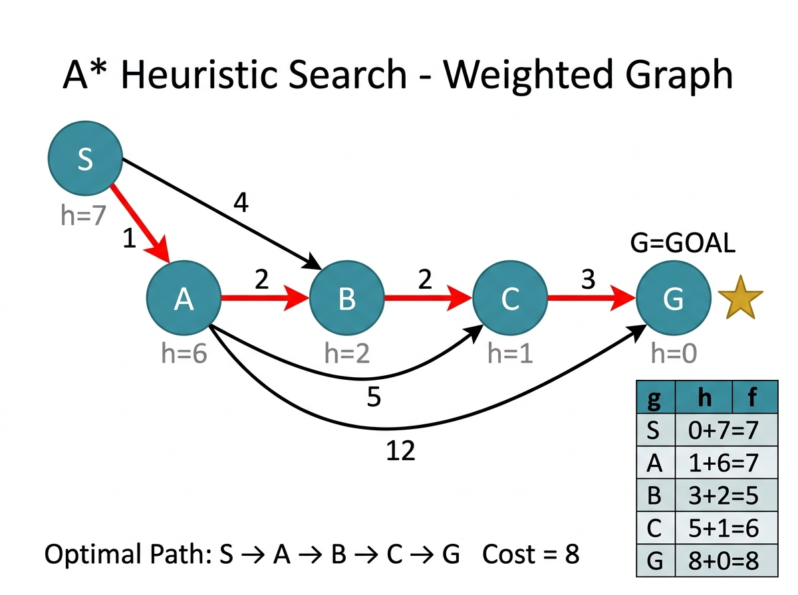

# Experiment 4: Heuristic Search (A* Algorithm)

## Aim

To implement the A* heuristic search algorithm to find the optimal (least-cost) path from source to goal using f(n) = g(n) + h(n).

## Algorithm

1. Push (f(start), g=0, start, [start]) into min-heap.
2. While heap is not empty:
   - Pop state with smallest f(n).
   - If goal reached, return path and cost.
   - For each neighbor with edge cost c:
     - tentative_g = g(current) + c
     - If better than known, push updated state.
3. Return empty if unreachable.

## Procedure

1. Navigate to the experiment folder.
2. Run: `python heuristic_search.py`
3. The program finds the optimal path from node `S` to node `G`.
4. Observe the optimal path and total cost.

## Source Code

Refer to file: `heuristic_search.py`

## Output




### Weighted Graph

```
        S
       / \
     1/   \4
     /     \
    A-------B
     \    2/ \2
     5\  /   \
       \/     C
        \    /3
       12\  /
          G (GOAL)
```

### Edge List

```
S --1--> A
S --4--> B
A --2--> B
A --5--> C
A --12-> G
B --2--> C
C --3--> G
```

### Heuristic Values h(n)

| Node | h(n) |
|------|------|
|  S   |  7   |
|  A   |  6   |
|  B   |  2   |
|  C   |  1   |
|  G   |  0   |

### A* Cost Table

| Step | Node | g(n) | h(n) | f(n) | Action        |
|------|------|------|------|------|---------------|
|  1   |  S   |  0   |  7   |  7   | Start         |
|  2   |  A   |  1   |  6   |  7   | Expand S -> A |
|  3   |  B   |  3   |  2   |  5   | Expand A -> B |
|  4   |  C   |  5   |  1   |  6   | Expand B -> C |
|  5   |  G   |  8   |  0   |  8   | GOAL REACHED  |

### Optimal Path

```
S -> A -> B -> C -> G     (Total Cost = 8)
```

### Terminal Output

```
Starting A* Search from 'S' to 'G'...

A* Search Traversal Path:
S -> A -> B -> C -> G
Total Path Cost: 8
```
