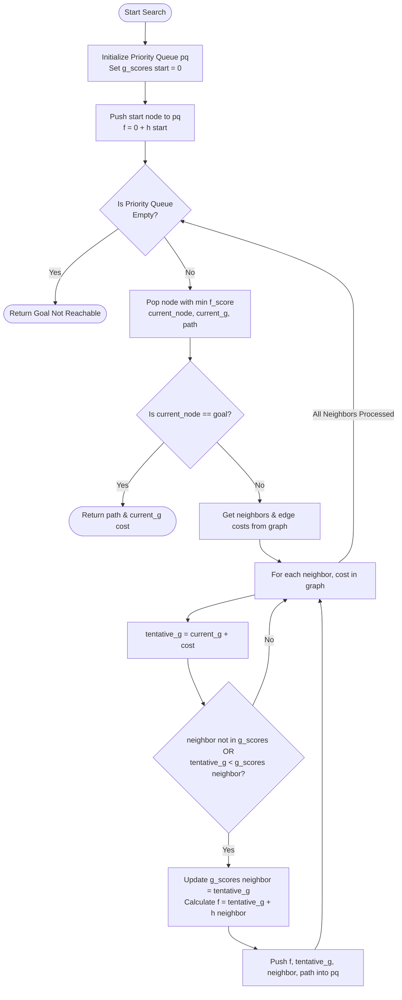
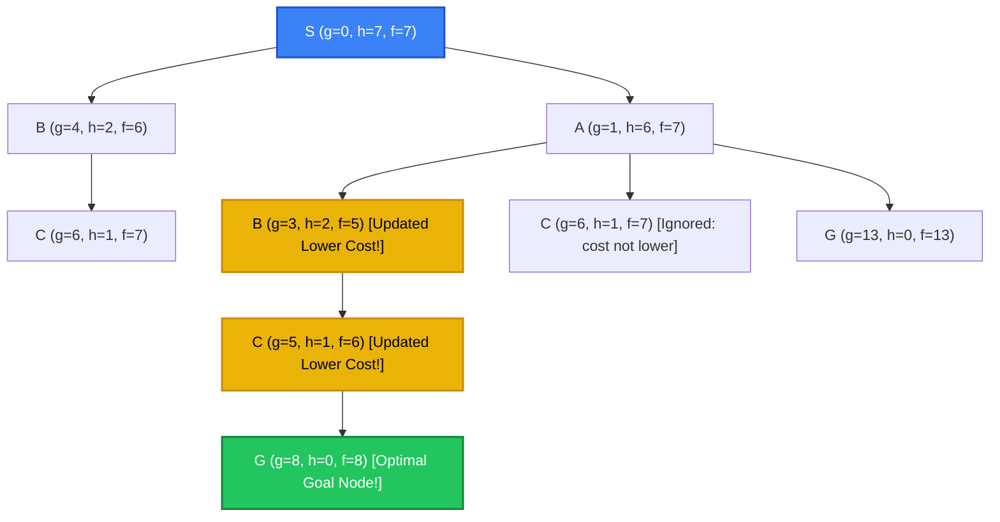
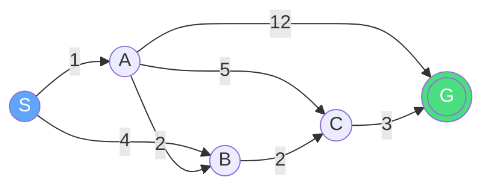
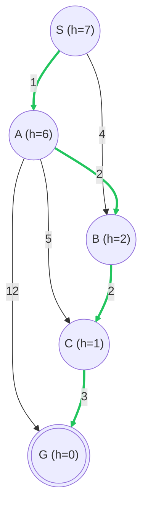

# Experiment 4: Heuristic Search (Hill Climbing / Local Search)

## Aim
To study, analyze, and implement Heuristic Search algorithms—focusing on Local Search optimization (Hill Climbing concepts) and Informed Pathfinding (A* Search Algorithm)—in Python to navigate complex state space landscapes and identify optimal solutions efficiently.

## Objective
1. **Understand Heuristic Evaluation**: Learn how domain-specific knowledge represented as heuristic functions $h(n)$ can drastically prune state space search trees compared to uninformed search strategies.
2. **Master Local Optimization & Landscapes**: Explore local search techniques (Hill Climbing variants) and understand state space landscape concepts such as objective functions, global maxima, local maxima, plateaus, and ridges.
3. **Implement A* Search Algorithm**: Write a robust Python implementation of A* search using a min-heap priority queue to combine actual path cost $g(n)$ and estimated goal distance $h(n)$.
4. **Analyze Heuristic Properties**: Evaluate the necessity of *admissibility* ($h(n) \le h^*(n)$) and *consistency/monotonicity* ($h(n) \le c(n, a, n') + h(n')$) for guaranteeing search optimality.
5. **Compare Search Paradigms**: Contrast local search optimization (which evaluates current state transitions without storing paths) with pathfinding heuristic search (which maintains explicit paths to target goal states).

---

## Theory

### 1. Introduction to Heuristic Search & Objective Functions
In Artificial Intelligence, search problems involve finding a sequence of actions or an optimal state within a large space of possibilities (the **state space**). Uninformed search techniques (such as Breadth-First Search or Depth-First Search) explore states systematically without any domain knowledge regarding how close a state is to the desired goal. Consequently, their time and space complexities grow exponentially with depth, rendering them intractable for complex real-world problems.

**Heuristic Search** (also known as *informed search*) solves this efficiency bottleneck by introducing a **heuristic function** $h(n)$. A heuristic is a practical rule of thumb, estimation, or domain-specific calculation that estimates the cost or distance from a given state $n$ to the nearest goal state. 

In optimization problems, state space evaluation relies on an **Objective Function** $f(n)$ or fitness score. The goal of local search is to maximize (or minimize) this objective function over the state space landscape.

---

### 2. Local Search and Hill Climbing Paradigms
Unlike systematic tree or graph search algorithms that explore paths from a start node to a goal node, **Local Search algorithms** operate solely on the *current state* and move incrementally to neighboring states. They do not maintain search trees or execution histories, making them exceptionally memory-efficient ($O(1)$ space complexity).

#### The Hill Climbing Search Algorithm
**Hill Climbing** is the quintessential local search algorithm. It works iteratively by starting at an arbitrary initial state and continuously moving in the direction of increasing value (or decreasing cost)—analogous to climbing a hill in a dense fog until reaching a peak.

There are four primary variants of Hill Climbing:
1. **Simple Hill Climbing**: Evaluates neighbor states one by one and immediately transitions to the *first* neighboring state whose objective score is strictly better than the current state.
2. **Steepest-Ascent Hill Climbing**: Evaluates *all* candidate neighbors in the local neighborhood and selects the single neighbor that yields the *maximum* improvement in the objective score.
3. **Stochastic Hill Climbing**: Selects randomly among the uphill moves. The probability of choosing a particular neighbor can depend on the steepness of the improvement.
4. **First-Choice Hill Climbing**: Implements stochastic search by generating neighbors randomly until one is found that is better than the current state.

---

### 3. Topographical Pitfalls in State Space Landscapes
Because local search algorithms make strictly local decisions based on immediate neighbors, they are vulnerable to specific structural anomalies in the state space terrain:

```text
                  Global Maximum
                       /\
                      /  \
      Local Maximum  /    \      Plateau / Shoulder
           /\       /      \    ┌────────────────┐
          /  \     /        \   │                │
         /    \___/          \__/                \___ Ridge Peak
        /                                                    \
       /                                                      \
State Space Terrain ─────────────────────────────────────────────► State
```

1. **Local Maxima**: A local maximum is a state that is higher/better than all of its immediate neighbors, but lower than the global maximum. Once a hill climbing search reaches a local maximum, every single neighbor state yields a lower objective score. The algorithm falsely concludes that it has reached the optimal peak and terminates prematurely.
2. **Plateaus (Flat Local Maxima & Shoulders)**: A plateau is a flat region of the state space landscape where all neighboring states have the exact same evaluation score. 
   - A **flat local maximum** is a flat peak from which no uphill exit exists.
   - A **shoulder** is a flat tableland that eventually leads upward.
   On a plateau, the algorithm receives no directional signal from its neighbors, leading to blind random selection or early termination.
3. **Ridges**: A ridge is a continuous sequence of local maxima connected together, forming a narrow elevated crest. The steep incline lies in a direction diagonal to the axis of allowable single-variable moves. Because local search only evaluates moves along orthogonal step axes, every single single-step move from a ridge point goes *downhill*, causing the search to stall even though an overall uphill path exists.

#### Mitigation Strategies for Topographical Failure
To overcome local maxima, plateaus, and ridges, several advanced local search algorithms were developed:
- **Random-Restart Hill Climbing**: Conducts a series of independent hill-climbing searches from randomly generated initial states, keeping track of the overall best peak found. It is complete with high probability over sufficient restarts.
- **Simulated Annealing**: Inspired by metallurgy, Simulated Annealing allows occasional "downhill" moves to escape local maxima. The probability $P$ of accepting a worse move decreases over time according to a temperature schedule: $P = e^{-\frac{\Delta E}{T}}$.
- **Tabu Search**: Keeps a short-term memory list ("tabu list") of recently visited states to prevent cycling back to previously explored local regions.

---

### 4. Informed Pathfinding Heuristic Search: A* Search
While local search optimizes static states without saving paths, many AI applications (like robot navigation or map routing) require finding an **optimal path** from start $S$ to goal $G$. This is accomplished by combining path cost tracking with heuristic guidance via the **A* Search Algorithm**.

#### Mathematical Formulation of A*
A* evaluates candidate nodes $n$ in a search graph using a combined evaluation function $f(n)$:

$$f(n) = g(n) + h(n)$$

Where:
- $g(n)$: The exact cumulative cost incurred from the start node $S$ to the current node $n$.
- $h(n)$: The estimated heuristic cost from node $n$ to the target goal node $G$.
- $f(n)$: The estimated total cost of the cheapest path passing through node $n$ from $S$ to $G$.

#### Theoretical Guarantees: Admissibility and Consistency
1. **Admissibility**: A heuristic function $h(n)$ is admissible if it **never overestimates** the actual true minimal cost $h^*(n)$ required to reach the goal state:
   $$h(n) \le h^*(n), \quad \forall n$$
   *Theorem*: If $h(n)$ is admissible, A* search using tree search is guaranteed to be **optimal** (always returns the lowest-cost path).
2. **Consistency (Monotonicity)**: A heuristic $h(n)$ is consistent if, for every node $n$ and every successor node $n'$ generated by action $a$ with edge cost $c(n, a, n')$:
   $$h(n) \le c(n, a, n') + h(n')$$
   *Theorem*: If $h(n)$ is consistent, A* search using graph search never needs to reopen closed nodes, and the sequence of $f(n)$ values popped from the priority queue is non-decreasing.

---

## Algorithm

### A* Heuristic Search Algorithm
1. **Initialize Data Structures**:
   - Create a Priority Queue `pq` (Min-Heap) storing tuples of `(f_score, g_score, current_node, path)`.
   - Create a hash map `g_scores` mapping each visited node to its recorded minimum $g(n)$ cost. Set `g_scores[start] = 0`.
2. **Push Start Node**:
   - Calculate $f(start) = 0 + h(start)$.
   - Push `(h(start), 0, start, [start])` into `pq`.
3. **Search Loop**:
   - While `pq` is not empty:
     1. Pop the entry `(f_score, current_g, current_node, path)` with the lowest $f\_score$.
     2. **Goal Test**: If `current_node == goal`, return `(path, current_g)` as the optimal path and total path cost.
     3. **Explore Neighbors**: For each `(neighbor, cost)` adjacent to `current_node`:
        a. Calculate `tentative_g = current_g + cost`.
        b. If `neighbor` is not in `g_scores` OR `tentative_g < g_scores[neighbor]`:
           - Update `g_scores[neighbor] = tentative_g`.
           - Compute $f = tentative\_g + h(neighbor)$.
           - Push `(f, tentative_g, neighbor, path + [neighbor])` into `pq`.
4. **Termination**:
   - If `pq` becomes empty without reaching the goal, return `([], 0)` indicating no valid path exists.

---

## Procedure
1. **Setup Development Environment**: Open VS Code, PyCharm, or any standard Python 3.x environment.
2. **Directory Structure**: Navigate to `d:\ARTIFICIAL INTELLIGENCE LAB\AI-LAB-JNTUA-R23\Experiment-04-Heuristic-Search`.
3. **Script Creation**: Open or create `heuristic_search.py`.
4. **Code Implementation**: Write the Python code defining the graph adjacency list, heuristic function values, priority queue logic, and `a_star_search()` function.
5. **Execution**: Open the integrated terminal and run:
   ```bash
   python heuristic_search.py
   ```
6. **Output Inspection**: Verify that A* outputs the shortest path `S -> A -> B -> C -> G` with a total path cost of `8`.

---

## Flowchart



---

## Search Tree / Decision Tree / State Space Tree

The state space search tree generated during the execution of A* search on the sample graph:



---

## Graph Representation

### 1. Adjacency Graph Topology


### 2. Hill Climbing State Space Landscape ASCII Diagram
```text
                     [GLOBAL MAXIMUM]
                            /\
                           /  \
       [LOCAL MAXIMUM]    /    \           [PLATEAU / SHOULDER]
             /\          /      \          ┌──────────────────┐
            /  \        /        \         │                  │
           /    \______/          \________│                  \________ [RIDGE]
          /                                                            \
   ______/                                                              \______
  
   [Simple Move]   --> Moves to first neighbor with better h(n)
   [Steepest Move] --> Scans all neighbors and moves to highest h(n) peak
   [Trap]          --> Gets stuck on Local Maxima, Plateaus, or Ridges
```

---

## Input
- **Graph Structure** (Adjacency list with edge weights):
  ```python
  example_graph = {
      'S': [('A', 1), ('B', 4)],
      'A': [('B', 2), ('C', 5), ('G', 12)],
      'B': [('C', 2)],
      'C': [('G', 3)],
      'G': []
  }
  ```
- **Heuristic Table** $h(n)$ (Estimated straight-line cost to goal `G`):
  ```python
  heuristic_values = {
      'S': 7,
      'A': 6,
      'B': 2,
      'C': 1,
      'G': 0
  }
  ```
- **Start Node**: `'S'`
- **Goal Node**: `'G'`

---

## Program

```python
"""
Experiment 04: Heuristic Search (A* Search)
Objective: Implement A* Search algorithm to find the optimal path using both path cost and heuristic.
"""

import heapq

def a_star_search(graph, heuristics, start, goal):
    """
    Function to perform A* Search on a graph.
    
    Args:
        graph (dict): Adjacency list where keys are nodes and values are lists of (neighbor, edge_cost) tuples.
        heuristics (dict): Estimated cost from node to goal.
        start (str): The starting node.
        goal (str): The goal node.
        
    Returns:
        tuple: (path, total_cost)
    """
    # Priority queue stores tuples of (f_score, g_score, current_node, path)
    pq = []
    heapq.heappush(pq, (heuristics[start], 0, start, [start]))
    
    # Dictionary to keep track of the minimum g_score to reach a node
    g_scores = {start: 0}
    
    while pq:
        f_score, current_g, current_node, path = heapq.heappop(pq)
        
        # If we reached the goal, return the path and cost
        if current_node == goal:
            return path, current_g
            
        # Explore neighbors
        for neighbor, cost in graph.get(current_node, []):
            tentative_g = current_g + cost
            
            # If we found a shorter path to neighbor, or neighbor not visited
            if neighbor not in g_scores or tentative_g < g_scores[neighbor]:
                g_scores[neighbor] = tentative_g
                f = tentative_g + heuristics[neighbor]
                heapq.heappush(pq, (f, tentative_g, neighbor, path + [neighbor]))
                
    return [], 0 # No path found

if __name__ == "__main__":
    # Example graph represented as an adjacency list with costs
    # Format: {node: [(neighbor, cost), ...]}
    example_graph = {
        'S': [('A', 1), ('B', 4)],
        'A': [('B', 2), ('C', 5), ('G', 12)],
        'B': [('C', 2)],
        'C': [('G', 3)],
        'G': []
    }
    
    # Example heuristic values (estimated distance to goal 'G')
    heuristic_values = {
        'S': 7,
        'A': 6,
        'B': 2,
        'C': 1,
        'G': 0
    }
    
    start_node = 'S'
    goal_node = 'G'
    print(f"Starting A* Search from '{start_node}' to '{goal_node}'...")
    
    path_found, cost = a_star_search(example_graph, heuristic_values, start_node, goal_node)
    
    print("\nA* Search Traversal Path:")
    if path_found:
        print(" -> ".join(path_found))
        print(f"Total Path Cost: {cost}")
    else:
        print("Goal not reachable.")
```

---

## Output

```text
┌───────────────────────────────────────────────┐
│ Starting A* Search from 'S' to 'G'...         │
│                                               │
│ A* Search Traversal Path:                     │
│ S -> A -> B -> C -> G                         │
│ Total Path Cost: 8                            │
└───────────────────────────────────────────────┘
```

---

## Step-by-Step Execution

| Step | Current Popped Node | Current Path | $g(n)$ | $h(n)$ | $f(n)$ | Neighbors Evaluated | Edge Cost | Tentative $g$ | Priority Queue (`pq`) Status after Step | Decision / Action |
|:---:|:---:|:---:|:---:|:---:|:---:|:---:|:---:|:---:|:---|:---|
| **0** | - | - | - | - | - | - | - | - | `[(7, 0, 'S', ['S'])]` | Push start node `S` |
| **1** | `S` | `['S']` | 0 | 7 | 7 | `A`<br/>`B` | 1<br/>4 | 1<br/>4 | `[(6, 4, 'B', ['S','B']),`<br/>`(7, 1, 'A', ['S','A'])]` | Expand `S`. `g_scores={'S':0, 'A':1, 'B':4}` |
| **2** | `B` | `['S','B']` | 4 | 2 | 6 | `C` | 2 | 6 (4+2) | `[(7, 1, 'A', ['S','A']),`<br/>`(7, 6, 'C', ['S','B','C'])]` | Expand `B`. `g_scores['C']=6` |
| **3** | `A` | `['S','A']` | 1 | 6 | 7 | `B`<br/>`C`<br/>`G` | 2<br/>5<br/>12 | 3 (1+2)<br/>6 (1+5)<br/>13 (1+12) | `[(5, 3, 'B', ['S','A','B']),`<br/>`(7, 6, 'C', ['S','B','C']),`<br/>`(13, 13, 'G', ['S','A','G'])]` | Expand `A`. Tentative $g(B)=3 < 4$, update `B`! |
| **4** | `B` | `['S','A','B']` | 3 | 2 | 5 | `C` | 2 | 5 (3+2) | `[(6, 5, 'C', ['S','A','B','C']),`<br/>`(7, 6, 'C', ['S','B','C']),`<br/>`(13, 13, 'G', ['S','A','G'])]` | Expand `B`. Tentative $g(C)=5 < 6$, update `C`! |
| **5** | `C` | `['S','A','B','C']` | 5 | 1 | 6 | `G` | 3 | 8 (5+3) | `[(7, 6, 'C', ['S','B','C']),`<br/>`(8, 8, 'G', ['S','A','B','C','G']),`<br/>`(13, 13, 'G', ['S','A','G'])]` | Expand `C`. Push `G` with $f=8+0=8$. |
| **6** | `C` | `['S','B','C']` | 6 | 1 | 7 | - | - | - | `[(8, 8, 'G', ['S','A','B','C','G']),`<br/>`(13, 13, 'G', ['S','A','G'])]` | Stale node! $g=6 > g_{scores}[C]=5$. Discard. |
| **7** | `G` | `['S','A','B','C','G']`| 8 | 0 | 8 | - | - | - | `[(13, 13, 'G', ['S','A','G'])]` | **Goal `G` reached!** Return optimal path and cost `8`. |

---

## Visualization

### 1. Heuristic Values Table
| Node ($n$) | Description / State Role | Heuristic Value $h(n)$ | True Minimal Distance to Goal $h^*(n)$ | Admissibility Check ($h(n) \le h^*(n)$) |
|:---:|:---|:---:|:---:|:---:|
| **S** | Start Node | **7** | 8 (via S-A-B-C-G) | $\checkmark$ Admissible ($7 \le 8$) |
| **A** | Primary Branch | **6** | 7 (via A-B-C-G) | $\checkmark$ Admissible ($6 \le 7$) |
| **B** | Secondary Branch | **2** | 5 (via B-C-G) | $\checkmark$ Admissible ($2 \le 5$) |
| **C** | Pre-Goal Node | **1** | 3 (via C-G) | $\checkmark$ Admissible ($1 \le 3$) |
| **G** | Target Goal State | **0** | 0 | $\checkmark$ Admissible ($0 \le 0$) |

---

### 2. Search Graph Visualization


---

### 3. Decision Tree Analysis
```text
                       [S: f=7]
                      /        \
             (g=1)   /          \ (g=4)
                    v            v
               [A: f=7]        [B: f=6] <-- Expanded First! (f=6 < 7)
               /   |   \           |
         (g=3)/ (g=6)\  \(g=13)    |(g=6)
             v        v   v        v
        [B: f=5]    [C]  [G]    [C: f=7]
           |
     (g=5) |
           v
        [C: f=6]
           |
     (g=8) |
           v
   [G: f=8 (GOAL REACHED!)]
```

---

### 4. Node Comparison Chart
```text
 Node  │ g(n) Cost │ h(n) Heuristic │ f(n) Score │ Expanded Order │ Included in Optimal Path?
───────┼───────────┼────────────────┼────────────┼────────────────┼───────────────────────────
   S   │     0     │       7        │     7      │       1st      │        YES (Start)
   A   │     1     │       6        │     7      │       3rd      │        YES
   B   │     3     │       2        │     5      │     2nd, 4th   │        YES
   C   │     5     │       1        │     6      │     5th, 6th   │        YES
   G   │     8     │       0        │     8      │   7th (Target) │        YES (Goal)
```

---

## Complexity Analysis

### 1. Local Search (Hill Climbing)
- **Time Complexity**:
  - *Best Case*: $O(1)$ — If the initial state is already a local/global peak.
  - *Worst Case*: $O(b \times m)$ — Where $b$ is the branching factor (number of neighbors per state) and $m$ is the maximum step length of the path to a peak. In infinite continuous state spaces, it can run indefinitely or get stuck in infinite loops.
- **Space Complexity**: $O(1)$ — Auxiliary space is constant because hill climbing only maintains the current state and its immediate neighbors without saving search trees or path histories.

### 2. Informed Pathfinding (A* Search)
- **Time Complexity**:
  - *Worst Case*: $O(b^d)$ — Where $b$ is the branching factor and $d$ is the depth of the optimal path. If the heuristic function is uninformative ($h(n) = 0$), A* degrades into Dijkstra's Algorithm (Uniform-Cost Search).
  - *Best Case / Absolute Heuristic*: $O(d)$ — When the heuristic function is perfect ($h(n) = h^*(n)$), A* navigates directly to the goal without expanding any extraneous nodes.
  - *Relative Error Bound*: $O(b^{\epsilon \cdot d})$, where $\epsilon = \frac{|h*(n) - h(n)|}{h*(n)}$ is the relative error of the heuristic.
- **Space Complexity**:
  - $O(b^d)$ — A* retains all generated nodes in memory within the Priority Queue and `g_scores` dictionary to guarantee optimality and handle edge relaxation. Memory consumption is typically the primary practical constraint for A*.

---

## Advantages

1. **Informed Efficiency**: Heuristic guidance drastically reduces search space tree expansion compared to blind searches like BFS and DFS.
2. **Guaranteed Optimality**: When paired with an admissible heuristic ($h(n) \le h^*(n)$), A* is mathematically guaranteed to identify the least-cost path.
3. **Optimally Efficient**: No other informed algorithm using the exact same heuristic function will expand fewer nodes than A* while guaranteeing optimal path discovery.
4. **Memory-Minimal Local Search**: Local search strategies (Hill Climbing) require only $O(1)$ memory, enabling optimization across massive state spaces.
5. **Flexible Objective Functions**: Hill climbing can optimize arbitrary continuous or discrete non-linear objective functions without requiring gradient derivative calculations.
6. **Path Cost Integration**: A* balances historical path cost $g(n)$ and projected remaining distance $h(n)$, preventing greedy sub-optimal traps.
7. **Graph Search Adaptability**: Easily handles arbitrary graph topologies with directed, undirected, and non-uniform weighted edges.
8. **Re-Open Node Elimination**: Under consistent heuristics, A* processes each node at most once without needing costly node re-openings.
9. **Anytime Algorithm Capability**: Local search algorithms can be stopped at any moment to yield the current best state found so far.
10. **Scalability with Random Restarts**: Random-Restart Hill Climbing effectively scales to escape local maxima and locate global optimal solutions.

---

## Disadvantages

1. **High Memory Overhead in A***: Retaining all visited nodes in memory ($O(b^d)$ space complexity) often causes Out-Of-Memory (OOM) errors on vast graphs (e.g., Rubik's Cube or Chess state spaces).
2. **Local Maxima Traps**: Simple Hill Climbing fails on non-convex state space landscapes by getting permanently trapped in sub-optimal local peaks.
3. **Plateau Wandering**: On flat objective landscapes, local search algorithms lose direction and wander aimlessly due to zero objective gradients.
4. **Ridge Failure**: Hill climbing cannot navigate narrow diagonal ridges using single-variable orthogonal moves.
5. **Heuristic Dependence**: The execution speed and performance of A* depend heavily on heuristic quality. A poorly designed or overestimating heuristic destroys optimality or degrades performance to Dijkstra's algorithm.

---

## Applications

1. **GPS Route Navigation & Mapping**: Computing optimal driving routes in services like Google Maps, Apple Maps, and Waze.
2. **Video Game Pathfinding**: Controlling non-player character (NPC) and unit movement across navmeshes in game engines (Unity, Unreal Engine).
3. **Robotics Motion Planning**: Enabling autonomous mobile robots (AMRs) to navigate obstacle-strewn environments while minimizing energy consumption.
4. **VLSI Integrated Circuit Routing**: Routing optimal wire traces on silicon printed circuit boards (PCBs) without electrical signal overlap.
5. **Logistics & Fleet Dispatching**: Solving Vehicle Routing Problems (VRP) and optimizing last-mile delivery routes for logistics carriers.
6. **Network Packet Routing**: Computing shortest data routing paths across autonomous internet backbones (OSPF protocol variants).
7. **8-Puzzle & 15-Puzzle Solvers**: Finding minimal sequence moves to solve sliding tile puzzles.
8. **Automated Structural Bioinformatics**: Modeling protein folding pathways to identify minimal free energy configurations.
9. **Airline Flight Scheduling**: Optimizing flight trajectories and crew scheduling patterns across international air networks.
10. **Natural Language Machine Translation**: Beam search decoding and sequence parsing in NLP models.
11. **Financial Portfolio Optimization**: Finding optimal asset allocations across non-convex risk-return investment landscapes.
12. **Industrial Job-Shop Scheduling**: Optimizing machine assembly line operations to minimize total manufacturing makespan.
13. **Telecommunication Tower Placement**: Optimizing wireless cell tower coordinates for maximum coverage and minimal interference.
14. **DNA Sequence Alignment**: Computing optimal global alignment sequences in computational genomics.
15. **Game Playing AI Engines**: Evaluating game state trees in Chess, Checkers, and Go backbones.

---

## Real World Use Cases

### Case Study 1: Google Maps Navigational Engine
Google Maps processes hundreds of millions of routing queries daily across global road networks. Rather than running unguided Dijkstra search across millions of intersections, Google Maps uses hierarchical variants of A* search (such as Contraction Hierarchies and Landmark Heuristics). The actual travel distance or travel time represents path cost $g(n)$, while Euclidean distance or straight-line time estimate serves as the admissible heuristic $h(n)$, reducing route computation time from seconds to milliseconds.

### Case Study 2: Amazon Kiva Warehouse Mobile Robots
Inside Amazon fulfillment centers, thousands of autonomous drive units navigate warehouse floors to transport inventory pods to picking stations. Each robot relies on A* search grid pathfinding integrated with dynamic collision avoidance heuristics to calculate shortest paths, avoid static shelf obstacles, and dynamically yield to cross-traffic robots.

---

## Viva Questions with Answers

### Q1: What is the core difference between Informed (Heuristic) Search and Uninformed Search?
**Answer**: Uninformed search (e.g., BFS, DFS) explores the search space blindly using only problem definition rules. Informed search uses domain-specific heuristic knowledge $h(n)$ to estimate remaining distance to the goal, directing exploration towards promising states and significantly improving search efficiency.

---

### Q2: Define the evaluation function used in A* Search and explain its components.
**Answer**: In A* search, $f(n) = g(n) + h(n)$:
- $g(n)$ is the exact cumulative cost incurred to reach node $n$ from the start node $S$.
- $h(n)$ is the estimated heuristic cost to reach the goal $G$ from node $n$.
- $f(n)$ represents the estimated total cost of the cheapest path from start to goal passing through node $n$.

---

### Q3: What is an Admissible Heuristic? Why is it mandatory for A* Optimality?
**Answer**: A heuristic $h(n)$ is admissible if it never overestimates the actual minimal cost $h^*(n)$ to reach the goal ($h(n) \le h^*(n)$). Admissibility ensures that A* will never overlook a true optimal path by mistakenly overestimating its remaining cost.

---

### Q4: What is a Consistent (Monotonic) Heuristic?
**Answer**: A heuristic is consistent if for every node $n$ and every neighbor $n'$ generated by action $a$ with step cost $c(n, a, n')$:
$$h(n) \le c(n, a, n') + h(n')$$
Consistency guarantees that the $f$-values along any path are non-decreasing, ensuring that when a node is expanded, its calculated path cost is optimal, eliminating the need to reopen closed nodes.

---

### Q5: Explain the major pitfalls encountered by Simple Hill Climbing search.
**Answer**:
1. **Local Maxima**: Peaks that are higher than surrounding neighbors but lower than the global optimum.
2. **Plateaus**: Flat regions of equal objective score where search receives zero gradient guidance.
3. **Ridges**: Narrow elevated crests where orthogonal single-step moves lead downhill.

---

### Q6: How does Random-Restart Hill Climbing resolve the Local Maxima problem?
**Answer**: Random-Restart Hill Climbing conducts a series of independent local hill-climbing searches starting from randomly generated initial states across the state space. By sampling multiple initial points, it eventually selects a starting basin that leads directly to the global maximum.

---

### Q7: What happens to A* Search if $h(n) = 0$ for all nodes?
**Answer**: If $h(n) = 0$, $f(n) = g(n) + 0 = g(n)$. A* search degrades into **Dijkstra's Algorithm** (Uniform-Cost Search), expanding nodes purely based on cumulative path cost without any heuristic guidance.

---

### Q8: Compare the Space Complexity of Hill Climbing and A* Search.
**Answer**:
- **Hill Climbing**: $O(1)$ constant space complexity because it only retains the current state and immediate neighbors in memory.
- **A* Search**: $O(b^d)$ exponential space complexity because it keeps all generated open and closed nodes in memory (in priority queues and hash tables) to guarantee optimality.

---

### Q9: How does Simulated Annealing escape local maxima?
**Answer**: Simulated Annealing permits occasional "downhill" (worse) moves with a probability $P = e^{-\frac{\Delta E}{T}}$. Early in the search (high Temperature $T$), it frequently accepts worse moves to explore the state space. As $T$ decays toward 0, it gradually converges into pure hill climbing.

---

### Q10: What data structure is used to implement the Open List in A* Search, and why?
**Answer**: A **Min-Heap Priority Queue** (`heapq` in Python) is used. It allows $O(1)$ extraction of the node with the minimum $f(n)$ value and $O(\log N)$ insertion of newly generated neighbor nodes, maximizing search performance.

---

## Conclusion
Experiment 04 successfully demonstrated the theory, mechanics, and implementation of Heuristic Search paradigms. The experiment highlighted how local search algorithms (Hill Climbing) optimize state space objective functions using minimal memory, while detailing their structural vulnerabilities to local maxima, plateaus, and ridges. Furthermore, the implementation of the A* search algorithm illustrated how integrating path cost $g(n)$ and admissible heuristic estimation $h(n)$ guarantees optimal pathfinding efficiency. Informed search techniques form the backbone of modern automated reasoning, computational pathfinding, and industrial optimization systems.
