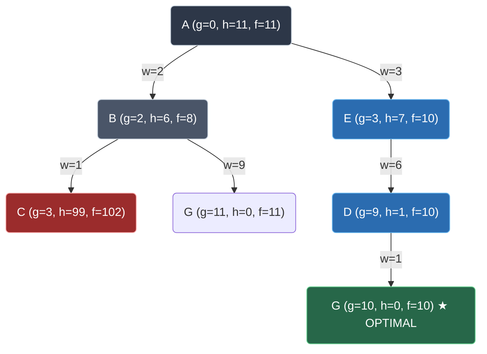
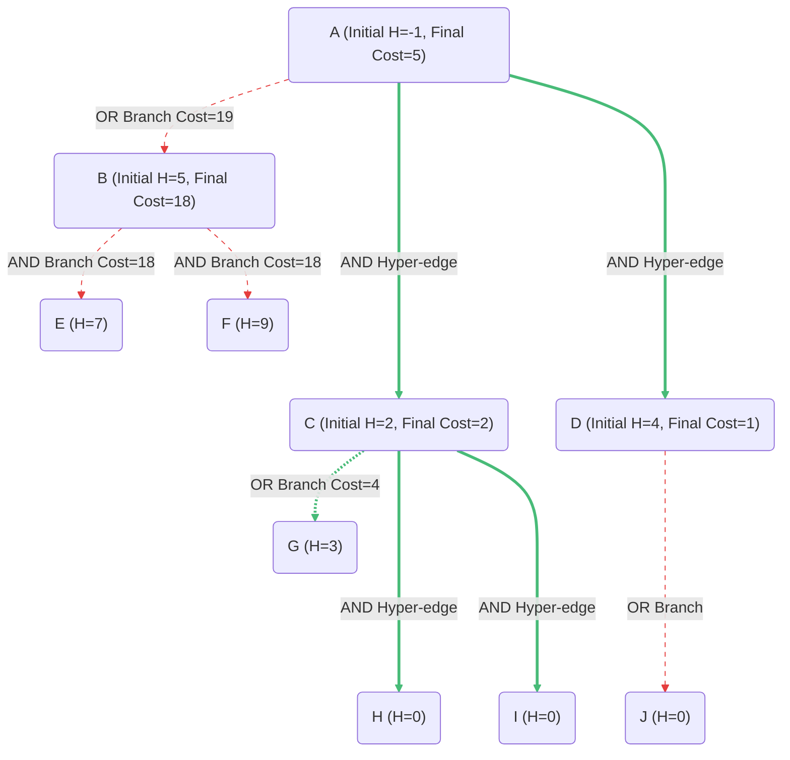
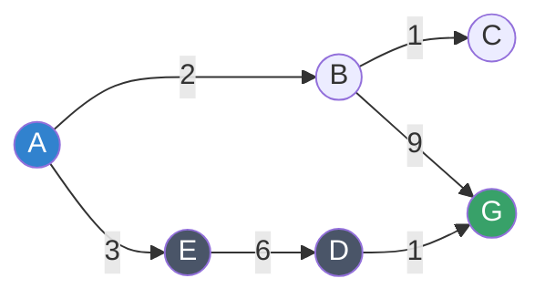
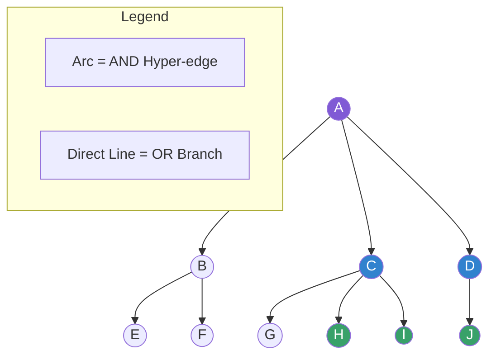
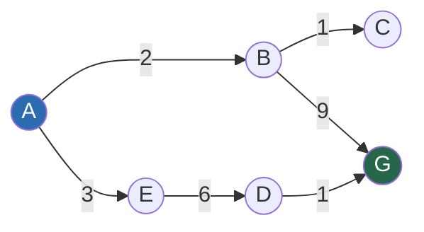
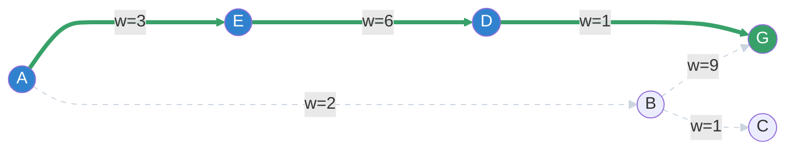
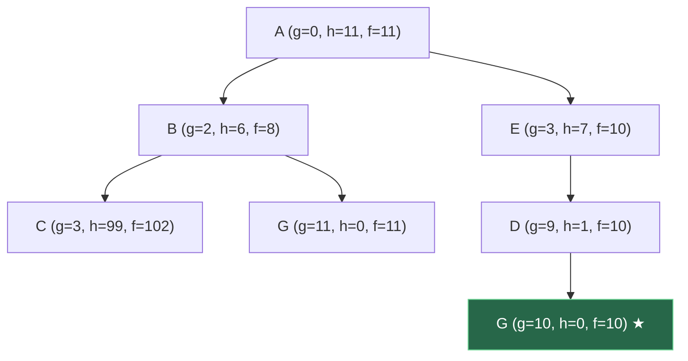
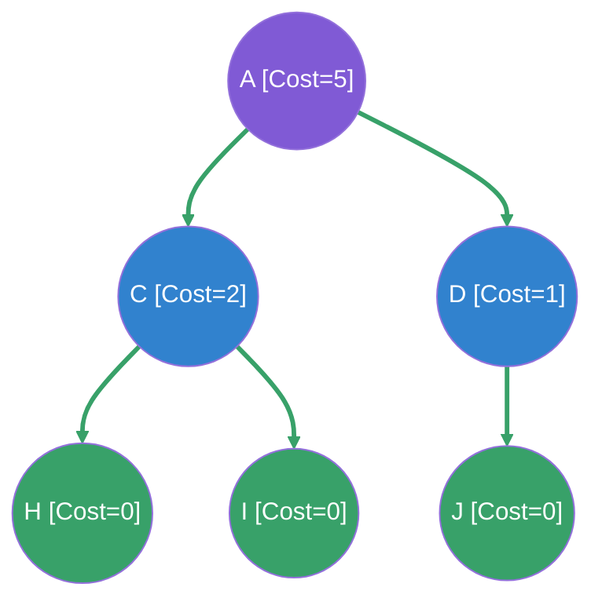

# Experiment 5: A* and AO* Search Algorithms

## Aim
To understand, design, and implement the **A* (A-Star)** search algorithm for optimal pathfinding in weighted graphs and the **AO* (AO-Star)** search algorithm for problem reduction in AND-OR graphs using Python.

---

## Objective
1. **Understand Heuristic-Guided Search:** Study informed search techniques that combine path costs and heuristic estimates to navigate state spaces efficiently.
2. **Implement A* Search Algorithm:** Develop a pathfinding program for standard OR graphs that guarantees finding the optimal (shortest) path when provided with an admissible heuristic.
3. **Implement AO* Search Algorithm:** Develop a problem reduction algorithm capable of identifying optimal solution subgraphs within AND-OR graph structures.
4. **Analyze Heuristic Properties:** Examine the mathematical principles of **admissibility** ($h(n) \le h^*(n)$) and **consistency/monotonicity** ($h(n) \le c(n, a, n') + h(n')$).
5. **Evaluate Performance Metrics:** Compare time complexity, space complexity, and memory requirements of A* and AO* search strategies.

---

## Theory

### 1. Introduction to Informed Search Algorithms
In Artificial Intelligence, search algorithms are categorized into **uninformed (blind) search** (e.g., Breadth-First Search, Depth-First Search) and **informed (heuristic) search**. Uninformed search methods explore the search space systematically without any prior knowledge about the distance to the target goal. Consequently, they often evaluate an excessive number of irrelevant states, leading to exponential time and space requirements.

Informed search algorithms address this bottleneck by utilizing domain-specific knowledge represented as a **heuristic function**, denoted as $h(n)$. The heuristic function estimates the remaining cost from a given state $n$ to the nearest goal state. By combining heuristic guidance with known path costs, algorithms like A* and AO* focus exploration towards promising regions of the search space.

---

### 2. A* Search Algorithm
The **A* (A-Star)** algorithm, formulated by Peter Hart, Nils Nilsson, and Bertram Raphael in 1968, is a graph traversal and path planning algorithm. It extends Dijkstra's Algorithm by incorporating heuristic evaluation to guide search direction while maintaining optimality.

#### 2.1 The Evaluation Function
At any node $n$, A* evaluates the total estimated cost of an optimal path constrained to pass through $n$:

$$f(n) = g(n) + h(n)$$

Where:
- $n$: The current state or node under evaluation.
- $g(n)$: The exact cost incurred from the start node $s$ to node $n$.
- $h(n)$: The estimated cost from node $n$ to the target goal node $g$.
- $f(n)$: The total estimated cost of the path from start node $s$ to goal node $g$ via node $n$.

#### 2.2 Admissibility
A heuristic function $h(n)$ is defined as **admissible** if it never overestimates the true minimal cost to reach the goal state. Mathematically, for every node $n$:

$$0 \le h(n) \le h^*(n)$$

Where $h^*(n)$ represents the actual true cost of the optimal path from node $n$ to the goal. When $h(n)$ is admissible, A* search using tree-search (or graph-search with re-opening) is guaranteed to return an optimal (shortest) path.

#### 2.3 Consistency (Monotonicity)
A heuristic function $h(n)$ is defined as **consistent** (or **monotonic**) if, for every node $n$ and every successor $n'$ generated by taking action $a$ with step cost $c(n, a, n')$, the estimated cost satisfies the triangle inequality:

$$h(n) \le c(n, a, n') + h(n')$$

Additionally, for any goal state $g$, $h(g) = 0$. Consistency is a stronger condition than admissibility: every consistent heuristic is admissible, but not all admissible heuristics are consistent. When $h(n)$ is consistent, the $f(n)$ values along any path are non-decreasing ($f(n') \ge f(n)$), ensuring that when a node is expanded from the OPEN set, its optimal path cost $g(n)$ is already finalized.

---

### 3. AO* Search Algorithm
While the A* algorithm operates on standard state-space graphs (often termed **OR graphs**), many complex AI problems—such as symbolic integration, game playing, rule-based reasoning, and task decomposition—require solving multiple interdependent subproblems concurrently. These problems are modeled using **AND-OR graphs**.

```
    OR Node (Choice)               AND Node (Decomposition)
        ( A )                            ( A )
       /     \                          /  ^  \
      /       \                        /   |   \
    (B)       (C)                    (B)  Arc  (C)
  [Solve B OR C]                    [Solve B AND C]
```

#### 3.1 Structure of AND-OR Graphs
- **OR Nodes:** Represent alternative choices or pathways. To solve an OR node $A$ with children $\{B, C\}$, it suffices to solve **either** $B$ **or** $C$.
- **AND Nodes:** Represent problem decomposition. To solve an AND node $A$ with children $\{B, C\}$ connected by an arc, one must solve **both** $B$ **and** $C$.

#### 3.2 AO* Hyper-Edges
In graph theory terms, an AND-OR graph is a **hypergraph**, where edges are **hyper-edges** connecting a parent node to a set of child nodes. A single hyper-edge branching from parent node $P$ to tuple $(C_1, C_2, \dots, C_k)$ indicates that selecting this branch requires conquering all sub-goals $C_1$ through $C_k$.

#### 3.3 AO* Operation & Bottom-Up Cost Revision
Unlike A*, which explores single candidate paths using OPEN and CLOSED priority queues, the **AO*** algorithm maintains a **partial solution tree**. AO* alternates between two major phases:
1. **Top-Down Graph Expansion:** Un-expanded leaf nodes in the current best partial solution tree are expanded by generating their branches.
2. **Bottom-Up Cost Revision (Backpropagation):** The heuristic costs $H(n)$ of parent nodes are recursively updated starting from the leaves up to the root node $A$:
   - For an **OR branch** with child $C_i$ and edge cost $w$:
     $$\text{Cost} = H(C_i) + w$$
   - For an **AND hyper-edge** with children $(C_1, C_2, \dots, C_k)$ and step weight $w$:
     $$\text{Cost} = \sum_{i=1}^{k} \left[ H(C_i) + w \right]$$

The algorithm selects the minimum cost among all available branch alternatives at each parent node, updating the optimal path pointer to track the minimal cost solution structure.

---

## Algorithm

### 1. A* Search Algorithm
```text
Input: Weighted Graph G = (V, E), Heuristic Table H, Start Node s, Goal Node g
Output: Optimal path sequence and total cost

1. Initialize OPEN set as a priority queue containing start node s:
   OPEN = { (s, g(s)=0, h(s), f(s)=g(s)+h(s)) }
2. Initialize CLOSED set as empty set: CLOSED = {}
3. Initialize parent pointer dictionary: parent[s] = s
4. Initialize g_score dictionary: g_score[s] = 0, g_score[v] = infinity for all v != s

5. WHILE OPEN set is not empty:
   a. Select node u from OPEN with the minimum evaluation value f(u).
   b. IF u == g THEN
         Reconstruct path by backtracking parent pointers from g to s.
         RETURN path and g_score[g].
   c. Remove u from OPEN set and insert u into CLOSED set.
   d. FOR EACH neighbor v of u with edge weight w(u, v):
         i. IF v is in CLOSED set THEN continue to next neighbor.
         ii. Calculate tentative_g = g_score[u] + w(u, v).
         iii. IF v is not in OPEN set THEN
                 Insert v into OPEN set.
              ELSE IF tentative_g >= g_score[v] THEN
                 Continue (found path is not strictly better).
         iv. Set parent[v] = u.
         v. Set g_score[v] = tentative_g.
         vi. Set f(v) = g_score[v] + h(v).

6. RETURN Failure (No path exists from s to g).
```

---

### 2. AO* Search Algorithm
```text
Input: AND-OR Graph Structure (Conditions), Initial Heuristics H, Root Node Start
Output: Optimal solution subgraph choice map and total minimal cost

1. Identify all non-terminal nodes present in the Conditions map.
2. Order the main nodes in reverse topological / bottom-up sequence (leaf-adjacent nodes first).
3. FOR EACH node N in reversed main nodes list:
   a. Initialize candidate cost list C = []
   b. FOR EACH branch condition B associated with node N:
         i. IF B is a single node (OR branch) THEN:
               branch_cost = H[B] + weight
         ii. ELSE IF B is a tuple of nodes (C1, C2, ..., Ck) (AND hyper-edge) THEN:
               branch_cost = SUM( H[Ci] + weight for each Ci in tuple )
         iii. Append branch_cost to C.
   c. Determine min_cost = MIN(C).
   d. Update heuristic value H[N] = min_cost.
   e. Record optimal_choice[N] = condition branch that yielded min_cost.
4. Construct optimal path structure starting from Start node using optimal_choice map:
   - IF Start has OR choice to Child: Path = Start -> ShortestPath(Child)
   - IF Start has AND choice to (C1, C2): Path = Start -> (ShortestPath(C1) + ShortestPath(C2))
5. RETURN Updated H[Start], optimal_choice map, and formatted shortest path.
```

---

## Procedure

1. **Environment Setup:** Launch Visual Studio Code or any standard Python IDE. Ensure Python 3.x interpreter is active.
2. **Directory Creation:** Create a project directory named `Experiment-05-A-Star-AO-Star`.
3. **Script Development:**
   - Create `astar.py` inside the directory and implement the graph structure, heuristic table, and A* algorithm loop.
   - Create `aostar.py` inside the directory and implement the AND-OR condition map, heuristic cost updates, and bottom-up AO* solver.
4. **Execution of A* Search:** Run `python astar.py` in the terminal to observe node evaluations, OPEN/CLOSED set operations, and optimal path generation.
5. **Execution of AO* Search:** Run `python aostar.py` in the terminal to inspect bottom-up cost revision across AND/OR nodes and final solution tree extraction.

---

## Flowchart

### A* Algorithm Flowchart
```mermaid
flowchart TD
    Start([Start A* Search]) --> Init[Initialize OPEN = {Start}, CLOSED = {}, g(Start)=0]
    Init --> CheckOpen{Is OPEN empty?}
    CheckOpen -- Yes --> Fail([Return Path Not Found])
    CheckOpen -- No --> SelectMin[Pop node u with lowest f = g + h from OPEN]
    SelectMin --> IsGoal{Is u == Goal?}
    IsGoal -- Yes --> Reconstruct[Reconstruct Path from Parent Pointers] --> Success([Return Path & Total Cost])
    IsGoal -- No --> MoveClosed[Move u from OPEN to CLOSED]
    MoveClosed --> ForNeighbors[For each neighbor v of u with edge weight w]
    ForNeighbors --> InClosed{Is v in CLOSED?}
    InClosed -- Yes --> SkipNeighbor[Skip neighbor v]
    InClosed -- No --> CalcG[tentative_g = g(u) + w]
    CalcG --> CheckG{tentative_g < g(v)?}
    CheckG -- Yes --> UpdateNode[Update parent(v)=u, g(v)=tentative_g, f(v)=g(v)+h(v)<br>Add v to OPEN if not present]
    CheckG -- No --> SkipNeighbor
    UpdateNode --> NextNeighbor{More neighbors?}
    SkipNeighbor --> NextNeighbor
    NextNeighbor -- Yes --> ForNeighbors
    NextNeighbor -- No --> CheckOpen
```

### AO* Algorithm Flowchart
```mermaid
flowchart TD
    StartAO([Start AO* Search]) --> LoadGraph[Load Graph Conditions & Initial Heuristic Array H]
    LoadGraph --> IdentifyNodes[Identify parent nodes & order in reverse topological order]
    IdentifyNodes --> LoopNodes[Select next node N from bottom-up list]
    LoopNodes --> EvaluateBranches[For each condition branch of N: Calculate cost<br>OR branch: H(child) + weight<br>AND branch: Sum(H(child_i) + weight)]
    EvaluateBranches --> FindMin[Select Branch with Minimum Cost]
    FindMin --> UpdateH[Update H(N) = min_cost<br>Store optimal_choice[N] = min_branch]
    UpdateH --> MoreNodes{More nodes to process?}
    MoreNodes -- Yes --> LoopNodes
    MoreNodes -- No --> TracePath[Trace solution structure from Root Node using optimal_choice map]
    TracePath --> EndAO([Output Final Costs & Optimal AND-OR Path Structure])
```

---

## Search Tree / Decision Tree / State Space Tree

### A* Search Tree Expansion


### AO* Decision / Decomposition Tree


---

## Graph Representation

### 1. A* Weighted Graph


### 2. AO* AND-OR Hypergraph


---

## Input

### 1. Input for A* Algorithm (`astar.py`)
- **Weighted Graph Adjacency List:**
  ```python
  graph = {
      'A': {'B': 2, 'E': 3},
      'B': {'C': 1, 'G': 9},
      'C': {},
      'E': {'D': 6},
      'D': {'G': 1},
      'G': {}
  }
  ```
- **Heuristic Table ($h(n)$ straight-line estimate to Goal 'G'):**
  ```python
  heuristics = {
      'A': 11,
      'B': 6,
      'C': 99,
      'D': 1,
      'E': 7,
      'G': 0
  }
  ```
- **Start Node:** `'A'`
- **Goal Node:** `'G'`

---

### 2. Input for AO* Algorithm (`aostar.py`)
- **Initial Heuristic Estimates $H$:**
  ```python
  H = {'A': -1, 'B': 5, 'C': 2, 'D': 4, 'E': 7, 'F': 9, 'G': 3, 'H': 0, 'I': 0, 'J': 0}
  ```
- **AND-OR Conditions Map:**
  *(Lists represent OR alternatives; tuples represent AND hyper-edges requiring all member nodes)*
  ```python
  Conditions = {
      'A': ['B', ('C', 'D')],   # OR B, OR AND(C, D)
      'B': [('E', 'F')],        # AND(E, F)
      'C': ['G', ('H', 'I')],   # OR G, OR AND(H, I)
      'D': ['J']                # OR J
  }
  ```

---

## Program

### File 1: `astar.py`
```python
"""
A* Search Algorithm Implementation

This script demonstrates the A* search algorithm for finding the shortest path
from a start node to a goal node in a weighted graph using heuristics.
"""

def a_star_algorithm(graph, heuristics, start, goal):
    """
    Implements the A* search algorithm.
    
    Args:
        graph (dict): The adjacency list of the graph with edge weights.
        heuristics (dict): The heuristic values for each node.
        start (str): The starting node.
        goal (str): The goal node.
        
    Returns:
        list: The optimal path from start to goal.
    """
    # Open set contains nodes to be evaluated
    open_set = {start}
    # Closed set contains nodes already evaluated
    closed_set = set()
    
    # g_score maps each node to the cost of the cheapest path from start
    g_score = {start: 0}
    # parents keeps track of the path
    parents = {start: start}
    
    while open_set:
        # Find the node with the lowest f(n) = g(n) + h(n) in open_set
        current_node = None
        current_f = float('inf')
        
        for node in open_set:
            # f(n) = g(n) + h(n)
            f_score = g_score.get(node, float('inf')) + heuristics.get(node, float('inf'))
            if f_score < current_f:
                current_node = node
                current_f = f_score
                
        if current_node == goal:
            # We reached the goal, reconstruct the path
            path = []
            while parents[current_node] != current_node:
                path.append(current_node)
                current_node = parents[current_node]
            path.append(start)
            path.reverse()
            return path, current_f
            
        # Move current node from open_set to closed_set
        open_set.remove(current_node)
        closed_set.add(current_node)
        
        # Explore neighbors
        if current_node in graph:
            for neighbor, weight in graph[current_node].items():
                if neighbor in closed_set:
                    continue
                    
                # Tentative g_score for the neighbor
                tentative_g = g_score[current_node] + weight
                
                if neighbor not in open_set:
                    open_set.add(neighbor)
                elif tentative_g >= g_score.get(neighbor, float('inf')):
                    continue # This is not a better path
                    
                # This path is the best so far
                parents[neighbor] = current_node
                g_score[neighbor] = tentative_g
                
    return None, float('inf') # Path not found

if __name__ == "__main__":
    # Example Graph
    graph = {
        'A': {'B': 2, 'E': 3},
        'B': {'C': 1, 'G': 9},
        'C': {},
        'E': {'D': 6},
        'D': {'G': 1},
        'G': {}
    }
    
    # Heuristics (Straight-line distance to goal 'G')
    heuristics = {
        'A': 11,
        'B': 6,
        'C': 99,
        'D': 1,
        'E': 7,
        'G': 0
    }
    
    start_node = 'A'
    goal_node = 'G'
    
    print(f"--- A* Search Algorithm ---")
    print(f"Finding path from '{start_node}' to '{goal_node}'...")
    
    path, cost = a_star_algorithm(graph, heuristics, start_node, goal_node)
    
    if path:
        print(f"\n✅ Path found: {' -> '.join(path)}")
        print(f"Total Cost: {cost}")
    else:
        print("\n❌ No path found.")
```

---

### File 2: `aostar.py`
```python
"""
AO* Search Algorithm Implementation

This script demonstrates the AO* search algorithm, which is used for solving 
AND-OR graphs. It finds an optimal solution graph from a start node to goal nodes.
"""

def cost(H, condition, weight=1):
    """Calculates the cost of a condition (AND/OR)."""
    cost_val = 0
    if type(condition) == tuple: # AND node
        for node in condition:
            cost_val += H.get(node, 0) + weight
    else: # OR node
        cost_val = H.get(condition, 0) + weight
    return cost_val

def update_cost(H, Conditions, weight=1):
    """Updates the heuristic costs for a node based on its conditions."""
    Main_nodes = list(Conditions.keys())
    Main_nodes.reverse() # Start from bottom-up
    least_cost = {}
    for key in Main_nodes:
        condition = Conditions[key]
        print(f"Evaluating Node: {key}")
        c = []
        for val in condition:
            c.append(cost(H, val, weight))
        
        # Minimum cost among OR alternatives, or the cost of the AND combination
        min_cost = min(c)
        H[key] = min_cost
        
        # Save the optimal path choice
        optimal_choice = condition[c.index(min_cost)]
        least_cost[key] = optimal_choice
        print(f"  Updated Cost of {key}: {min_cost}")
        print(f"  Optimal Choice for {key}: {optimal_choice}")
        print("-" * 30)
    return least_cost

def shortest_path(Start, Updated_cost, H):
    """Reconstructs the shortest path from the updated costs."""
    Path = Start
    if Start in Updated_cost.keys():
        optimal_choice = Updated_cost[Start]
        if type(optimal_choice) == tuple: # AND node
            Path += " -> ("
            for node in optimal_choice:
                Path += shortest_path(node, Updated_cost, H) + " + "
            Path = Path[:-3] + ")"
        else: # OR node
            Path += " -> " + shortest_path(optimal_choice, Updated_cost, H)
    return Path

if __name__ == "__main__":
    # Heuristic Values for Nodes
    H = {'A': -1, 'B': 5, 'C': 2, 'D': 4, 'E': 7, 'F': 9, 'G': 3, 'H': 0, 'I': 0, 'J': 0}
    
    # Conditions: Dictionary defining AND/OR graph.
    # Tuples represent AND conditions, strings represent OR conditions.
    Conditions = {
        'A': ['B', ('C', 'D')],
        'B': [('E', 'F')],
        'C': ['G', ('H', 'I')],
        'D': ['J']
    }
    
    print("--- AO* Search Algorithm ---\n")
    print("Initial Heuristic Costs:", H)
    print("Graph Conditions:", Conditions)
    print("\nStarting Cost Updates...")
    print("=" * 30)
    
    weight = 1
    Updated_cost = update_cost(H, Conditions, weight=weight)
    
    print("=" * 30)
    print("\nFinal Optimal Path Choices:")
    for node, choice in Updated_cost.items():
        print(f"{node} -> {choice}")
        
    print(f"\n✅ Shortest Path:\n{shortest_path('A', Updated_cost, H)}")
```

---

## Output

### 1. Terminal Output for `astar.py`
```text
┌─────────────────────────────────────────────────────────────┐
│                 A* Search Algorithm Output                  │
├─────────────────────────────────────────────────────────────┤
│ --- A* Search Algorithm ---                                 │
│ Finding path from 'A' to 'G'...                             │
│                                                             │
│ ✅ Path found: A -> E -> D -> G                              │
│ Total Cost: 10                                              │
└─────────────────────────────────────────────────────────────┘
```

### 2. Terminal Output for `aostar.py`
```text
┌─────────────────────────────────────────────────────────────┐
│                AO* Search Algorithm Output                  │
├─────────────────────────────────────────────────────────────┤
│ --- AO* Search Algorithm ---                                │
│                                                             │
│ Initial Heuristic Costs: {'A': -1, 'B': 5, 'C': 2, 'D': 4,  │
│ 'E': 7, 'F': 9, 'G': 3, 'H': 0, 'I': 0, 'J': 0}              │
│ Graph Conditions: {'A': ['B', ('C', 'D')], 'B': [('E', 'F')],│
│ 'C': ['G', ('H', 'I')], 'D': ['J']}                         │
│                                                             │
│ Starting Cost Updates...                                    │
│ ==============================                              │
│ Evaluating Node: D                                          │
│   Updated Cost of D: 1                                      │
│   Optimal Choice for D: J                                   │
│ ------------------------------                              │
│ Evaluating Node: C                                          │
│   Updated Cost of C: 2                                      │
│   Optimal Choice for C: ('H', 'I')                          │
│ ------------------------------                              │
│ Evaluating Node: B                                          │
│   Updated Cost of B: 18                                     │
│   Optimal Choice for B: ('E', 'F')                          │
│ ------------------------------                              │
│ Evaluating Node: A                                          │
│   Updated Cost of A: 5                                      │
│   Optimal Choice for A: ('C', 'D')                          │
│ ==============================                              │
│                                                             │
│ Final Optimal Path Choices:                                 │
│ D -> J                                                      │
│ C -> ('H', 'I')                                             │
│ B -> ('E', 'F')                                             │
│ A -> ('C', 'D')                                             │
│                                                             │
│ ✅ Shortest Path:                                            │
│ A -> (C -> (H + I) + D -> J)                                │
└─────────────────────────────────────────────────────────────┘
```

---

## Step-by-Step Execution

### 1. Step-by-Step Execution of A* Search
| Iteration | Current Node ($u$) | OPEN Set (Node, $g$, $h$, $f=g+h$) | CLOSED Set | Actions & Decision |
| :---: | :---: | :--- | :--- | :--- |
| **0** | - | `[(A, g=0, h=11, f=11)]` | `{}` | Initialize start node A. |
| **1** | **A** | `[(B, g=2, h=6, f=8), (E, g=3, h=7, f=10)]` | `{A}` | Pop A. Expand neighbors B ($2+6=8$) and E ($3+7=10$). |
| **2** | **B** | `[(E, g=3, h=7, f=10), (G, g=11, h=0, f=11), (C, g=3, h=99, f=102)]` | `{A, B}` | Pop B ($f=8$). Expand C ($3+99=102$) and G ($11+0=11$). Min in OPEN is E ($f=10$). |
| **3** | **E** | `[(D, g=9, h=1, f=10), (G, g=11, h=0, f=11), (C, g=3, h=99, f=102)]` | `{A, B, E}` | Pop E ($f=10$). Expand D ($3+6=9, h=1, f=10$). Min in OPEN is D ($f=10$). |
| **4** | **D** | `[(G, g=10, h=0, f=10), (C, g=3, h=99, f=102)]` | `{A, B, E, D}` | Pop D ($f=10$). Expand G ($9+1=10, h=0, f=10$). Update G cost from 11 to 10. |
| **5** | **G** | `[(C, g=3, h=99, f=102)]` | `{A, B, E, D, G}` | Pop G ($f=10$). Goal node reached! Reconstruct path `A -> E -> D -> G`. |

---

### 2. Step-by-Step Execution of AO* Search
| Step | Node Evaluated | Conditions / Branches | Branch Cost Calculations | Minimum Cost | Selected Optimal Choice | Updated Heuristic $H[N]$ |
| :---: | :---: | :--- | :--- | :---: | :---: | :---: |
| **1** | **D** | `['J']` | $H(J) + 1 = 0 + 1 = 1$ | **1** | `'J'` | **1** |
| **2** | **C** | `['G', ('H', 'I')]` | **OR Branch G:** $H(G)+1 = 3+1 = 4$<br>**AND Branch (H,I):** $(H(H)+1) + (H(I)+1) = (0+1)+(0+1) = 2$ | **2** | `('H', 'I')` | **2** |
| **3** | **B** | `[('E', 'F')]` | **AND Branch (E,F):** $(H(E)+1) + (H(F)+1) = (7+1)+(9+1) = 18$ | **18** | `('E', 'F')` | **18** |
| **4** | **A** | `['B', ('C', 'D')]` | **OR Branch B:** $H(B)+1 = 18+1 = 19$<br>**AND Branch (C,D):** $(H(C)+1) + (H(D)+1) = (2+1)+(1+1) = 5$ | **5** | `('C', 'D')` | **5** |

---

## Visualization

### 1. Weighted Graph Diagram for A*


### 2. Heuristic Table
| Node | A* Heuristic $h(n)$ | AO* Initial $H(n)$ | AO* Final Updated Cost | Role / Description |
| :---: | :---: | :---: | :---: | :--- |
| **A** | 11 | -1 | **5** | Start Node / Root |
| **B** | 6 | 5 | **18** | Subproblem Branch |
| **C** | 99 | 2 | **2** | Subproblem OR/AND Node |
| **D** | 1 | 4 | **1** | Subproblem OR Node |
| **E** | 7 | 7 | 7 | Intermediate Node |
| **F** | N/A | 9 | 9 | Leaf Node |
| **G** | 0 | 3 | 3 | Goal Node (A*) / Subproblem Leaf (AO*) |
| **H** | N/A | 0 | 0 | Terminal Sub-goal (AO*) |
| **I** | N/A | 0 | 0 | Terminal Sub-goal (AO*) |
| **J** | N/A | 0 | 0 | Terminal Sub-goal (AO*) |

### 3. OPEN and CLOSED Lists History (A*)
```text
Iteration 0:
  OPEN:   [ A (f=11) ]
  CLOSED: [ ]

Iteration 1:
  OPEN:   [ B (f=8), E (f=10) ]
  CLOSED: [ A ]

Iteration 2:
  OPEN:   [ E (f=10), G (f=11), C (f=102) ]
  CLOSED: [ A, B ]

Iteration 3:
  OPEN:   [ D (f=10), G (f=11), C (f=102) ]
  CLOSED: [ A, B, E ]

Iteration 4:
  OPEN:   [ G (f=10), C (f=102) ]
  CLOSED: [ A, B, E, D ]

Iteration 5 (Goal Reached):
  OPEN:   [ C (f=102) ]
  CLOSED: [ A, B, E, D, G ]
```

### 4. Shortest Path Highlighted Diagram (A*)


### 5. Search Tree Diagram (A*)


### 6. AO* AND-OR Graph Diagram


---

## Complexity Analysis

### 1. A* Search Algorithm
- **Time Complexity:**
  - **Worst Case:** $O(b^d)$, where $b$ is the branching factor and $d$ is the depth of the shortest path. This occurs when the heuristic function is uninformative ($h(n) = 0$), causing A* to degrade into Dijkstra's Algorithm.
  - **Best Case:** $O(d)$, occurring when the heuristic function is perfectly accurate ($h(n) = h^*(n)$), driving the search directly to the goal without exploring extra nodes.
  - **Typical Heuristic-Guided Case:** $O(b^{\Delta d})$, where $\Delta d$ is the search depth error introduced by heuristic inaccuracy.
- **Space Complexity:**
  - **Worst Case:** $O(b^d)$. A* maintains all expanded nodes in the `CLOSED` set and all frontier nodes in the `OPEN` set. Space complexity is the primary practical limitation of A*.

---

### 2. AO* Search Algorithm
- **Time Complexity:**
  - **Worst Case:** $O(b^d)$, where $b$ is the branching factor of the AND-OR graph and $d$ is the depth of the solution graph. Since AO* evaluates hyper-edges and performs bottom-up cost propagation across partial trees, time depends on the total count of AND/OR condition branches.
  - **Best Case:** $O(k \cdot d)$, where $k$ is the number of required subproblems per AND hyper-edge along a direct optimal path.
- **Space Complexity:**
  - **Worst Case:** $O(b^d)$, as AO* retains the entire partial solution graph in memory to propagate cost updates recursively from leaf nodes to the root.

---

## Advantages

1. **A* Guarantee of Optimality:** Finds the provably shortest path if the heuristic function $h(n)$ is admissible and consistent.
2. **A* Completeness:** Guaranteed to find a solution path if at least one valid path exists in a finite graph.
3. **A* Informed Exploration:** Significantly cuts down node evaluations compared to blind BFS or DFS by leveraging $h(n)$.
4. **A* Flexibility:** Highly versatile; can be adapted for grid maps, road networks, dynamic environments, and high-dimensional spaces.
5. **A* Optimally Efficient:** No other informed search algorithm expanding the same search tree with the same heuristic can expand fewer nodes than A*.
6. **AO* Subproblem Decomposition:** Purpose-built for AND-OR graphs, cleanly partitioning complex AI problems into independent sub-goals.
7. **AO* Avoids Unnecessary Branching:** Uses bottom-up cost estimates to discard expensive OR alternatives early.
8. **AO* Parallelization Potential:** Subproblems connected under an AND hyper-edge can be solved concurrently on multi-threaded architectures.
9. **AO* Non-Redundant Computation:** Dynamically updates parent costs when subproblem costs change, maintaining partial solution integrity.
10. **Combined Utility:** Together, A* and AO* provide comprehensive coverage for both path-finding (OR) and rule-based planning (AND-OR) paradigms.

---

## Disadvantages

1. **A* High Memory Requirement:** Retains all generated nodes in the OPEN and CLOSED lists, leading to memory exhaustion on large state spaces.
2. **A* Sensitivity to Heuristic Quality:** Poor heuristics ($h(n)$ overestimating or underestimating severely) degrade performance to $O(b^d)$ exponential search.
3. **AO* Inability to Handle Cycles natively:** Basic AO* algorithms can enter infinite loops if the AND-OR graph contains feedback loops or cycles.
4. **AO* Structural Complexity:** Implementing hyper-edge tracking and recursive backpropagation is significantly more complex than standard graph search.
5. **Re-computation Overhead:** In dynamic graphs where edge costs change frequently, re-evaluating A* paths or AO* solution subgraphs incurs continuous computational overhead.

---

## Applications

1. **GPS Navigation Systems:** Calculating turn-by-turn routes in applications like Google Maps and Apple Maps.
2. **Video Game AI Pathfinding:** Controlling Non-Player Character (NPC) movement across complex terrain maps.
3. **Robotics Motion Planning:** Autonomous mobile robots navigating obstacle-cluttered factory environments.
4. **Automated Theorem Proving:** Decomposing complex mathematical proofs into simpler lemmas using AND-OR graphs.
5. **Symbolic Integration:** Computer Algebra Systems (e.g., Mathematica, Maple) breaking down calculus operations.
6. **Natural Language Syntax Parsing:** Evaluating syntax trees and grammatical structures in NLP pipelines.
7. **Network Packet Routing:** Identifying low-latency optimal data transmission channels in dynamic telecommunication networks.
8. **VLSI Circuit Routing:** Finding optimal pin connections and wire layouts on silicon chips.
9. **Logistics & Supply Chain Management:** Optimizing multi-stop delivery routes and vehicle fleet scheduling.
10. **8-Puzzle & Rubik's Cube Solvers:** Finding minimal moves to solve combinatorial puzzles.
11. **Medical Diagnostic Expert Systems:** Decomposing patient symptom analysis into diagnostic sub-tests via AND-OR trees.
12. **Automated General Game Playing (GGP):** Evaluating decision trees in games like Chess, Go, and Checkers.
13. **Robotic Arm Trajectory Planning:** Computing collision-free joint angles in multi-axis manipulators.
14. **Flight Path Optimization:** Aircraft flight trajectory planning considering wind vectors and restricted airspace.
15. **Financial Portfolio Optimization:** Selecting combinations of investments that meet risk-return sub-conditions.

---

## Real World Use Cases

### 1. Google Maps & Vehicle Telematics (A*)
Modern navigation engines use enhanced variations of A* (such as Contraction Hierarchies with A* or Bidirectional A*) to compute routes across road graphs with tens of millions of intersections. The $g(n)$ term captures real-time travel duration (incorporating speed limits and congestion), while $h(n)$ represents Euclidean or straight-line distance to the target destination.

### 2. Autonomous Mobile Robots (AMRs) in Warehouses (A*)
Robots in automated fulfillment centers (e.g., Amazon Robotics) use A* for real-time grid pathfinding. When moving between storage racks, A* computes collision-free trajectories around static infrastructure and dynamic obstacles.

### 3. Medical Diagnostic Systems (AO*)
Expert systems for clinical diagnosis model medical inquiries as AND-OR trees. To diagnose a complex condition (Root Node A), the system evaluates an OR choice between differential diagnostic tracks. Opting for a specific track requires performing an AND combination of blood tests, imaging, and physical exams ($C_1 \text{ AND } C_2$). AO* selects the diagnostic path that minimizes total cost and patient invasiveness.

### 4. Compiler Code Optimization & Instruction Scheduling (AO*)
Advanced compilers break down source code optimization into subproblems (register allocation, instruction reordering, loop unrolling). An AND hyper-edge represents code blocks where all sub-instructions must be optimized together, while an OR node represents choice between alternative instruction sequences. AO* identifies the minimal execution cost binary code.

---

## Viva Questions with Answers

### 1. Q: What is the main difference between uninformed and informed search algorithms?
**A:** Uninformed search algorithms (e.g., BFS, DFS) explore the search space blindly using only initial state and transition rules. Informed search algorithms (e.g., A*, AO*) utilize domain-specific heuristic functions $h(n)$ to estimate distance to the goal, directing exploration toward optimal paths.

### 2. Q: Define the evaluation function of the A* algorithm and explain its components.
**A:** The evaluation function is $f(n) = g(n) + h(n)$, where:
- $g(n)$ is the exact cost from the start node to current node $n$.
- $h(n)$ is the estimated heuristic cost from node $n$ to the goal node.
- $f(n)$ is the total estimated path cost through node $n$.

### 3. Q: What does it mean for a heuristic function to be admissible?
**A:** A heuristic $h(n)$ is admissible if it never overestimates the actual cost to reach the goal state from node $n$ ($0 \le h(n) \le h^*(n)$ for all $n$). Admissibility guarantees that A* will find an optimal solution.

### 4. Q: What is the consistency (monotonicity) condition of a heuristic in A*?
**A:** A heuristic $h(n)$ is consistent if for every node $n$ and successor $n'$ connected by action $a$ with cost $c(n,a,n')$, $h(n) \le c(n,a,n') + h(n')$. Consistency ensures that $f(n)$ values along any path are non-decreasing.

### 5. Q: How does A* behave if the heuristic function $h(n) = 0$ for all nodes?
**A:** If $h(n) = 0$, $f(n) = g(n)$. A* search degrades into **Dijkstra's Algorithm**, operating as an uninformed uniform-cost search.

### 6. Q: Explain the fundamental difference between an OR node and an AND node in an AND-OR graph.
**A:** An **OR node** represents choice: solving any one of its child branches solves the parent node. An **AND node** represents problem reduction: solving the parent node requires solving **all** of its child subproblems concurrently.

### 7. Q: What is an AO* hyper-edge?
**A:** An AO* hyper-edge (or AND-branch) is a directed edge connecting a single parent node to a set/tuple of child nodes $(C_1, C_2, \dots, C_k)$, indicating that selecting this branch necessitates conquering all child subproblems simultaneously.

### 8. Q: Why does the AO* algorithm perform bottom-up cost revision?
**A:** Because in an AND-OR graph, the true cost of a parent node depends on the sum (for AND nodes) or minimum (for OR nodes) of its children's updated heuristic costs. Bottom-up backpropagation updates parent costs dynamically as new sub-goals are expanded and evaluated.

### 9. Q: What is the primary space complexity limitation of the A* algorithm?
**A:** A* has a worst-case space complexity of $O(b^d)$ because it retains all generated nodes in the `OPEN` and `CLOSED` sets in memory, which can lead to memory exhaustion on large problem domains.

### 10. Q: Is the AO* algorithm guaranteed to find an optimal path in graphs with cycles?
**A:** Standard AO* assumes an acyclic AND-OR graph. If cycles are present, basic AO* can get trapped in infinite cost-update loops unless modified with cycle-detection mechanisms.

---

## Conclusion

In this experiment, we successfully implemented and analyzed two cornerstone informed search strategies in Artificial Intelligence: the **A* Search Algorithm** and the **AO* Search Algorithm**.

- **A* Search** demonstrated high efficiency and guaranteed optimality for pathfinding in weighted OR graphs by balancing known path costs $g(n)$ with admissible heuristic estimates $h(n)$.
- **AO* Search** showcased how complex problems can be solved via problem reduction on AND-OR hypergraphs, leveraging top-down expansion and bottom-up cost updates to identify minimal-cost solution subgraphs.

Both algorithms highlight how domain heuristics dramatically restrict search space explosion compared to blind search strategies, providing foundational principles widely utilized in navigation systems, robotics, expert systems, and game intelligence.
