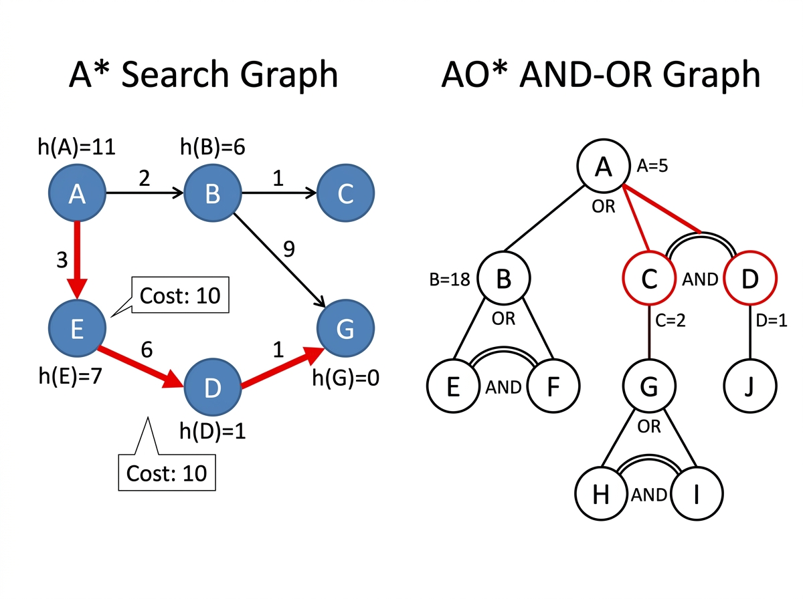

# Experiment 5: A* Search and AO* Search

## Aim

To implement (a) A* search for optimal path finding in a weighted graph, and (b) AO* search for solving AND-OR graphs by computing optimal cost bottom-up.

## Algorithm

### Part A - A* Search
1. Maintain open set and closed set.
2. At each step pick node with lowest f(n) = g(n) + h(n).
3. Expand neighbors, updating cost if better path found.
4. Reconstruct path when goal is reached.

### Part B - AO* Search
1. Process AND-OR graph nodes bottom-up.
2. AND node cost = sum of all child costs + weight per child.
3. OR node cost = minimum child cost + weight.
4. Select minimum cost alternative as optimal choice.
5. Reconstruct optimal solution path.

## Procedure

1. Navigate to the experiment folder.
2. Run: `python astar_aostar.py`
3. Part 1 runs A* on a weighted graph from A to G.
4. Part 2 runs AO* on an AND-OR graph.
5. Observe both paths and costs.

## Source Code

Refer to file: `astar_aostar.py`

## Output




### Part 1 - A* Graph

```
      A [h=11]
     / \
   2/   \3
   /     \
  B[h=6]  E[h=7]
  |\       \
 1| \9     6\
  |  \      \
  C  G(GOAL) D[h=1]
              \
               1\
                G(GOAL)[h=0]
```

### Part 1 - A* Cost Table

| Node | g(n) | h(n) | f(n) |
|------|------|------|------|
|  A   |  0   |  11  |  11  |
|  B   |  2   |   6  |   8  |
|  E   |  3   |   7  |  10  |
|  D   |  9   |   1  |  10  |
|  G   | 10   |   0  |  10  |

### Part 2 - AO* AND-OR Graph

```
            A  (OR node)
           / \
         B    (C, D)  <- AND
         |     /    \
       (E,F)  C      D
       AND    |\      \
             G (H,I)  J
                AND
```

### Part 2 - Cost Propagation

```
D: cost(J)   = 0+1 = 1       => D = 1
C: cost(G)   = 3+1 = 4
   cost(H,I) = 1+1 = 2       => C = 2  [choose (H,I)]
B: cost(E,F) = 8+10 = 18     => B = 18
A: cost(B)   = 18+1 = 19
   cost(C,D) = 3+2  = 5      => A = 5  [choose (C,D)]
```

### Terminal Output

```
========================================
   PART 1: A* Search Algorithm
========================================

Finding path from 'A' to 'G'...

Path found : A -> E -> D -> G
Total Cost : 10

========================================
   PART 2: AO* Search Algorithm
========================================

Initial Heuristic Costs: {'A': -1, 'B': 5, 'C': 2, 'D': 4, 'E': 7, 'F': 9, 'G': 3, 'H': 0, 'I': 0, 'J': 0}
AND-OR Graph Conditions: {'A': ['B', ('C', 'D')], 'B': [('E', 'F')], 'C': ['G', ('H', 'I')], 'D': ['J']}

Starting Cost Updates...
  ============================
  Evaluating Node: D
    Updated Cost  : 1
    Optimal Choice: J
  ----------------------------
  Evaluating Node: C
    Updated Cost  : 2
    Optimal Choice: ('H', 'I')
  ----------------------------
  Evaluating Node: B
    Updated Cost  : 18
    Optimal Choice: ('E', 'F')
  ----------------------------
  Evaluating Node: A
    Updated Cost  : 5
    Optimal Choice: ('C', 'D')
  ----------------------------
  ============================

Final Optimal Path Choices:
  D -> J
  C -> ('H', 'I')
  B -> ('E', 'F')
  A -> ('C', 'D')

Shortest Path:
  A -> (C -> (H + I) + D -> J)
```
