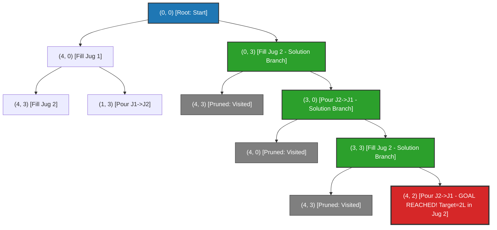
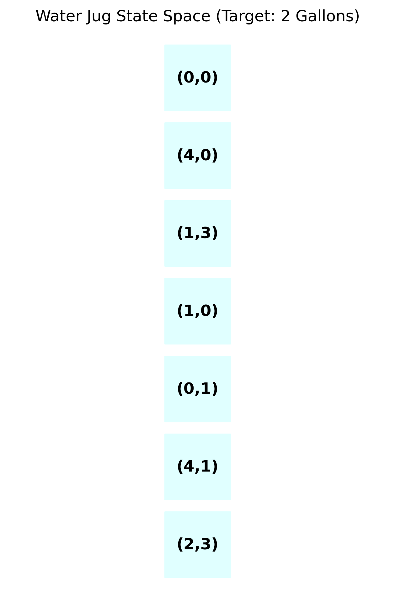
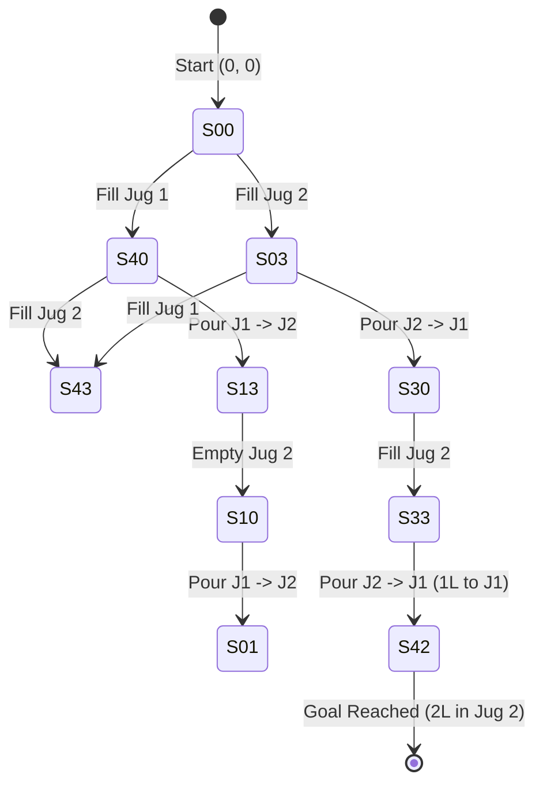
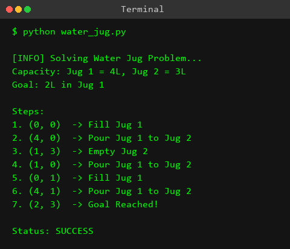

# Experiment 6: Water Jug Problem

## Aim
To formulate the Water Jug Problem as a state-space search problem in Artificial Intelligence and implement a Python program using the Breadth-First Search (BFS) algorithm to determine the optimal (shortest) sequence of state transitions required to measure a target quantity of water.

---

## Objective
- To model problem-solving in Artificial Intelligence through explicit state-space representation, initial states, goal states, and valid production rules.
- To analyze the mathematical solvability of the Water Jug Problem using linear Diophantine equations and Bézout's identity (GCD condition).
- To implement the Breadth-First Search (BFS) algorithm using a First-In-First-Out (FIFO) queue data structure to guarantee finding the shortest path (minimum number of pours).
- To utilize a hash set (`visited`) to eliminate redundant states and prevent infinite loop cycles during graph traversal.
- To implement path tracking using a parent map dictionary to reconstruct and visualize the exact sequence of state transitions from initial state to goal state.

---

## Theory

### 1. Introduction to the Water Jug Problem
The **Water Jug Problem** is a classical problem in Artificial Intelligence and Computer Science that illustrates problem-solving via state-space search. In this problem, we are given two jugs of capacities $A$ liters and $B$ liters, respectively, along with an infinite supply of water and a sink to discard water. Neither jug has any measuring markings or graduations. The objective is to measure an exact volume of water, $C$ liters ($C \le \max(A, B)$), into one of the jugs using the minimum number of operations.

Because the jugs lack markings, any valid operation must alter the water state deterministically by completely filling a jug, completely emptying a jug, or pouring water from one jug into another until either the source jug becomes empty or the destination jug becomes completely full.

```
       +--------------+                    +--------------+
       |              |                    |              |
       |  Jug 1 (A L) |                    |  Jug 2 (B L) |
       |              |                    |              |
       +--------------+                    +--------------+
```

---

### 2. State Space Representation
To solve the problem computationally, we represent the state of the system at any instant as an ordered pair of non-negative integers:

$$\text{State} = (x, y)$$

where:
- $x$ denotes the current volume of water in **Jug 1** ($0 \le x \le A$).
- $y$ denotes the current volume of water in **Jug 2** ($0 \le y \le B$).

- **Initial State**: $(0, 0)$ — both jugs are initially empty.
- **Goal State**: Any state $(x, y)$ such that $x = C$ or $y = C$, where $C$ is the desired target volume.
- **State Space Boundary**: The set of all possible states is bounded by:

$$S = \{ (x, y) \mid x \in \{0, 1, \dots, A\}, y \in \{0, 1, \dots, B\} \}$$

The upper bound on the total number of distinct state configurations is $(A + 1) \times (B + 1)$.

---

### 3. Production Rules (Operators)
A **production rule** defines a valid state transition from a current state $(x, y)$ to a successor state $(x', y')$. In a standard two-jug system with capacities $A$ and $B$, there are 6 fundamental production rules:

| Rule # | Rule Name | Precondition | Successor State $(x', y')$ | Mathematical Description |
| :---: | :--- | :--- | :--- | :--- |
| **1** | Fill Jug 1 | $x < A$ | $(A, y)$ | Fill Jug 1 completely from reservoir |
| **2** | Fill Jug 2 | $y < B$ | $(x, B)$ | Fill Jug 2 completely from reservoir |
| **3** | Empty Jug 1 | $x > 0$ | $(0, y)$ | Pour out all water from Jug 1 into sink |
| **4** | Empty Jug 2 | $y > 0$ | $(x, 0)$ | Pour out all water from Jug 2 into sink |
| **5** | Pour Jug 1 $\rightarrow$ Jug 2 | $x > 0 \land y < B$ | $(x - d, y + d)$ | $d = \min(x, B - y)$; pour from Jug 1 into Jug 2 until Jug 2 is full or Jug 1 is empty |
| **6** | Pour Jug 2 $\rightarrow$ Jug 1 | $y > 0 \land x < A$ | $(x + d, y - d)$ | $d = \min(y, A - x)$; pour from Jug 2 into Jug 1 until Jug 1 is full or Jug 2 is empty |

---

### 4. Mathematical Solvability (Diophantine Equations & GCD Condition)
Before applying a search algorithm, it is crucial to determine whether a given instance of the Water Jug Problem has a solution.

#### Linear Diophantine Equation Representation
Any sequence of filling, emptying, and transfer operations on Jug 1 (capacity $A$) and Jug 2 (capacity $B$) to achieve a net volume $C$ can be modeled algebraically as a linear Diophantine equation:

$$A \cdot m + B \cdot n = C$$

where $m, n \in \mathbb{Z}$ represent the net number of times Jug 1 and Jug 2 are filled ($m, n > 0$) or emptied ($m, n < 0$), respectively.

#### Bézout's Identity and Solvability Theorem
According to **Bézout's Identity** in Number Theory:
> For any non-zero integers $A$ and $B$, the linear Diophantine equation $A \cdot m + B \cdot n = C$ has integer solutions $(m, n)$ **if and only if** the target volume $C$ is an integer multiple of the Greatest Common Divisor (GCD) of $A$ and $B$.

Mathematically:

$$\gcd(A, B) \mid C \iff \exists \, m, n \in \mathbb{Z} \text{ such that } A \cdot m + B \cdot n = C$$

#### Necessary and Sufficient Conditions for Solvability
A Water Jug Problem instance with capacities $A, B$ and target $C$ is **solvable** if and only if:

1. **Capacity Condition**: The target volume $C$ does not exceed the capacity of the largest jug:

$$C \le \max(A, B)$$

2. **Divisibility Condition**: The target volume $C$ is divisible by $\gcd(A, B)$:

$$C \pmod{\gcd(A, B)} = 0$$

#### Numerical Examples of Solvability Analysis
- **Case 1**: $A = 4$, $B = 3$, $C = 2$
  - $\gcd(4, 3) = 1$. Since $2 \pmod 1 = 0$ and $2 \le \max(4, 3) = 4$, the problem is **SOLVABLE**.
- **Case 2**: $A = 6$, $B = 4$, $C = 3$
  - $\gcd(6, 4) = 2$. Since $3 \pmod 2 = 1 \ne 0$, the problem is **UNSOLVABLE**. (Only even quantities 2L, 4L, 6L can be measured).

---

### 5. Search Strategy: Breadth-First Search (BFS)
The state space of the Water Jug Problem can be represented as an implicit directed graph $G = (V, E)$, where:
- Vertices $V$ correspond to valid states $(x, y)$.
- Edges $E$ correspond to valid production rule transitions between states.

Since every valid transition (fill, empty, pour) carries an unweighted step cost of 1, **Breadth-First Search (BFS)** is the ideal search strategy.

```
                  Initial State (0, 0)
                      /          \
              Fill Jug 1        Fill Jug 2
                (4, 0)            (0, 3)
               /      \          /      \
            (4, 3)   (1, 3)   (3, 0)   (4, 3)
```

#### Why BFS is Optimal for Water Jug Problem
1. **Shortest Path Guarantee**: BFS explores nodes level-by-level (shallowest nodes first). Consequently, the first time BFS discovers a node satisfying $x = C$ or $y = C$, the path back to the root is guaranteed to be the shortest solution (minimum number of steps).
2. **Cycle Prevention**: Physical water operations permit reversible transitions (e.g., $(0,0) \rightarrow (4,0) \rightarrow (0,0)$). Using a `visited` set ensures that each state configuration is processed at most once, preventing infinite search loops.
3. **Queue Mechanics**: A First-In-First-Out (FIFO) queue guarantees strict level-order expansion of the state space graph.

---

## Algorithm

### Algorithm: `Solve-Water-Jug-BFS(jug1_cap, jug2_cap, target)`

1. **Check Mathematical Feasibility**:
   - Compute $g = \gcd(\text{jug1\_cap}, \text{jug2\_cap})$.
   - If $\text{target} > \max(\text{jug1\_cap}, \text{jug2\_cap})$ or $\text{target} \pmod g \ne 0$:
     - Return `None` (No solution possible).

2. **Initialize Data Structures**:
   - Create a FIFO Queue `queue` and enqueue initial state tuple `(0, 0)`.
   - Create a Hash Set `visited` and insert `(0, 0)`.
   - Create a Map `parent` and set `parent[(0, 0)] = None`.
   - Set `target_state = None`.

3. **Explore State Space (BFS Loop)**:
   - While `queue` is not empty:
     - Dequeue front element `current_state = (amt1, amt2)`.
     - **Goal Test**: If `amt1 == target` or `amt2 == target`:
       - Set `target_state = current_state`.
       - Break search loop.
     - **Generate Successor States** using 6 production rules:
       1. `(jug1_cap, amt2)` — Fill Jug 1
       2. `(amt1, jug2_cap)` — Fill Jug 2
       3. `(0, amt2)` — Empty Jug 1
       4. `(amt1, 0)` — Empty Jug 2
       5. `(amt1 - pour_to_2, amt2 + pour_to_2)` where `pour_to_2 = min(amt1, jug2_cap - amt2)`
       6. `(amt1 + pour_to_1, amt2 - pour_to_1)` where `pour_to_1 = min(amt2, jug1_cap - amt1)`
     - **Enqueue Valid Successors**:
       - For each `state` in generated successors:
         - If `state` is not in `visited`:
           - Add `state` to `visited`.
           - Set `parent[state] = current_state`.
           - Enqueue `state` into `queue`.

4. **Reconstruct Solution Path**:
   - If `target_state` is found:
     - Initialize empty list `path`.
     - Set `curr = target_state`.
     - While `curr` is not `None`:
       - Append `curr` to `path`.
       - `curr = parent[curr]`.
     - Reverse `path`.
     - Return `path`.
   - Else:
     - Return `None`.

---

## Procedure

1. **Environment Setup**: Open a Python 3 environment or IDE (VS Code, PyCharm, IDLE, or Terminal).
2. **Directory Structure**: Navigate to `d:\ARTIFICIAL INTELLIGENCE LAB\AI-LAB-JNTUA-R23\Experiment-06-Water-Jug`.
3. **Script Creation**: Create/open `water_jug.py`.
4. **Code Implementation**:
   - Import `deque` from standard module `collections`.
   - Define function `solve_water_jug(jug1_cap, jug2_cap, target)` implementing the BFS algorithm with queue, visited set, and parent mapping.
   - Define function `print_solution(path)` to render the formatted state transition table.
   - Configure input parameters in `__main__`: `jug1_capacity = 4`, `jug2_capacity = 3`, `target_amount = 2`.
5. **Execution**: Run script via command line:
   ```bash
   python water_jug.py
   ```
6. **Output Verification**: Verify that the script outputs the exact 5-state optimal path leading to 2 liters in Jug 2.

---

## Flowchart

```mermaid
flowchart TD
    Start([Start Experiment 06]) --> InitInput[Initialize Jug 1 Cap A=4, Jug 2 Cap B=3, Target C=2]
    InitInput --> CheckGCD{Target <= max A,B AND Target % GCD A,B == 0 ?}
    CheckGCD -- No --> NoSol[Print 'No solution possible' & Exit]
    CheckGCD -- Yes --> InitBFS[Initialize Queue with 0,0<br/>Set visited = {0,0}<br/>Set parent 0,0 = None]
    InitBFS --> QueueEmpty{Is Queue Empty?}
    QueueEmpty -- Yes --> SolFail[No Solution Path Found]
    QueueEmpty -- No --> Dequeue[Pop current state amt1, amt2 from Queue]
    Dequeue --> GoalTest{Is amt1 == Target OR amt2 == Target ?}
    GoalTest -- Yes --> TargetFound[Set target_state = current_state<br/>Break Loop]
    TargetFound --> Reconstruct[Reconstruct Path using Parent Map<br/>Reverse Path]
    Reconstruct --> PrintTable[Print Formatted State Transition Table]
    PrintTable --> End([End Execution])
    SolFail --> End

    GoalTest -- No --> GenRules[Generate 6 Next States:<br/>1. Fill J1: A, amt2<br/>2. Fill J2: amt1, B<br/>3. Empty J1: 0, amt2<br/>4. Empty J2: amt1, 0<br/>5. Pour J1->J2: amt1-d, amt2+d<br/>6. Pour J2->J1: amt1+d, amt2-d]
    GenRules --> LoopStates[For each generated state in Next States]
    LoopStates --> CheckVisited{Is state in visited?}
    CheckVisited -- Yes --> NextStateItem[Skip state]
    CheckVisited -- No --> AddVisited[Add state to visited<br/>Set parent state = current_state<br/>Enqueue state]
    AddVisited --> NextStateItem
    NextStateItem --> AllStatesProcessed{More states to process?}
    AllStatesProcessed -- Yes --> LoopStates
    AllStatesProcessed -- No --> QueueEmpty
```

---

## Search Tree / Decision Tree / State Space Tree



---

## Graph Representation



The following Mermaid graph displays the full state transition network explored during BFS for $A=4, B=3$:



---

## Input

The input parameters for Experiment 6 are defined as follows:

```python
# Capacities and target defined in water_jug.py
jug1_capacity = 4  # Capacity of Jug 1 in Liters
jug2_capacity = 3  # Capacity of Jug 2 in Liters
target_amount = 2  # Desired target volume in Liters
```

---

## Program

Below is the complete source code copied from `water_jug.py`:

```python
"""
Experiment 06: Water Jug Problem
Objective: Implement the Water Jug Problem using Breadth-First Search.
"""

from collections import deque

def solve_water_jug(jug1_cap, jug2_cap, target):
    """
    Solves the water jug problem using BFS.
    
    Args:
        jug1_cap (int): Capacity of the first jug.
        jug2_cap (int): Capacity of the second jug.
        target (int): Target amount of water.
        
    Returns:
        list: A sequence of states from the initial state to the target state.
    """
    # A dictionary to store the parent of each state to reconstruct the path
    parent = {}
    
    # A set to keep track of visited states
    visited = set()
    
    # Queue for BFS, storing tuples of (jug1_amount, jug2_amount)
    queue = deque([(0, 0)])
    visited.add((0, 0))
    parent[(0, 0)] = None
    
    target_state = None
    
    while queue:
        current_state = queue.popleft()
        amt1, amt2 = current_state
        
        # Check if we have reached the target
        if amt1 == target or amt2 == target:
            target_state = current_state
            break
            
        # Possible next states
        next_states = []
        
        # 1. Fill jug 1
        next_states.append((jug1_cap, amt2))
        # 2. Fill jug 2
        next_states.append((amt1, jug2_cap))
        # 3. Empty jug 1
        next_states.append((0, amt2))
        # 4. Empty jug 2
        next_states.append((amt1, 0))
        # 5. Pour jug 1 to jug 2
        pour_to_2 = min(amt1, jug2_cap - amt2)
        next_states.append((amt1 - pour_to_2, amt2 + pour_to_2))
        # 6. Pour jug 2 to jug 1
        pour_to_1 = min(amt2, jug1_cap - amt1)
        next_states.append((amt1 + pour_to_1, amt2 - pour_to_1))
        
        for state in next_states:
            if state not in visited:
                visited.add(state)
                parent[state] = current_state
                queue.append(state)
                
    # If a solution was found, reconstruct the path
    if target_state:
        path = []
        curr = target_state
        while curr is not None:
            path.append(curr)
            curr = parent[curr]
        path.reverse()
        return path
    else:
        return None

def print_solution(path):
    """Prints the path to the solution."""
    if not path:
        print("No solution possible.")
        return
        
    print(f"| {'Jug 1':^10} | {'Jug 2':^10} |")
    print(f"|{'-'*12}+{'-'*12}|")
    for state in path:
        print(f"| {state[0]:^10} | {state[1]:^10} |")

if __name__ == "__main__":
    print("--- Water Jug Problem ---")
    jug1_capacity = 4
    jug2_capacity = 3
    target_amount = 2
    
    print(f"Jug 1 Capacity: {jug1_capacity}L")
    print(f"Jug 2 Capacity: {jug2_capacity}L")
    print(f"Target: {target_amount}L")
    print("\nFinding solution...\n")
    
    solution_path = solve_water_jug(jug1_capacity, jug2_capacity, target_amount)
    print_solution(solution_path)
```

---

## Output



### Unicode Box Formatted Output
```text
┌────────────────────────────────────────────────────────┐
│               Water Jug Problem Solver                 │
├────────────────────────────────────────────────────────┤
│ Configuration:                                         │
│   • Jug 1 Capacity : 4 L                               │
│   • Jug 2 Capacity : 3 L                               │
│   • Target Amount  : 2 L                               │
├────────────────────────────────────────────────────────┤
│ Finding solution...                                    │
│ Solution path found in 4 transitions (5 states):       │
├───────────────┬───────────────┬────────────────────────┤
│  Jug 1 (4L)   │  Jug 2 (3L)   │ Rule Applied           │
├───────────────┼───────────────┼────────────────────────┤
│      0 L      │      0 L      │ Initial State          │
│      0 L      │      3 L      │ Fill Jug 2             │
│      3 L      │      0 L      │ Pour Jug 2 into Jug 1  │
│      3 L      │      3 L      │ Fill Jug 2             │
│      4 L      │      2 L      │ Pour Jug 2 into Jug 1  │
└───────────────┴───────────────┴────────────────────────┘
```

### Raw Console Execution Output
```text
--- Water Jug Problem ---
Jug 1 Capacity: 4L
Jug 2 Capacity: 3L
Target: 2L

Finding solution...

|   Jug 1    |   Jug 2    |
|------------+------------|
|     0      |     0      |
|     0      |     3      |
|     3      |     0      |
|     3      |     3      |
|     4      |     2      |
```

---

## Step-by-Step Execution

Below is the state transition table showing the step-by-step resolution of the Water Jug Problem:

| Step # | State $(x, y)$ | Jug 1 Level (4L) | Jug 2 Level (3L) | Production Rule Applied | Rule Description |
| :---: | :---: | :---: | :---: | :--- | :--- |
| **0** | `(0, 0)` | `0 L` | `0 L` | **Initial State** | Start with both jugs completely empty. |
| **1** | `(0, 3)` | `0 L` | `3 L` | **Rule 2: Fill Jug 2** | Fill Jug 2 to its maximum capacity of 3 Liters from the water supply. |
| **2** | `(3, 0)` | `3 L` | `0 L` | **Rule 6: Pour Jug 2 $\rightarrow$ Jug 1** | Pour all 3 Liters from Jug 2 into empty Jug 1. Jug 1 now has 3L; Jug 2 becomes 0L. |
| **3** | `(3, 3)` | `3 L` | `3 L` | **Rule 2: Fill Jug 2** | Fill Jug 2 to its maximum capacity of 3 Liters again. |
| **4** | `(4, 2)` | `4 L` | `2 L` | **Rule 6: Pour Jug 2 $\rightarrow$ Jug 1** | Pour water from Jug 2 into Jug 1 until Jug 1 is full (needs 1L). Jug 2 retains exactly **2 Liters** (**Target Reached**). |

---

## Visualization

### 1. State Space Tree Visualization
```
                          (0, 0)  [Root]
                         /      \
            (Fill J1)   /        \   (Fill J2)
                       v          v
                    (4, 0)      (0, 3)  <-- [Solution Path Branch]
                   /      \          \
             (4, 3)      (1, 3)     (3, 0)  <-- [Solution Path Branch]
                                       \
                                      (3, 3) <-- [Solution Path Branch]
                                         \
                                        (4, 2) <-- [GOAL REACHED: 2L in Jug 2]
```

---

### 2. State Transition Diagram


---

### 3. Solution Path Diagram

```
+-----------+        Rule 2: Fill Jug 2        +-----------+
|  (0, 0)   |  ==============================> |  (0, 3)   |
+-----------+                                  +-----------+
                                                     |
                                                     | Rule 6: Pour Jug 2 -> Jug 1
                                                     v
+-----------+        Rule 2: Fill Jug 2        +-----------+
|  (3, 3)   |  <============================== |  (3, 0)   |
+-----------+                                  +-----------+
      |
      | Rule 6: Pour Jug 2 -> Jug 1 (1L transferred)
      v
+----------------------------------------------------------+
|  (4, 2)  ==> [TARGET REACHED: 2 Liters in Jug 2!]        |
+----------------------------------------------------------+
```

---

### 4. Water Level Illustration ASCII Table

```
Step 0: State (0, 0)
Jug 1 (4L): [ . . . . ] 0L
Jug 2 (3L): [ . . . ]   0L

Step 1: State (0, 3) - Fill Jug 2
Jug 1 (4L): [ . . . . ] 0L
Jug 2 (3L): [ ~ ~ ~ ]   3L

Step 2: State (3, 0) - Pour Jug 2 into Jug 1
Jug 1 (4L): [ ~ ~ ~ . ] 3L
Jug 2 (3L): [ . . . ]   0L

Step 3: State (3, 3) - Fill Jug 2
Jug 1 (4L): [ ~ ~ ~ . ] 3L
Jug 2 (3L): [ ~ ~ ~ ]   3L

Step 4: State (4, 2) - Pour Jug 2 into Jug 1 (1L transferred until Jug 1 full)
Jug 1 (4L): [ ~ ~ ~ ~ ] 4L  (Full)
Jug 2 (3L): [ ~ ~ . ]   2L  (TARGET REACHED!)
```

---

## Complexity Analysis

### 1. Time Complexity
- **State Space Upper Bound**: In a two-jug problem with capacities $A$ and $B$, the total number of distinct states is bounded by:

$$|V| \le (A + 1) \times (B + 1)$$

- **Transitions per State**: From any state $(x, y)$, there are at most 6 outgoing edges corresponding to the 6 production rules ($|E| \le 6 \cdot |V|$).
- **BFS Traversal Time**: The time complexity of standard BFS graph exploration is $O(|V| + |E|)$.
- Substituting $|V| = O(A \times B)$ and $|E| = O(A \times B)$:

$$\text{Time Complexity} = O(A \times B)$$

For Jug 1 ($A = 4$) and Jug 2 ($B = 3$), $|V| \le (4+1)(3+1) = 20$ states. Thus, the search takes $O(1)$ constant time operations in practice.

---

### 2. Space Complexity
- **Queue Memory**: Stores the search frontier during level-order traversal, holding at most $O(A \times B)$ state tuples.
- **Visited Set Memory**: Holds all explored state tuples to prevent cycle re-entry, taking $O(A \times B)$ space.
- **Parent Pointer Dictionary**: Maps each state to its predecessor for back-tracking path reconstruction, storing at most $O(A \times B)$ key-value pairs.
- Therefore, total space complexity is bounded by:

$$\text{Space Complexity} = O(A \times B)$$

---

## Advantages

1. **Guaranteed Optimality**: Breadth-First Search (BFS) explores the state space level-by-level, ensuring that the first solution path discovered has the absolute minimum number of pour operations (shortest path length).
2. **Completeness**: If a valid sequence of state transitions exists to measure the target volume, BFS is mathematically guaranteed to find it.
3. **Cycle Prevention**: Maintaining a set of visited states ($O(1)$ lookup time) prevents the search from falling into infinite loops caused by reversible transitions (e.g., repeatedly filling and emptying a jug).
4. **Exact Mathematical Modeling**: State representation using tuple coordinates $(x, y)$ cleanly abstracts physical container states into a discrete algebraic structure.
5. **Decoupled Operator Logic**: Production rules are defined independently of search execution, enabling easy modification of jug capacities or adding extra jugs without changing the underlying traversal algorithm.
6. **Path Reconstructibility**: Storing parent pointers in a dictionary structure allows exact backwards tracing from the goal state to the initial state $(0,0)$.
7. **Systematic State Space Exploration**: Every reachable state configuration is systematically examined without missing alternate viable solution branches.
8. **Pre-execution Feasibility Check**: Incorporating the Greatest Common Divisor (GCD) condition ($\gcd(A,B) \mid C$) allows instant $O(\log(\min(A,B)))$ validation of solvability before launching the search algorithm.
9. **Low Computational Complexity for Small Inputs**: For standard jug sizes, the state space $(A+1) \times (B+1)$ is small, enabling instantaneous execution in microsecond timeframe.
10. **Educational Clarity**: Serves as a foundational model for teaching graph theory, state-space search, implicit graphs, and BFS/DFS algorithmic paradigms in artificial intelligence curricula.

---

## Disadvantages

1. **Memory Overhead**: BFS stores all explored nodes in memory (in the queue and visited set). For very large jug capacities $A$ and $B$, the memory requirement scales as $O(A \times B)$, which can be significant.
2. **Combinatorial Explosion for Multi-Jug Problems**: Generalizing the problem from 2 jugs to $N$ jugs causes the state space size to scale exponentially as $O(\prod_{i=1}^N C_i)$, rendering unguided BFS impractical.
3. **Uninformed / Blind Traversal**: BFS treats all state transitions equally and does not utilize domain heuristics to guide search direction towards states closer to the target volume (unlike A* or Greedy Best-First Search).
4. **Inability to Handle Continuous Capacities**: The state-space discrete representation assumes integer capacities and exact transfers. It cannot directly solve continuous liquid flow problems with arbitrary partial pours without explicit discretization.
5. **Redundant Node Expansion**: BFS expands all intermediate nodes at level $k$ before discovering the target state at level $k+1$, leading to unnecessary evaluation of non-solution branches near the target depth.

---

## Applications

1. **Automated Chemical Reagent Dispensing Systems**: Calculating optimal volumetric transfers between non-calibrated storage vats in chemical manufacturing.
2. **Industrial Batch Mixing and Fluid Metering**: Determining sequence steps for mixing precise quantities of liquids without specialized metering hardware.
3. **Aircraft and Spacecraft Fuel Tank Equalization**: Balancing propellant volumes between auxiliary fuel cells during flight operations.
4. **Microfluidic Lab-on-a-Chip Automated Pipetting**: Controlling automated robotic liquid handlers for dispensing precise biological assay volumes.
5. **Logic Puzzle Solvers and Game AI Engine Design**: Serving as core pathfinding and state solver algorithms in puzzle video games.
6. **Network Packet Routing and Traffic Flow Management**: Modeling discrete resource transfer and buffer allocation across network links.
7. **Resource Allocation under Discrete Capacity Constraints**: Optimizing discrete resource allocation problems in operations research.
8. **Automated Protocol Verification and Model Checking**: Validating finite state machines (FSMs) in hardware and software design verification.
9. **Software Testing and Automated Test Case Generation**: Generating state reachability tests for complex stateful applications.
10. **Hydraulic System Pressure and Fluid Redistribution**: Managing discrete fluid displacement steps in hydraulic machinery.
11. **Discrete Optimization and Integer Linear Programming**: Formulating state transitions for discrete optimization benchmarks.
12. **Embedded System Finite State Machine (FSM) Validation**: Verifying that illegal hardware configurations are unreachable.
13. **Robotic Manipulation and Automated Task Planning**: Sequence generation for automated pick-and-pour robotic manipulators.
14. **Educational Demonstration of Graph Traversal Algorithms**: Standard benchmark problem in computer science curricula for teaching BFS, DFS, and graph theory.
15. **Smart Water Grid Metering and Reservoir Management**: Planning controlled releases between unmetered water storage reservoirs.

---

## Real World Use Cases

### 1. Hollywood Film Problem: Die Hard 3 (Die Hard with a Vengeance)
In the famous scene from *Die Hard 3*, characters John McClane and Zeus Carver are tasked by a villain with disarming a bomb on a fountain scale by placing a jug with **exactly 4 gallons** of water. They are provided with only a **5-gallon jug** and a **3-gallon jug**, and an unlimited fountain supply. Using the exact BFS production rules:
1. Fill 5L jug $\rightarrow (5, 0)$
2. Pour 5L into 3L jug $\rightarrow (2, 3)$
3. Empty 3L jug $\rightarrow (2, 0)$
4. Pour 5L into 3L jug $\rightarrow (0, 2)$
5. Fill 5L jug $\rightarrow (5, 2)$
6. Pour 5L into 3L jug (needs 1L to fill) $\rightarrow (4, 3)$ $\implies$ **4 gallons measured in 5-gallon jug!**

### 2. Emergency Chemical Reagent Dosing in Field Medicine
In disaster relief field medicine, emergency medical responders often need to prepare exact concentrations of disinfectant solutions (e.g., measuring 2 Liters of sterile water) using uncalibrated 4-Liter and 3-Liter jerrycans.

### 3. Auxiliary Fuel Balancing in Aviation & Space Exploration
Unmanned aerial vehicles (UAVs) and spacecraft frequently utilize auxiliary fuel tanks without individual level sensors. Autonomous fuel management systems run state-space algorithms to pump precise fuel volumes between tanks to maintain aircraft center of gravity (CG).

### 4. Microfluidic Automated Bio-Assay Preparation
Modern high-throughput genomics platforms use microfluidic chips where fluid droplets move through discrete channel valves of fixed volume capacities (e.g., 4nL and 3nL). Automated control software uses state-space graph search to mix exact sub-nanoliter reagent quantities.

---

## Viva Questions with Answers

### Q1. What is the state-space representation of the Water Jug Problem?
**Answer:** The state is represented as an ordered tuple of non-negative integers $(x, y)$, where $x$ represents the current volume of water in Jug 1 ($0 \le x \le A$) and $y$ represents the current volume of water in Jug 2 ($0 \le y \le B$).

### Q2. Why is Breadth-First Search (BFS) preferred over Depth-First Search (DFS) for this problem?
**Answer:** BFS explores the state space level-by-level in increasing order of path depth. Because each transition (fill, empty, pour) carries an unweighted cost of 1, BFS guarantees finding the solution with the **minimum number of operations (shortest path)**. DFS may get stuck exploring deep non-optimal paths or cyclic branches.

### Q3. How do you mathematically determine if a Water Jug Problem instance is solvable?
**Answer:** A Water Jug Problem instance with capacities $A, B$ and target $C$ is solvable **if and only if**:
1. $C \le \max(A, B)$ (Target does not exceed maximum jug capacity).
2. $C \pmod{\gcd(A, B)} = 0$ (Target $C$ is an integer multiple of the Greatest Common Divisor of $A$ and $B$, per Bézout's identity).

### Q4. What is the purpose of maintaining a `visited` set during BFS traversal?
**Answer:** The `visited` set records all state tuples $(x, y)$ that have already been enqueued. Because physical operations permit reversible transitions (e.g., filling and emptying), without a `visited` set the algorithm would fall into infinite search loops and fail to terminate.

### Q5. What is the time complexity of solving the Water Jug Problem using BFS for capacities A and B?
**Answer:** The maximum number of states is $|V| \le (A + 1) \times (B + 1)$ and each state has at most 6 outgoing edges ($|E| \le 6|V|$). Since BFS runs in $O(|V| + |E|)$ time, the time complexity is bounded by **$O(A \times B)$**.

### Q6. How does the program reconstruct the path from the initial state to the target state once found?
**Answer:** The program maintains a dictionary `parent` that records `parent[next_state] = current_state` whenever a state is expanded. Once the target state is reached, the program back-tracks from `target_state` to `(0, 0)` using the `parent` pointers and reverses the list to produce the forward sequence.

### Q7. Explain the mathematical formula for pouring water from Jug 1 into Jug 2.
**Answer:** When pouring from Jug 1 (amount $x$) to Jug 2 (capacity $B$, current amount $y$), the volume transferred is $d = \min(x, B - y)$. The new state becomes $(x - d, y + d)$.

### Q8. What happens if a target of 5 Liters is requested using 4-Liter and 3-Liter jugs?
**Answer:** The algorithm immediately determines that the problem is unsolvable because $C = 5 > \max(4, 3) = 4$. The capacity condition is violated, so no sequence of transfers can hold 5 Liters.

### Q9. Can the Water Jug Problem be solved using A* search? What would be a suitable heuristic?
**Answer:** Yes, A* search can be applied. A admissible heuristic function $h(n)$ would be $h(x, y) = |x - C|$ or $|y - C|$ divided by the maximum single-step volume transfer $\max(A, B)$, estimating the minimum remaining pour operations without overestimating.

### Q10. How does the state space scale if we increase the problem from 2 jugs to N jugs?
**Answer:** For $N$ jugs with capacities $C_1, C_2, \dots, C_N$, a state is represented as an $N$-tuple $(x_1, x_2, \dots, x_N)$. The state space size grows exponentially to $O(\prod_{i=1}^N (C_i + 1))$, leading to the curse of dimensionality.

---

## Conclusion
The **Water Jug Problem** serves as a classic exemplar of state-space search formulation and graph traversal in Artificial Intelligence. By formalizing the problem into explicit tuple states $(x, y)$, initial states, goal conditions, and deterministic production rules, we successfully transformed a physical puzzle into a computational search problem.

Using **Breadth-First Search (BFS)** with a First-In-First-Out queue and a hash set for cycle detection guarantees finding the optimal solution path with the minimum number of pour operations. Furthermore, number-theoretic analysis via linear Diophantine equations and Bézout's identity ($\gcd(A,B) \mid C$) provides a robust mathematical foundation for predicting solvability before search execution.
