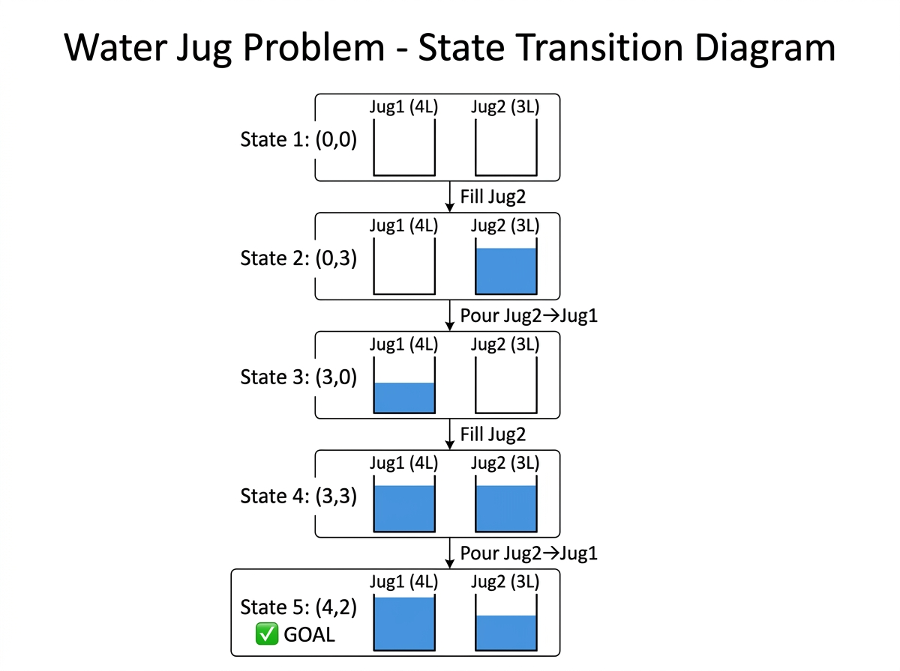

# Experiment 6: Water Jug Problem

## Aim

To solve the Water Jug Problem using BFS — finding the minimum steps to measure exactly 2 litres using a 4-litre jug and a 3-litre jug.

## Algorithm

1. Start with state (Jug1=0, Jug2=0).
2. Use BFS. Generate all possible next states from current:
   - Fill Jug1 / Fill Jug2
   - Empty Jug1 / Empty Jug2
   - Pour Jug1 into Jug2 / Pour Jug2 into Jug1
3. Stop when Jug1 == target OR Jug2 == target.
4. Reconstruct path with parent pointers.

## Procedure

1. Navigate to the experiment folder.
2. Run: `python water_jug.py`
3. Jug 1 = 4L, Jug 2 = 3L, Target = 2L.
4. Observe the state transitions printed as a table.

## Source Code

Refer to file: `water_jug.py`

## Output




### Jug Diagram

```
  Jug 1 (4L)      Jug 2 (3L)
 +----------+    +----------+
 |          |    |          |
 |          |    |          |
 |          |    |          |
 |          |    |          |
 +----------+    +----------+
   Goal: 2L in either jug
```

### State Transition Diagram

```
(Jug1, Jug2)

(0, 0)
  |
  v  Fill Jug 2
(0, 3)
  |
  v  Pour Jug2 -> Jug1
(3, 0)
  |
  v  Fill Jug 2
(3, 3)
  |
  v  Pour Jug2 -> Jug1 (Jug1 reaches 4L, 2L remains in Jug2)
(4, 2)  <-- TARGET REACHED!
```

### Solution Steps

```
Step | Operation              | Jug1 (4L) | Jug2 (3L)
-----|------------------------|-----------|----------
  0  | Initial State          |     0     |     0
  1  | Fill Jug 2             |     0     |     3
  2  | Pour Jug2 into Jug1    |     3     |     0
  3  | Fill Jug 2             |     3     |     3
  4  | Pour Jug2 into Jug1    |     4     |     2  <- GOAL
```

### Terminal Output

```
--- Water Jug Problem ---
Jug 1 Capacity: 4L
Jug 2 Capacity: 3L
Target: 2L

Finding solution...

|   Jug 1    |   Jug 2    |
|------------+------------|
|     0      |     0      |
|     0      |     3      |
|     3      |     0      |
|     3      |     3      |
|     4      |     2      |
```
