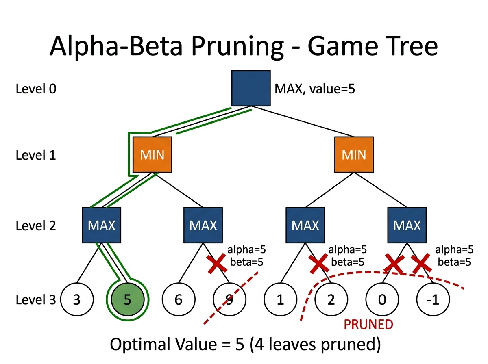

# Experiment 7: Alpha-Beta Pruning

## Aim

To implement Alpha-Beta Pruning to optimize the Minimax algorithm in game tree search, reducing nodes evaluated without changing the optimal result.

## Algorithm

1. Start with alpha = -infinity, beta = +infinity.
2. At MAX node: pick highest value child; update alpha; prune if beta <= alpha.
3. At MIN node: pick lowest value child; update beta; prune if beta <= alpha.
4. Stop recursion at leaf nodes and return their score.
5. Return optimal value at root.

## Procedure

1. Navigate to the experiment folder.
2. Run: `python alpha_beta.py`
3. The program evaluates a game tree of depth 3 with 8 leaf nodes.
4. Observe which branches are pruned and the final optimal value.

## Source Code

Refer to file: `alpha_beta.py`

## Output




### Game Tree Structure

```
                        [MAX] Root
                       /           \
              [MIN] Left            Right [MIN]
              /      \              /         \
        [MAX]D2A  [MAX]D2B    [MAX]D2C    [MAX]D2D
          / \        / \        / \           / \
         3   5      6   9      1   2         0  -1
                        X          X         X   X
                      (pruned)  (pruned)  (pruned)
```

### Pruning Trace

```
D2A: max(3, 5) = 5      alpha = 5
D2B: eval 6; beta=5 <= alpha=5 => PRUNE 9   returns 6
Left MIN: min(5, 6) = 5   alpha = 5

D2C: eval 1; beta=5 => PRUNE 2              returns 1
D2D: PRUNED entirely (beta <= alpha)
Right MIN: returns 1

Root MAX: max(5, 1) = 5
```

### Pruned Leaf Nodes

```
Score  9  -> PRUNED  (under D2B)
Score  2  -> PRUNED  (under D2C)
Score  0  -> PRUNED  (under D2D)
Score -1  -> PRUNED  (under D2D)
```

### Terminal Output

```
+----------------------------------------+
|         Alpha-Beta Pruning Test        |
+----------------------------------------+
|  Leaf node scores:                     |
|  [3, 5, 6, 9, 1, 2, 0, -1]            |
+----------------------------------------+
|  Optimal value is : 5                  |
+----------------------------------------+
```
