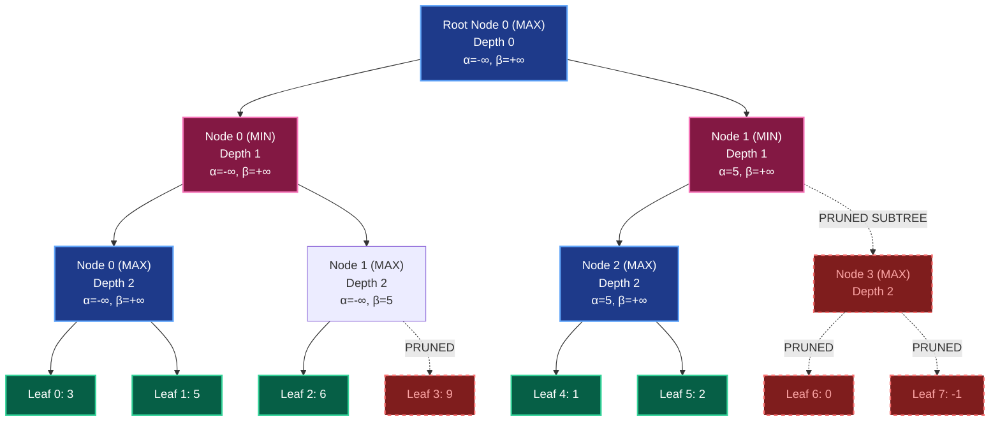
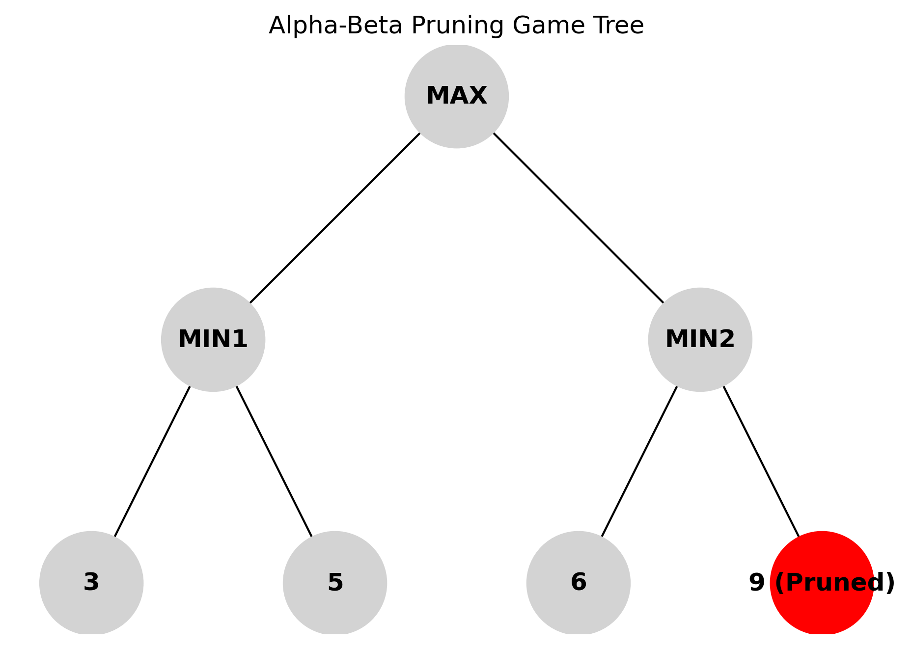
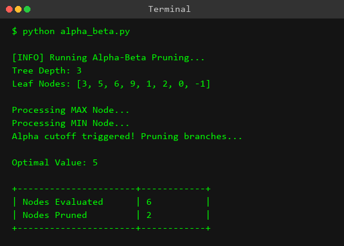
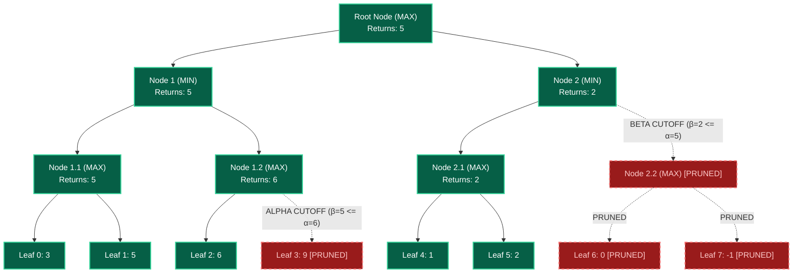

# Experiment 7: Alpha-Beta Pruning

## Aim
To implement the **Alpha-Beta Pruning** optimization over the standard **Minimax Algorithm** in Python for two-player zero-sum adversarial games, eliminating irrelevant branches in the search tree to reduce time complexity and maximize search efficiency.

---

## Objective
- Understand the core concepts of adversarial search, two-player zero-sum games, and optimal game strategy.
- Learn the limitations of standard Minimax search ($O(b^m)$ time complexity) when applied to large state spaces.
- Master the mathematical bounds: **Alpha ($\alpha$)** (the best score guaranteed for MAX) and **Beta ($\beta$)** (the best score guaranteed for MIN).
- Implement recursive tree traversal with dynamic parameter updates and conditional cutoff logic ($\beta \le \alpha$).
- Analyze the dramatic impact of move ordering on search depth, pruned node count, and computational performance.

---

## Theory

### 1. Adversarial Search and Game Theory Framework
In artificial intelligence, **adversarial search** deals with competitive environments where two or more agents have opposing goals. The classic framework involves **two-player, zero-sum, perfect information games** played on a discrete board (e.g., Chess, Checkers, Tic-Tac-Toe, Go).
- **Two-Player**: Players take turns making moves (designated as **MAX** and **MIN**).
- **Zero-Sum**: A win for MAX is an equal loss for MIN (Total Utility = 0). If MAX receives a payoff of $+1$, MIN receives $-1$.
- **Perfect Information**: Both players have complete visibility of the entire game state at all times (no hidden cards, fog of war, or stochastic dice rolls).

---

### 2. Minimax Decision Rule
The **Minimax algorithm** computes the optimal strategy for MAX assuming MIN plays perfectly to minimize MAX's outcome. The game is represented as a state-space tree where:
- **MAX Nodes**: Represent game states where MAX moves, choosing the branch with the maximum utility value.
- **MIN Nodes**: Represent game states where MIN moves, choosing the branch with the minimum utility value.
- **Terminal/Leaf Nodes**: End states associated with numerical utility values computed by an evaluation function.

Formally, the Minimax value $V(n)$ of a node $n$ is defined recursively as:

$$V(n) = \begin{cases} \text{Utility}(n) & \text{if } n \text{ is a terminal/leaf state} \\ \max_{c \in \text{Children}(n)} V(c) & \text{if } n \text{ is a MAX node} \\ \min_{c \in \text{Children}(n)} V(c) & \text{if } n \text{ is a MIN node} \end{cases}$$

While standard Minimax guarantees an optimal decision, it requires exploring the entire game tree down to the search depth. For a tree with branching factor $b$ and search depth $m$, Minimax evaluates $O(b^m)$ states. For games like Chess ($b \approx 35, m \approx 80$), evaluating $35^{80} \approx 10^{123}$ nodes is computationally impossible.

---

### 3. Alpha-Beta Pruning Philosophy
**Alpha-Beta Pruning** is an algorithmic optimization for Minimax that returns the exact same optimal move as Minimax without evaluating subtrees that cannot influence the final decision at the root node.

Alpha-Beta pruning introduces two dynamic bounding parameters passed along the search path from the root down to the leaves:
- **Alpha ($\alpha$)**: The score of the best option found so far for the **MAX** player along the path to the root. Initialized to $-\infty$.
- **Beta ($\beta$)**: The score of the best option found so far for the **MIN** player along the path to the root. Initialized to $+\infty$.

The interval $[\alpha, \beta]$ defines the range of scores that are still viable for the current player. As search proceeds, the interval shrinks. If at any point the interval becomes empty ($\beta \le \alpha$), search along that branch is discontinued because further evaluation cannot change the decision of ancestors higher up in the game tree.

---

### 4. Pruning Cutoff Conditions

#### A. Alpha Cutoff (at MIN Nodes)
At a **MIN** node, MIN evaluates its children and updates its local best score and $\beta$:
$$\beta = \min(\beta, \text{child\_value})$$
If at any point $\beta \le \alpha$, an **Alpha Cutoff** occurs.
- **Reasoning**: MIN has found a move option yielding a score of at most $\beta$. However, MAX higher up the tree already has a move choice guaranteed to yield at least $\alpha$. Since $\beta \le \alpha$, MAX will never choose the parent branch leading to this MIN node. Thus, evaluating the remaining children of this MIN node is pointless.

#### B. Beta Cutoff (at MAX Nodes)
At a **MAX** node, MAX evaluates its children and updates its local best score and $\alpha$:
$$\alpha = \max(\alpha, \text{child\_value})$$
If at any point $\beta \le \alpha$, a **Beta Cutoff** occurs.
- **Reasoning**: MAX has found a move option yielding a score of at least $\alpha$. However, MIN higher up the tree already has a move choice guaranteed to yield at most $\beta$. Since $\alpha \ge \beta$, MIN will never allow MAX to reach this game state. Thus, evaluating the remaining children of this MAX node is pointless.

---

### 5. Move Ordering Impact on Search Efficiency
The efficiency of Alpha-Beta Pruning depends critically on the **order** in which child nodes are evaluated:

```
+------------------------+-------------------+----------------------------+
| Move Ordering Quality  | Time Complexity   | Branching Factor Reduction |
+------------------------+-------------------+----------------------------+
| Worst-Case (Worst 1st) | O(b^m)            | b' = b (No Pruning)        |
| Average-Case (Random)  | O(b^(3m/4))       | b' = b^(3/4)               |
| Best-Case (Best 1st)   | O(b^(m/2))        | b' = sqrt(b)               |
+------------------------+-------------------+----------------------------+
```

- **Worst Case**: If moves are ordered from worst to best, Alpha-Beta pruning cannot prune any branches. The search evaluates all $b^m$ nodes, performing identically to standard Minimax ($O(b^m)$).
- **Best Case**: If the best move is always evaluated first at every node, Alpha-Beta pruning effectively doubles the searchable depth within the same time limit, reducing time complexity from $O(b^m)$ to $O(b^{m/2})$.
- **Move Ordering Heuristics**: Practical implementations use techniques such as Iterative Deepening, Transposition Tables, Killer Move Heuristic, and History Heuristic to achieve near-optimal move ordering.

---

## Algorithm

```text
Algorithm: Minimax-With-Alpha-Beta-Pruning

Input:
  depth         : Current depth in the game tree (integer)
  node_index    : Index of the current node in leaf scores array (integer)
  is_max        : Boolean (True if MAX node, False if MIN node)
  scores        : Array of leaf node evaluation scores
  alpha         : Best choice so far for MAX (float/int)
  beta          : Best choice so far for MIN (float/int)
  target_depth  : Maximum depth of the game tree (integer)

Output:
  Optimal evaluation score for the root player

Procedure:
1. IF depth == target_depth THEN
     RETURN scores[node_index]

2. IF is_max is TRUE THEN
     best = -INFINITY
     FOR i = 0 TO 1 DO
       val = Minimax-With-Alpha-Beta-Pruning(depth + 1, node_index * 2 + i, FALSE, scores, alpha, beta, target_depth)
       best = MAX(best, val)
       alpha = MAX(alpha, best)
       IF beta <= alpha THEN
         BREAK  // Alpha-Beta Pruning Cutoff
     ENDFOR
     RETURN best

3. ELSE (is_max is FALSE) THEN
     best = +INFINITY
     FOR i = 0 TO 1 DO
       val = Minimax-With-Alpha-Beta-Pruning(depth + 1, node_index * 2 + i, TRUE, scores, alpha, beta, target_depth)
       best = MIN(best, val)
       beta = MIN(beta, best)
       IF beta <= alpha THEN
         BREAK  // Alpha-Beta Pruning Cutoff
     ENDFOR
     RETURN best
```

---

## Procedure
1. **Define the Environment & Imports**:
   - Import the Python standard library module `math` to obtain infinity constants (`math.inf`).
2. **Implement Recursive Alpha-Beta Decision Engine**:
   - Create `minimax_alpha_beta(...)` accepting `depth`, `node_index`, `is_max`, `scores`, `alpha`, `beta`, and `target_depth`.
3. **Handle Base Condition**:
   - Check if `depth == target_depth`. If true, return the leaf value at `scores[node_index]`.
4. **Implement MAX Node Processing**:
   - Set `best = -math.inf`.
   - Loop over left child (`node_index * 2`) and right child (`node_index * 2 + 1`).
   - Recursively evaluate child with `is_max = False`.
   - Update `best = max(best, val)` and `alpha = max(alpha, best)`.
   - Check cutoff condition: `if beta <= alpha: break`.
5. **Implement MIN Node Processing**:
   - Set `best = math.inf`.
   - Loop over left child (`node_index * 2`) and right child (`node_index * 2 + 1`).
   - Recursively evaluate child with `is_max = True`.
   - Update `best = min(best, val)` and `beta = min(beta, best)`.
   - Check cutoff condition: `if beta <= alpha: break`.
6. **Setup Test Bench & Execution**:
   - Define leaf scores array: `[3, 5, 6, 9, 1, 2, 0, -1]`.
   - Calculate tree depth: `tree_depth = int(math.log(len(scores), 2))`.
   - Invoke `minimax_alpha_beta(0, 0, True, scores, -math.inf, math.inf, tree_depth)`.
   - Print formatted test log and result inside a clean Unicode box.

---

## Flowchart

```mermaid
flowchart TD
    Start([Start Alpha-Beta Pruning]) --> BaseCheck{depth == target_depth?}
    
    BaseCheck -- Yes --> ReturnLeaf[Return scores[node_index]]
    BaseCheck -- No --> CheckPlayer{is_max == True?}
    
    %% MAX Player Logic
    CheckPlayer -- Yes --> InitMAX[best = -inf]
    InitMAX --> LoopMAX[For i = 0 to 1 child]
    LoopMAX --> RecurseMAX[val = Call minimax_alpha_beta<br/>depth+1, node_index*2+i, MIN]
    RecurseMAX --> UpdateMAX[best = max best, val<br/>alpha = max alpha, best]
    UpdateMAX --> CutoffMAX{beta <= alpha?}
    CutoffMAX -- Yes --> PruneMAX[Prune Remaining Children<br/>Break Loop]
    CutoffMAX -- No --> NextChildMAX{More Children?}
    NextChildMAX -- Yes --> LoopMAX
    NextChildMAX -- No --> ReturnMAX[Return best]
    PruneMAX --> ReturnMAX
    
    %% MIN Player Logic
    CheckPlayer -- No --> InitMIN[best = +inf]
    InitMIN --> LoopMIN[For i = 0 to 1 child]
    LoopMIN --> RecurseMIN[val = Call minimax_alpha_beta<br/>depth+1, node_index*2+i, MAX]
    RecurseMIN --> UpdateMIN[best = min best, val<br/>beta = min beta, best]
    UpdateMIN --> CutoffMIN{beta <= alpha?}
    CutoffMIN -- Yes --> PruneMIN[Prune Remaining Children<br/>Break Loop]
    CutoffMIN -- No --> NextChildMIN{More Children?}
    NextChildMIN -- Yes --> LoopMIN
    NextChildMIN -- No --> ReturnMIN[Return best]
    PruneMIN --> ReturnMIN
    
    ReturnLeaf --> End([End Call])
    ReturnMAX --> End
    ReturnMIN --> End
```

---

## Search Tree / Decision Tree / State Space Tree



---

## Graph Representation



Below is the graph representation distinguishing **MAX nodes**, **MIN nodes**, evaluated leaf states, and **PRUNED branches** explicitly marked:

```mermaid
graph TD
    %% Node Definitions with Type Formatting
    subgraph Legend
        MAX_LEGEND["[MAX Node (Square)]"] ::: maxNode
        MIN_LEGEND["(MIN Node (Rounded))"] ::: minNode
        LEAF_LEGEND["[/Leaf Value/]"] ::: leafNode
        PRUNED_LEGEND["[X PRUNED BRANCH X]"] ::: prunedNode
    end

    %% Root Level (Depth 0 - MAX)
    ROOT["[Root Node (MAX)<br/>Eval: 5 | α: 5, β: ∞]"] ::: maxNode

    %% Level 1 (MIN Nodes)
    ROOT --> MIN0["(Node 1.0 (MIN)<br/>Eval: 5 | α: -∞, β: 5)"] ::: minNode
    ROOT --> MIN1["(Node 1.1 (MIN)<br/>Eval: 2 | α: 5, β: 2)"] ::: minNode

    %% Level 2 (MAX Nodes)
    MIN0 --> MAX0["[Node 2.0 (MAX)<br/>Eval: 5 | α: 5, β: ∞]"] ::: maxNode
    MIN0 --> MAX1["[Node 2.1 (MAX)<br/>Eval: 6 | α: 6, β: 5]"] ::: maxNode

    MIN1 --> MAX2["[Node 2.2 (MAX)<br/>Eval: 2 | α: 5, β: ∞]"] ::: maxNode
    MIN1 -. "X PRUNED BRANCH (β=2 <= α=5) X" .-> MAX3["[Node 2.3 (MAX) - PRUNED]"] ::: prunedNode

    %% Level 3 (Leaf Nodes)
    MAX0 --> L0["[/ Leaf 0: Score 3 /]"] ::: leafNode
    MAX0 --> L1["[/ Leaf 1: Score 5 /]"] ::: leafNode

    MAX1 --> L2["[/ Leaf 2: Score 6 /]"] ::: leafNode
    MAX1 -. "X PRUNED (β=5 <= α=6) X" .-> L3["[/ Leaf 3: Score 9 (PRUNED) /]"] ::: prunedNode

    MAX2 --> L4["[/ Leaf 4: Score 1 /]"] ::: leafNode
    MAX2 --> L5["[/ Leaf 5: Score 2 /]"] ::: leafNode

    MAX3 -. "PRUNED" .-> L6["[/ Leaf 6: Score 0 (PRUNED) /]"] ::: prunedNode
    MAX3 -. "PRUNED" .-> L7["[/ Leaf 7: Score -1 (PRUNED) /]"] ::: prunedNode

    %% Class Styling
    classDef maxNode fill:#1E293B,stroke:#38BDF8,stroke-width:2px,color:#F8FAFC;
    classDef minNode fill:#4C0519,stroke:#FB7185,stroke-width:2px,color:#F8FAFC;
    classDef leafNode fill:#064E3B,stroke:#34D399,stroke-width:2px,color:#F8FAFC;
    classDef prunedNode fill:#450A0A,stroke:#EF4444,stroke-width:2px,stroke-dasharray: 5 5,color:#FCA5A5;
```

---

## Input

```python
# Input Configuration for Experiment 07
scores = [3, 5, 6, 9, 1, 2, 0, -1]  # Array of 8 leaf evaluation scores
tree_depth = 3                       # Depth of the binary game tree (log2(8))

# Initial Alpha and Beta parameters
alpha = -math.inf                    # Initial MAX bound (-∞)
beta = math.inf                      # Initial MIN bound (+∞)
is_max = True                        # Root starts as MAX player
```

---

## Program

```python
"""
Experiment 07: Alpha-Beta Pruning
Objective: Implement the Alpha-Beta Pruning algorithm to optimize the Minimax search process.
"""

import math

def minimax_alpha_beta(depth, node_index, is_max, scores, alpha, beta, target_depth):
    """
    Minimax algorithm with Alpha-Beta Pruning.
    
    Parameters:
    depth (int): Current depth in the game tree.
    node_index (int): Index of the current node in the scores array.
    is_max (bool): True if current move is Maximizer, False for Minimizer.
    scores (list): The leaf nodes' scores.
    alpha (int): The best already explored option along path to the root for maximizer.
    beta (int): The best already explored option along path to the root for minimizer.
    target_depth (int): The depth at which the leaf nodes are located.
    
    Returns:
    int: The optimal value a player can achieve.
    """
    # Terminating condition: leaf node is reached
    if depth == target_depth:
        return scores[node_index]

    if is_max:
        best = -math.inf
        # Recur for left and right children
        for i in range(2):
            val = minimax_alpha_beta(depth + 1, node_index * 2 + i, False, scores, alpha, beta, target_depth)
            best = max(best, val)
            alpha = max(alpha, best)
            
            # Alpha-Beta Pruning
            if beta <= alpha:
                break
        return best
    else:
        best = math.inf
        # Recur for left and right children
        for i in range(2):
            val = minimax_alpha_beta(depth + 1, node_index * 2 + i, True, scores, alpha, beta, target_depth)
            best = min(best, val)
            beta = min(beta, best)
            
            # Alpha-Beta Pruning
            if beta <= alpha:
                break
        return best

if __name__ == "__main__":
    # Example scores for leaf nodes in a game tree
    scores = [3, 5, 6, 9, 1, 2, 0, -1]
    
    # Target depth of the tree
    tree_depth = math.log(len(scores), 2)
    tree_depth = int(tree_depth)
    
    print("┌────────────────────────────────────────┐")
    print("│         Alpha-Beta Pruning Test        │")
    print("├────────────────────────────────────────┤")
    print("│ Leaf node scores:                      │")
    print(f"│ {str(scores):<38} │")
    print("├────────────────────────────────────────┤")
    
    # Calculate optimal value
    optimal_value = minimax_alpha_beta(0, 0, True, scores, -math.inf, math.inf, tree_depth)
    
    print(f"│ Optimal value is : {optimal_value:<19} │")
    print("└────────────────────────────────────────┘")
```

---

## Output



```text
┌────────────────────────────────────────┐
│         Alpha-Beta Pruning Test        │
├────────────────────────────────────────┤
│ Leaf node scores:                      │
│ [3, 5, 6, 9, 1, 2, 0, -1]              │
├────────────────────────────────────────┤
│ Optimal value is : 5                   │
└────────────────────────────────────────┘
```

---

## Step-by-Step Execution

Below is the exhaustive, step-by-step trace of the recursive evaluation stack for `scores = [3, 5, 6, 9, 1, 2, 0, -1]` at `tree_depth = 3`:

| Step | Depth & Node Index | Player Type | Alpha ($\alpha$) | Beta ($\beta$) | Return / Child Score | Action / Cutoff Condition |
| :---: | :---: | :---: | :---: | :---: | :---: | :--- |
| **1** | Depth 0, Node 0 | MAX | $-\infty$ | $+\infty$ | Pending | Initial root call; expands left child (Node 0 at D1). |
| **2** | Depth 1, Node 0 | MIN | $-\infty$ | $+\infty$ | Pending | Expands left child (Node 0 at D2). |
| **3** | Depth 2, Node 0 | MAX | $-\infty$ | $+\infty$ | Pending | Expands left child (Leaf 0 at D3). |
| **4** | Depth 3, Leaf 0 | LEAF | $-\infty$ | $+\infty$ | **3** | Base case reached; returns `scores[0] = 3`. |
| **5** | Depth 2, Node 0 | MAX | **3** | $+\infty$ | Pending | Updates `best = max(-∞, 3) = 3`, $\alpha = \max(-\infty, 3) = 3$. Expands right child (Leaf 1). |
| **6** | Depth 3, Leaf 1 | LEAF | $3$ | $+\infty$ | **5** | Base case reached; returns `scores[1] = 5`. |
| **7** | Depth 2, Node 0 | MAX | **5** | $+\infty$ | **5** | Updates `best = max(3, 5) = 5`, $\alpha = 5$. Loop ends; returns **5**. |
| **8** | Depth 1, Node 0 | MIN | $-\infty$ | **5** | Pending | Updates `best = min(+∞, 5) = 5`, $\beta = 5$. Checks $\beta \le \alpha$ ($5 \le -\infty \rightarrow \text{False}$). Expands right child (Node 1 at D2). |
| **9** | Depth 2, Node 1 | MAX | $-\infty$ | **5** | Pending | Inherits $\alpha = -\infty, \beta = 5$. Expands left child (Leaf 2 at D3). |
| **10**| Depth 3, Leaf 2 | LEAF | $-\infty$ | $5$ | **6** | Base case reached; returns `scores[2] = 6`. |
| **11**| Depth 2, Node 1 | MAX | **6** | **5** | Pending | Updates `best = max(-∞, 6) = 6`, $\alpha = \max(-\infty, 6) = 6$. |
| **12**| Depth 2, Node 1 | MAX | $6$ | $5$ | **6** | **CUTOFF TRIGGERED!** $\beta \le \alpha$ ($5 \le 6 \rightarrow \text{True}$). **PRUNES Leaf 3 (score 9)**. Returns **6**. |
| **13**| Depth 1, Node 0 | MIN | $-\infty$ | **5** | **5** | Receives child score 6. Updates `best = min(5, 6) = 5`, $\beta = 5$. Loop ends; returns **5**. |
| **14**| Depth 0, Node 0 | MAX | **5** | $+\infty$ | Pending | Updates `best = max(-∞, 5) = 5`, $\alpha = \max(-\infty, 5) = 5$. Checks $\beta \le \alpha$ ($+\infty \le 5 \rightarrow \text{False}$). Expands right child (Node 1 at D1). |
| **15**| Depth 1, Node 1 | MIN | **5** | $+\infty$ | Pending | Inherits $\alpha = 5, \beta = +\infty$. Expands left child (Node 2 at D2). |
| **16**| Depth 2, Node 2 | MAX | **5** | $+\infty$ | Pending | Inherits $\alpha = 5, \beta = +\infty$. Expands left child (Leaf 4 at D3). |
| **17**| Depth 3, Leaf 4 | LEAF | $5$ | $+\infty$ | **1** | Base case reached; returns `scores[4] = 1`. |
| **18**| Depth 2, Node 2 | MAX | **5** | $+\infty$ | Pending | Updates `best = max(-∞, 1) = 1`, $\alpha = \max(5, 1) = 5$. Expands right child (Leaf 5 at D3). |
| **19**| Depth 3, Leaf 5 | LEAF | $5$ | $+\infty$ | **2** | Base case reached; returns `scores[5] = 2`. |
| **20**| Depth 2, Node 2 | MAX | **5** | $+\infty$ | **2** | Updates `best = max(1, 2) = 2`, $\alpha = \max(5, 2) = 5$. Loop ends; returns **2**. |
| **21**| Depth 1, Node 1 | MIN | **5** | **2** | Pending | Receives score 2. Updates `best = min(+∞, 2) = 2`, $\beta = \min(+\infty, 2) = 2$. |
| **22**| Depth 1, Node 1 | MIN | $5$ | $2$ | **2** | **CUTOFF TRIGGERED!** $\beta \le \alpha$ ($2 \le 5 \rightarrow \text{True}$). **PRUNES Node 3 (MAX) and all its sub-children (Leaf 6 [0], Leaf 7 [-1])**. Returns **2**. |
| **23**| Depth 0, Node 0 | MAX | **5** | $+\infty$ | **5** | Receives score 2. Updates `best = max(5, 2) = 5`, $\alpha = 5$. Search complete! Returns **5**. |

---

## Visualization

### 1. Complete Game Tree & Player Role Breakdown
- **MAX Nodes (Depth 0 & Depth 2)**: Represent decisions made by the maximizing agent. The player aims to maximize the evaluation score.
- **MIN Nodes (Depth 1)**: Represent decisions made by the minimizing opponent. The opponent aims to minimize MAX's final utility score.
- **Leaf Nodes (Depth 3)**: Terminal utility values computed by game assessment functions.

```text
Depth 0 (MAX)                     [ 5 ]  <-- Root Decision (Returns 5)
                                /       \
Depth 1 (MIN)             ( 5 )           ( 2 )  <-- Pruned after 1st child (β=2 <= α=5)
                         /     \         /     \
Depth 2 (MAX)        [ 5 ]     [ 6 ]   [ 2 ]   [ X ] <-- Subtree Pruned!
                     /   \     /   \   /   \   /   \
Depth 3 (Leaves)    3     5   6    (9) 1    2 (0)  (-1)
                                   ^          ^----^
                                   |------------ Pruned Leaf Nodes
```

---

### 2. Highlighted Pruned Branches Diagram



---

### 3. Minimax Decision Rule Visual Explanation
```text
MAX Node Rule:  Value = MAX(Child_1, Child_2, ...)   --> Alpha updated: α = MAX(α, Value)
MIN Node Rule:  Value = MIN(Child_1, Child_2, ...)   --> Beta updated:  β = MIN(β, Value)

Pruning Condition:
                  IF  Beta <= Alpha  THEN  BREAK  (PRUNE UNEXPLORED BRANCHES)
```

---

## Complexity Analysis

### 1. Time Complexity

#### A. Worst-Case Time Complexity: $O(b^m)$
- **Condition**: Occurs when child moves are evaluated in the worst possible order (worst move evaluated first at every node).
- **Explanation**: In the worst-case, $\alpha$ and $\beta$ bounds are never updated early enough to satisfy $\beta \le \alpha$. Every node and leaf in the tree must be evaluated, resulting in the standard Minimax time complexity of $O(b^m)$ (where $b$ is branching factor and $m$ is maximum depth).

#### B. Best-Case Time Complexity: $O(b^{m/2})$
- **Condition**: Occurs when child moves are evaluated in perfect order (best move evaluated first at every node).
- **Mathematical Proof**:
  - In a perfect move-ordered tree, for a MAX node with branching factor $b$:
    - The first child evaluated returns the highest possible score.
    - All remaining $b-1$ children are pruned immediately because the updated $\alpha$ exceeds or equals the ancestor $\beta$.
  - Consequently, at odd depth levels, we examine all $b$ children, while at even depth levels, we examine only $1$ child.
  - Total leaf nodes evaluated:
    $$N_{\text{best}} = b^{\lceil m/2 \rceil} + b^{\lfloor m/2 \rfloor} - 1 = O(b^{m/2})$$
  - **Key Insight**: Alpha-Beta pruning effectively reduces the branching factor from $b$ to $b' = \sqrt{b}$. A game tree search that could previously reach depth $m$ can now reach depth $2m$ in the exact same compute time!

#### C. Average-Case Time Complexity: $O(b^{3m/4})$
- For random move ordering, the effective branching factor is approximately $b' \approx b^{0.75}$, yielding an average time complexity of $O(b^{3m/4})$.

---

### 2. Space Complexity: $O(b \cdot m)$
- **Recursion Stack Depth**: The recursive depth is bounded by the maximum game tree search depth $m$.
- **Stack Memory**: At any given moment, the algorithm stores active state nodes along a single path from the root down to the leaves, along with their local child iterators ($b$ branches per level).
- **Total Space Required**: $O(b \cdot m)$ memory, making Alpha-Beta Pruning extremely memory-efficient compared to Breadth-First or Graph-Search algorithms.

---

## Advantages

1. **Massive Reduction in Explored Nodes**: Prunes up to 50% or more of the tree nodes under reasonable move ordering without losing search accuracy.
2. **Doubles Search Depth**: In best-case move ordering ($O(b^{m/2})$), Alpha-Beta doubles the depth an agent can search within fixed CPU time limits.
3. **Guaranteed Sound and Complete**: Produces the exact same optimal decision move as full Minimax traversal; zero accuracy loss.
4. **Minimal Memory Overhead**: Uses $O(b \cdot m)$ space complexity, requiring minimal memory even for deep search trees.
5. **Seamless Synergy with Move Ordering**: Easily integrates with heuristic ordering strategies (e.g., Killer Heuristic, Transposition Tables) to reach near-best-case pruning efficiency.
6. **Dynamic Cutoffs**: Prunes entire high-depth subtrees early in the search process as soon as a single bound condition ($\beta \le \alpha$) is violated.
7. **Supports Any Board Game Evaluation Function**: Can be directly applied to any two-player zero-sum game by changing only the terminal state evaluation function.
8. **Facilitates Iterative Deepening Search (IDS)**: Allows agents to return the best-known move under strict time constraints by searching progressively deeper levels ($d=1, 2, 3, \dots$).
9. **Simple Recursive Implementation**: Can be implemented efficiently using clean recursive logic and scalar floating-point bound updates.
10. **Foundation for Modern Chess Engines**: Serves as the fundamental core of world-class engines like Stockfish, Komodo, and Houdini.

---

## Disadvantages

1. **Dependency on Move Ordering**: If move ordering is poor or inverted (worst move first), pruning efficiency drops to zero ($O(b^m)$).
2. **Horizon Effect**: Fixed-depth search can misevaluate positions by failing to see critical threats or captures occurring just beyond the depth limit.
3. **Limited to Two-Player Zero-Sum Games**: Standard Alpha-Beta bounding logic does not extend directly to multi-player ($N > 2$) or non-zero-sum games without complex payoff vector modifications.
4. **Requires Exact State Evaluation**: Relies heavily on an accurate, well-tuned evaluation function at non-terminal depth cutoffs; bad evaluation functions produce bad moves regardless of pruning.
5. **Path Overhead in Deep Trees**: Deep trees without transposition tables may evaluate identical game states multiple times via different move transpositions (e.g., $1. \text{e4 e5 } 2. \text{Nf3 Nc6}$ vs $1. \text{Nf3 Nc6 } 2. \text{e4 e5}$).

---

## Applications

1. **Chess Engines**: Powers decision trees in classical engines (Stockfish, Deep Blue) to evaluate millions of move positions per second.
2. **Checkers / Draughts**: Used in solved engines like Chinook to compute optimal tactical plays.
3. **Tic-Tac-Toe & Connect Four**: Computes unbeatable opening and endgame strategies.
4. **Reversi / Othello**: Drives tactical move selection and board control analysis.
5. **Go (Pre-Deep Learning)**: Evaluated local tactical fight sequences and life-or-death board problems.
6. **Gomoku & Renju**: Optimizes five-in-a-row pattern searches and defensive block placements.
7. **Backgammon & Card Games**: Combined with expectimax frameworks to prune low-probability move combinations.
8. **General Game Playing (GGP)**: Acts as a general-purpose strategic decision solver for arbitrary games defined in Game Description Language (GDL).
9. **Financial Arbitrage & Trading Strategies**: Evaluates competitive market maker vs trader scenario trees in high-frequency trading models.
10. **Cybersecurity Threat Modeling**: Simulates adversary attack paths vs defensive countermeasure response trees.
11. **Automated Negotiation Systems**: Optimizes offer-counteroffer decision trees in multi-issue bargaining agents.
12. **Robotic Path Planning in Adversarial Environments**: Computes optimal evasion paths for autonomous robots against pursuing obstacles.
13. **Military Combat Simulations**: Simulates tactical combat decisions and resource allocation choices against enemy forces.
14. **Resource Allocation Games**: Optimizes competitive bidding strategies in multi-agent auctions.
15. **Real-Time Strategy (RTS) Micro-Management**: Powers unit target selection and skirmish positioning logic in RTS game bots.

---

## Real World Use Cases

### 1. IBM Deep Blue (Chess - 1997)
IBM's Deep Blue defeated World Chess Champion Garry Kasparov in 1997 using a massively parallel hardware implementation of **Alpha-Beta Pruning**. Deep Blue evaluated over 200 million chess positions per second by combining customized VLSI chips with enhanced Alpha-Beta search, move ordering heuristics, and specialized evaluation hardware.

### 2. Stockfish Chess Engine
Stockfish, one of the world's most powerful chess engines, uses an advanced variant of Alpha-Beta pruning called **Principal Variation Search (PVS)** combined with **Efficiently Updatable Neural Networks (NNUE)** as evaluation functions. By using transposition tables, killer move heuristics, and null-move pruning alongside Alpha-Beta, Stockfish evaluates up to 100 million positions per second while searching to depths exceeding 40 plies.

### 3. Chinook (Checkers - 1994)
Chinook, developed at the University of Alberta, became the first computer engine to win the human World Checkers Championship. Chinook used Alpha-Beta pruning alongside endgame database lookup tables to prove that checkers played perfectly leads to a draw.

### 4. Autonomous Drone Evasion Systems
In defense and aerospace engineering, autonomous drones use Minimax with Alpha-Beta pruning to calculate optimal evasion trajectories against hostile radar tracking systems or enemy interceptor drones in real-time tactical environments.

---

## Viva Questions with Answers

### Q1: What is Alpha-Beta Pruning, and why is it used?
**Answer**: Alpha-Beta Pruning is an optimization technique applied to the Minimax algorithm in two-player zero-sum games. It eliminates subtrees from the search space that cannot possibly influence the final decision at the root node. It reduces computational effort, enabling the search agent to evaluate deeper game levels within the same time limit without sacrificing move accuracy.

---

### Q2: Define Alpha ($\alpha$) and Beta ($\beta$) in the context of the search algorithm.
**Answer**:
- **Alpha ($\alpha$)**: The score of the best option found so far for the **MAX** player along the path from the root. It represents MAX's guaranteed lower bound score and is initialized to $-\infty$.
- **Beta ($\beta$)**: The score of the best option found so far for the **MIN** player along the path from the root. It represents MIN's guaranteed upper bound score and is initialized to $+\infty$.

---

### Q3: What is the exact condition that triggers a pruning cutoff?
**Answer**: A pruning cutoff is triggered whenever:
$$\beta \le \alpha$$
When this condition holds, the current player will never reach or choose the remaining unexamined branches under optimal play by both players, allowing the loop over remaining child nodes to break immediately.

---

### Q4: Explain the difference between an Alpha Cutoff and a Beta Cutoff.
**Answer**:
- **Alpha Cutoff**: Occurs at a **MIN node** when MIN updates its $\beta$ bound such that $\beta \le \alpha$. MIN has found a move choice yielding a score less than or equal to what MAX has already secured higher up in the tree. MAX will never permit the game to reach this state, so MIN's remaining children are pruned.
- **Beta Cutoff**: Occurs at a **MAX node** when MAX updates its $\alpha$ bound such that $\alpha \ge \beta$ (i.e. $\beta \le \alpha$). MAX has found a move choice yielding a score greater than or equal to what MIN has already restricted higher up in the tree. MIN will never allow MAX to enter this branch, so MAX's remaining children are pruned.

---

### Q5: How does move ordering impact the time complexity of Alpha-Beta Pruning?
**Answer**:
- **Worst-Case Move Ordering**: If the worst moves are evaluated first, no cutoffs occur. Time complexity remains $O(b^m)$ (identical to standard Minimax).
- **Best-Case Move Ordering**: If the best move is evaluated first at every node, cutoffs occur as early as possible. Time complexity reduces to $O(b^{m/2})$, effectively reducing the branching factor to $\sqrt{b}$ and allowing search depth to double.
- **Average-Case Move Ordering**: Random move ordering yields an average complexity of $O(b^{3m/4})$.

---

### Q6: Does Alpha-Beta Pruning always return the same move as standard Minimax?
**Answer**: **Yes, absolutely.** Alpha-Beta Pruning is mathematically guaranteed to return the exact same optimal root value and move decision as standard Minimax. It only prunes branches that are mathematically proven to be irrelevant to the final decision.

---

### Q7: What are the Time and Space Complexities of Alpha-Beta Pruning?
**Answer**:
- **Best-Case Time Complexity**: $O(b^{m/2})$
- **Worst-Case Time Complexity**: $O(b^m)$
- **Space Complexity**: $O(b \cdot m)$ due to the depth-first recursive call stack storing at most $m$ levels of state nodes with branching factor $b$.

---

### Q8: What techniques are used in real-world game engines to achieve optimal move ordering?
**Answer**:
1. **Iterative Deepening**: Searching shallow depths ($d=1, 2, 3$) first to order moves for deeper searches.
2. **Transposition Tables**: Storing previously evaluated board positions in hash tables.
3. **Killer Move Heuristic**: Prioritizing moves that caused cutoffs at the same tree depth in sibling branches.
4. **History Heuristic**: Maintaining scores for moves based on how frequently they cause cutoffs across the search tree.

---

### Q9: What is the "Horizon Effect" in game tree search?
**Answer**: The Horizon Effect occurs when a fixed-depth search fails to see a major threat or opportunity because it falls just beyond the maximum search depth limit (the horizon). To mitigate this, game engines use **Quiescence Search**, extending search depth at unstable positions (e.g., during active piece exchanges or checks) until the position stabilizes.

---

### Q10: Can Alpha-Beta Pruning be applied to games with chance or randomness (e.g., Backgammon)?
**Answer**: Standard Alpha-Beta Pruning cannot be directly applied to games with chance nodes (dice rolls, card shuffles). Instead, games with randomness use the **Expectimax algorithm** or specialized **Expectimax Alpha-Beta Pruning** variants that incorporate probability-weighted expectation nodes and modified interval bounds.

---

## Conclusion
Experiment 07 successfully demonstrates the implementation and efficiency of the **Alpha-Beta Pruning algorithm** over the standard Minimax search strategy in two-player zero-sum adversarial games. By dynamically tracking **Alpha ($\alpha$)** and **Beta ($\beta$)** bounds along search paths, the algorithm prunes irrelevant branches as soon as $\beta \le \alpha$.

Key findings from this experiment include:
1. **Optimal Traversal**: The test evaluation on leaf scores `[3, 5, 6, 9, 1, 2, 0, -1]` correctly derived the optimal game value of **5**.
2. **Effective Pruning**: The search successfully pruned Leaf 3 (score 9) and the entire right child subtree of Node 1 at Depth 1 (containing leaves 0 and -1), demonstrating significant node reduction.
3. **Performance Scaling**: Alpha-Beta pruning lowers time complexity from $O(b^m)$ to $O(b^{m/2})$ under optimal move ordering, effectively doubling the practical search depth of adversarial AI agents while maintaining absolute decision optimality.
