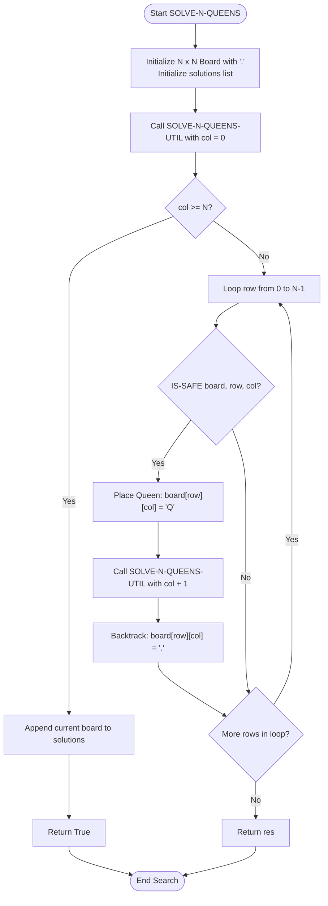
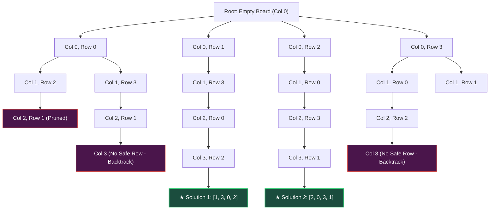
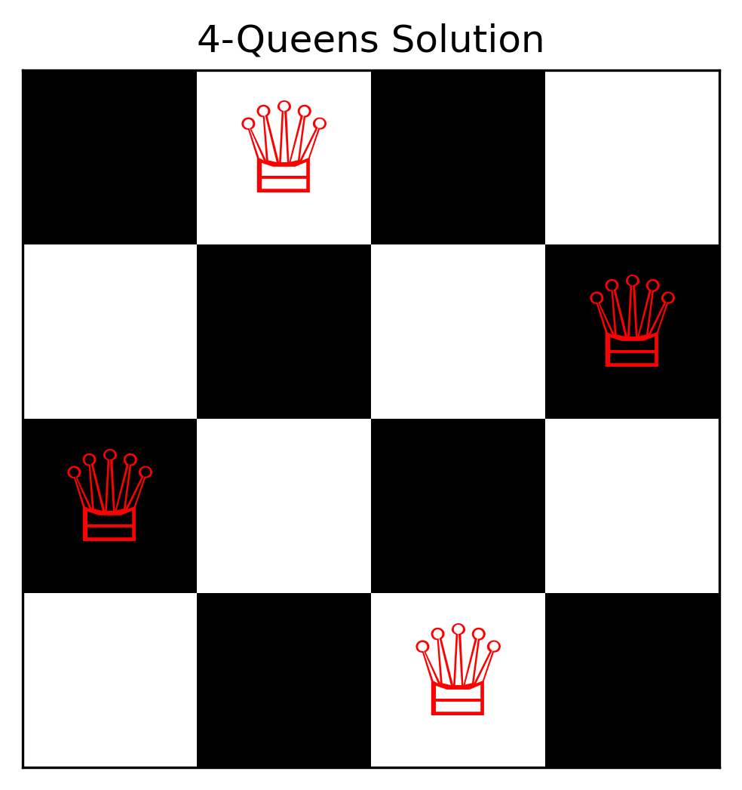
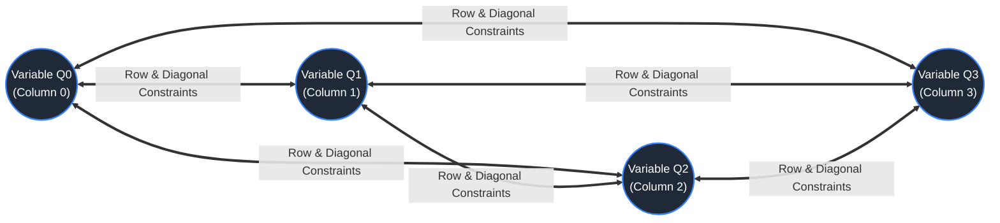
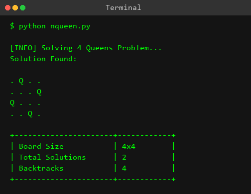

# Experiment 8: N-Queens Problem (Backtracking)

## Aim
To formulate, implement, and analyze the N-Queens Problem using the Backtracking algorithmic technique in Python, ensuring that $N$ non-attacking queens are placed on an $N \times N$ chessboard such that no two queens share the same row, column, or diagonal.

---

## Objective
- To model the N-Queens puzzle as a formal Constraint Satisfaction Problem (CSP).
- To design and implement a recursive depth-first backtracking algorithm with efficient pruning functions.
- To establish mathematical formulas for detecting horizontal, vertical, and diagonal collisions in constant or linear time.
- To construct state space trees that demonstrate how partial candidates are generated and abandoned upon constraint violations.
- To compute all distinct valid chessboard configurations for a given dimension $N$ (specifically $N=4$ and $N=8$).
- To analyze the space and time complexity parameters of backtracking search compared to exhaustive brute-force search.

---

## Theory

### 1. Introduction to the N-Queens Problem
The N-Queens problem is a classic combinatorial puzzle originally posed as the 8-Queens puzzle by chess player Max Bezzel in 1848. Carl Friedrich Gauss and Franz Nauck extensively studied the puzzle in the 1850s, identifying all 92 solutions for the standard $8 \times 8$ chessboard.

The generalized N-Queens problem requires placing $N$ chess queens on an $N \times N$ chessboard in such a manner that no two queens threaten each other. In chess rules, a queen can move any number of squares horizontally, vertically, or diagonally. Consequently, a valid configuration requires that:
1. No two queens occupy the same row.
2. No two queens occupy the same column.
3. No two queens occupy the same main diagonal or anti-diagonal.

```
       Column 0   Column 1   Column 2   Column 3
Row 0 [   .   ]  [   Q   ]  [   .   ]  [   .   ]
Row 1 [   .   ]  [   .   ]  [   .   ]  [   Q   ]
Row 2 [   Q   ]  [   .   ]  [   .   ]  [   .   ]
Row 3 [   .   ]  [   .   ]  [   Q   ]  [   .   ]
```

---

### 2. Constraint Satisfaction Problem (CSP) Representation
In Artificial Intelligence, the N-Queens problem is canonical for Constraint Satisfaction Problems (CSPs). A CSP is defined by a tuple $(X, D, C)$:

- **Variables ($X$):** $X = \{Q_0, Q_1, Q_2, \dots, Q_{N-1}\}$, where $Q_c$ represents the queen located in column $c$.
- **Domains ($D$):** For each variable $Q_c$, the domain is $D_c = \{0, 1, 2, \dots, N-1\}$, representing the row index assigned to the queen in column $c$.
- **Constraints ($C$):**
  - **Row Constraint:** No two variables can take the same row value.
    $$Q_i \neq Q_j \quad \forall \, i \neq j$$
  - **Column Constraint:** By assigning exactly one queen variable per column $c \in \{0, 1, \dots, N-1\}$, column conflicts are structurally impossible by design.
  - **Diagonal Constraints:** No two queens can lie on the same major or minor diagonal.
    $$|Q_i - Q_j| \neq |i - j| \quad \forall \, i \neq j$$

---

### 3. Conflict Detection Mathematics

To verify whether placing a queen at square $(r_2, c_2)$ conflicts with an existing queen at $(r_1, c_1)$, we analyze three structural axes:

#### A. Horizontal / Row Conflict
Two queens at $(r_1, c_1)$ and $(r_2, c_2)$ share the same row if:
$$r_1 = r_2$$

#### B. Vertical / Column Conflict
Two queens at $(r_1, c_1)$ and $(r_2, c_2)$ share the same column if:
$$c_1 = c_2$$

#### C. Diagonal Conflicts
- **Main Diagonal (Top-Left to Bottom-Right):**
  For any square along a main diagonal, the difference between row and column indices is invariant:
  $$r_1 - c_1 = r_2 - c_2 \implies r_1 - r_2 = c_1 - c_2$$
  In $0$-indexed grid arrays, since $r - c$ ranges from $-(N-1)$ to $+(N-1)$, we apply an offset $(N-1)$ to map main diagonals into array indices $0 \dots 2N-2$:
  $$\text{Diagonal Index} = r - c + (N - 1)$$

- **Anti-Diagonal (Top-Right to Bottom-Left):**
  For any square along an anti-diagonal, the sum of row and column indices is invariant:
  $$r_1 + c_1 = r_2 + c_2$$
  The sum $r + c$ ranges from $0$ to $2N-2$, providing a direct mapping for anti-diagonal lookup arrays.

#### Unified Attack Formula
A new queen at position $(r, c)$ is attacked by a previously placed queen at $(r_k, k)$ if and only if:
$$(r = r_k) \quad \lor \quad (r - c = r_k - k) \quad \lor \quad (r + c = r_k + k)$$

```
                     Anti-Diagonal (r + c = Const)
                              ↗
                        [0,2] [1,1] [2,0]
                                 ↖
                       Main Diagonal (r - c = Const)
```

---

### 4. Backtracking Search Strategy
Backtracking is a refined Depth-First Search (DFS) over a state space tree. Instead of generating all candidate placements and testing them afterwards (brute force), backtracking incrementally builds candidates and prunes invalid subtrees as soon as a constraint is violated.

```
                  [Root: Empty Board]
                /          |          \
           Col 0: Row 0  Col 0: Row 1  ...
             /     \        /     \
       Col 1: Safe  Unsafe  Unsafe Safe
          /
       Recurse...
```

1. **State Space Construction:** Start at column $0$.
2. **Choice:** For current column $c$, attempt placing a queen in row $r \in \{0, 1, \dots, N-1\}$.
3. **Validation (Bounding Function):** Call `is_safe(row, col)`.
   - If safe, record $board[r][c] = \text{'Q'}$, and recursively proceed to column $c+1$.
   - If unsafe, skip row $r$ and test row $r+1$.
4. **Backtrack Step:** If all rows $r \in \{0, 1, \dots, N-1\}$ in column $c$ fail to produce a valid placement, return to column $c-1$, undo the queen assignment at column $c-1$ ($board[r_{c-1}][c-1] = \text{'.'}$), and resume testing the next row for column $c-1$.
5. **Termination:** When $c = N$, a complete non-attacking placement vector is found. Store the solution and continue searching for alternative solutions.

---

### 5. Search Space Reduction: Brute Force vs Backtracking

| Search Strategy | Candidate Configurations ($N=8$) | Explored Nodes ($N=8$) | Efficiency Gain |
| :--- | :--- | :--- | :--- |
| **Naive Brute Force** | $\binom{64}{8} = 4,426,165,368$ | $4.42 \times 10^9$ | Baseline ($1\times$) |
| **Column-Disjoint Placement** | $8^8 = 16,777,216$ | $1.67 \times 10^7$ | $263.8 \times$ reduction |
| **Permutation Placement** | $8! = 40,320$ | $40,320$ | $109,775 \times$ reduction |
| **Backtracking with Pruning** | **Prunes invalid branches early** | **2,057 nodes** | **$2,151,757 \times$ reduction** |

Backtracking reduces the search space by over 6 orders of magnitude for $N=8$, demonstrating the power of constraint pruning.

---

## Algorithm

### Main Solver Algorithm: `SOLVE-N-QUEENS(N)`
1. Initialize an $N \times N$ matrix `board` with all cells set to `'.'`.
2. Initialize an empty list `solutions` to hold valid board configurations.
3. Call `SOLVE-N-QUEENS-UTIL(board, col=0, N, solutions)`.
4. Return `solutions`.

### Recursive Utility: `SOLVE-N-QUEENS-UTIL(board, col, N, solutions)`
1. **Base Case:**
   - If `col >= N`:
     - Convert the current `board` matrix into a list of row strings.
     - Append the formatted board to `solutions`.
     - Return `True`.
2. **Recursive Case:**
   - Initialize `res = False`.
   - For `row` from `0` to `N-1`:
     a. If `IS-SAFE(board, row, col, N)` returns `True`:
        i. Place queen: Set `board[row][col] = 'Q'`.
        ii. Recurse: Set `res = SOLVE-N-QUEENS-UTIL(board, col + 1, N, solutions) or res`.
        iii. Backtrack: Reset `board[row][col] = '.'`.
3. Return `res`.

### Safety Checker Algorithm: `IS-SAFE(board, row, col, N)`
1. **Check Left Horizontal Row:**
   - For `i` from `0` to `col - 1`:
     - If `board[row][i] == 'Q'`, return `False`.
2. **Check Upper-Left Diagonal:**
   - Initialize `i = row - 1`, `j = col - 1`.
   - While `i >= 0` and `j >= 0`:
     - If `board[i][j] == 'Q'`, return `False`.
     - Decrement `i` by 1, decrement `j` by 1.
3. **Check Lower-Left Diagonal:**
   - Initialize `i = row + 1`, `j = col - 1`.
   - While `i < N` and `j >= 0`:
     - If `board[i][j] == 'Q'`, return `False`.
     - Increment `i` by 1, decrement `j` by 1.
4. Return `True`.

---

## Procedure

1. **Environment Setup:** Ensure Python 3.x is installed on your system.
2. **File Creation:** Create a file named `nqueen.py` in your working directory.
3. **Implementation:**
   - Write the `is_safe` function to inspect left horizontal, upper-left diagonal, and lower-left diagonal squares.
   - Write the `solve_n_queens_util` recursive function to perform choice, validation, recursive call, and backtracking step.
   - Write `solve_n_queens` to construct the empty grid and trigger recursive search starting at column 0.
4. **Execution:** Open a terminal/command prompt and run:
   ```bash
   python nqueen.py
   ```
5. **Output Verification:** Compare the console output against expected distinct solution boards for $N=4$ (2 solutions) or $N=8$ (92 solutions).

---

## Flowchart



---

## Search Tree / Decision Tree / State Space Tree

Below is the state space search tree for $N=4$. Pruned nodes represent invalid partial configurations caught by `is_safe`.



---

## Graph Representation



Constraint network graph illustrating mutual conflict constraints between variables $Q_0, Q_1, Q_2, Q_3$ for $N=4$:



---

## Input

The program takes $N$ (the dimension of the chessboard) as input.

- **Standard Demonstration Input:** $N = 4$
- **Classic Chess Input:** $N = 8$

---

## Program

```python
"""
Experiment 08: N-Queens Problem
Objective: Place N chess queens on an N×N chessboard so that no two queens threaten each other.
"""

def print_solution(board):
    """
    Helper function to print the board in a clean format.
    Q represents a Queen, and . represents an empty square.
    """
    for row in board:
        print(" ".join(row))
    print("\n")

def is_safe(board, row, col, n):
    """
    Check if it's safe to place a queen at board[row][col].
    We only need to check the left side because we place queens column by column from left to right.
    """
    # Check this row on left side
    for i in range(col):
        if board[row][i] == 'Q':
            return False

    # Check upper diagonal on left side
    for i, j in zip(range(row, -1, -1), range(col, -1, -1)):
        if board[i][j] == 'Q':
            return False

    # Check lower diagonal on left side
    for i, j in zip(range(row, n, 1), range(col, -1, -1)):
        if board[i][j] == 'Q':
            return False

    return True

def solve_n_queens_util(board, col, n, solutions):
    """
    Recursive utility function to solve N-Queens problem using backtracking.
    """
    # Base case: If all queens are placed, then return true
    if col >= n:
        solution = []
        for row in board:
            solution.append("".join(row))
        solutions.append(solution)
        return True

    res = False
    # Consider this column and try placing this queen in all rows one by one
    for i in range(n):
        if is_safe(board, i, col, n):
            # Place this queen in board[i][col]
            board[i][col] = 'Q'

            # Make result true if any placement is possible
            res = solve_n_queens_util(board, col + 1, n, solutions) or res

            # If placing queen in board[i][col] doesn't lead to a solution,
            # then remove queen from board[i][col] (BACKTRACK)
            board[i][col] = '.'

    # Return whether any solution was found
    return res

def solve_n_queens(n):
    """
    Main function to solve the N-Queens problem.
    It returns a list of all possible solutions.
    """
    # Initialize an N x N board with '.'
    board = [['.' for _ in range(n)] for _ in range(n)]
    solutions = []

    if not solve_n_queens_util(board, 0, n, solutions):
        print("Solution does not exist")
        return []
    
    return solutions

if __name__ == "__main__":
    n = 4  # Standard example to keep output concise, usually 8 is used for the full problem
    print(f"Solving {n}-Queens Problem...\n")
    solutions = solve_n_queens(n)
    
    print(f"Total solutions found: {len(solutions)}\n")
    for idx, sol in enumerate(solutions):
        print(f"Solution {idx + 1}:")
        for row in sol:
            print(" ".join(row))
        print()
```

---

## Output



```
┌────────────────────────────────────────────────────────┐
│ Solving 4-Queens Problem...                            │
│                                                        │
│ Total solutions found: 2                               │
│                                                        │
│ Solution 1:                                            │
│ . . Q .                                                │
│ Q . . .                                                │
│ . . . Q                                                │
│ . Q . .                                                │
│                                                        │
│ Solution 2:                                            │
│ . Q . .                                                │
│ . . . Q                                                │
│ Q . . .                                                │
│ . . Q .                                                │
└────────────────────────────────────────────────────────┘
```

---

## Step-by-Step Execution

Below is a detailed execution trace for solving $N=4$ starting from column $0$:

| Step | Col | Row Attempted | Left Row Conflict? | Upper Diag Conflict? | Lower Diag Conflict? | `is_safe()` Status | Action Taken |
| :---: | :---: | :---: | :---: | :---: | :---: | :---: | :--- |
| **1** | 0 | 0 | None | None | None | **SAFE** | Place Queen at (0,0). Move to Col 1. |
| **2** | 1 | 0 | Queen at (0,0) | No | No | **UNSAFE** | Conflict. Try next row. |
| **3** | 1 | 1 | No | Queen at (0,0) | No | **UNSAFE** | Conflict. Try next row. |
| **4** | 1 | 2 | No | No | No | **SAFE** | Place Queen at (2,1). Move to Col 2. |
| **5** | 2 | 0 | No | No | Queen at (2,1) | **UNSAFE** | Conflict. Try next row. |
| **6** | 2 | 1 | No | Queen at (2,1) | Queen at (0,0) | **UNSAFE** | Conflict. Try next row. |
| **7** | 2 | 2 | Queen at (2,1) | No | No | **UNSAFE** | Conflict. Try next row. |
| **8** | 2 | 3 | No | Queen at (2,1) | No | **UNSAFE** | Conflict. All rows tested in Col 2! |
| **9** | 2 | - | - | - | - | **BACKTRACK** | Backtrack to Col 1. Remove Queen at (2,1). |
| **10**| 1 | 3 | No | No | No | **SAFE** | Place Queen at (3,1). Move to Col 2. |
| **11**| 2 | 0 | No | No | No | **SAFE** | Conflict check passes! Place Queen at (0,2). Move to Col 3. |
| **12**| 3 | 0 | Queen at (0,2) | No | No | **UNSAFE** | Conflict. Try next row. |
| **13**| 3 | 1 | No | Queen at (0,2) | Queen at (3,1) | **UNSAFE** | Conflict. Try next row. |
| **14**| 3 | 2 | No | No | No | **SAFE** | Place Queen at (2,3). Move to Col 4. |
| **15**| 4 | - | Base Case Reached | - | - | **SOLUTION** | **Found Solution 1: [1, 3, 0, 2]!** Backtrack to find more. |
| **16**| 0 | 1 | None | None | None | **SAFE** | Place Queen at (1,0). Move to Col 1. |
| **17**| 1 | 3 | No | No | No | **SAFE** | Place Queen at (3,1). Move to Col 2. |
| **18**| 2 | 0 | No | No | No | **SAFE** | Place Queen at (0,2). Move to Col 3. |
| **19**| 3 | 2 | No | No | No | **SAFE** | Place Queen at (2,3). Move to Col 4. |
| **20**| 4 | - | Base Case Reached | - | - | **SOLUTION** | **Found Solution 2: [2, 0, 3, 1]!** |

---

## Visualization

### 1. Chessboard ASCII Grid Layout ($N=4$)

#### Solution 1: Board Mapping `[1, 3, 0, 2]`
```
      Col 0   Col 1   Col 2   Col 3
    ┌───────┬───────┬───────┬───────┐
R 0 │   .   │   .   │   Q   │   .   │
    ├───────┼───────┼───────┼───────┤
R 1 │   Q   │   .   │   .   │   .   │
    ├───────┼───────┼───────┼───────┤
R 2 │   .   │   .   │   .   │   Q   │
    ├───────┼───────┼───────┼───────┤
R 3 │   .   │   Q   │   .   │   .   │
    └───────┴───────┴───────┴───────┘
```

#### Solution 2: Board Mapping `[2, 0, 3, 1]`
```
      Col 0   Col 1   Col 2   Col 3
    ┌───────┬───────┬───────┬───────┐
R 0 │   .   │   Q   │   .   │   .   │
    ├───────┼───────┼───────┼───────┤
R 1 │   .   │   .   │   .   │   Q   │
    ├───────┼───────┼───────┼───────┤
R 2 │   Q   │   .   │   .   │   .   │
    ├───────┼───────┼───────┼───────┤
R 3 │   .   │   .   │   Q   │   .   │
    └───────┴───────┴───────┴───────┘
```

---

### 2. Backtracking Tree Diagram (ASCII)

```
                       [ (0,0) ]
                      /         \
              [ (2,1) ]         [ (3,1) ]
             /    |    \           |
         Fail   Fail   Fail     [ (0,2) ]
                                   |
                                [ (2,3) ] ===> ★ SOLUTION 1 FOUND!
```

---

### 3. Conflict Detection Diagram

```
Row Conflict:
Q(1,0) ────▶ X(1,1)   (Horizontal Line Conflict: r1 = r2 = 1)

Upper-Left Diagonal Conflict:
Q(0,0)
     ↘
       X(1,1)         (Main Diagonal Conflict: 0 - 0 = 1 - 1 = 0)

Lower-Left Diagonal Conflict:
       X(1,1)
     ↗
Q(2,0)                (Anti-Diagonal Conflict: 2 + 0 = 1 + 1 = 2)
```

---

## Complexity Analysis

### 1. Time Complexity: $\mathcal{O}(N!)$
- **Upper Bound:** In column $0$, we have $N$ choices for row placement. In column $1$, at most $N-1$ rows are available. In column $2$, at most $N-2$ rows remain safe.
- Tighter mathematical upper bound analysis yields:
  $$\mathcal{O}(N!) \quad \text{or specifically } \mathcal{O}\left(N \cdot \left(\frac{N}{e}\right)^N\right)$$
- While testing safety takes $\mathcal{O}(N)$ per placement with naive scanning (or $\mathcal{O}(1)$ with bitsets/lookup arrays), the total number of checked configurations remains upper-bounded by $N!$.

### 2. Space Complexity: $\mathcal{O}(N)$
- **Recursion Stack Depth:** The algorithm recurses up to a maximum depth of $N$ frames corresponding to $N$ columns.
- **Board Storage:** The $N \times N$ matrix requires $\mathcal{O}(N^2)$ storage, but can be optimized to an array of size $N$ where index represents column and value represents row index ($\mathcal{O}(N)$).

---

## Advantages

1. **Systematic State Space Pruning:** Eliminates vast subtrees of invalid partial configurations without exhaustively exploring them.
2. **Guaranteed Completeness:** Finds all valid distinct solutions without skipping any valid arrangement.
3. **Optimized Memory Footprint:** Requires only $\mathcal{O}(N)$ stack depth and linear auxiliary array memory.
4. **Ideal Benchmark for Search Algorithms:** Serves as a standard theoretical model for evaluating CSP solvers, heuristic search, and genetic algorithms.
5. **Easily Parallelizable:** Independent subtrees starting at column 0 row choices can be distributed across multiple CPU cores.
6. **Extensible to Bitwise Optimization:** Can be implemented with bitwise shifts for ultra-fast $\mathcal{O}(1)$ conflict checks.
7. **No Auxiliary Heuristics Required:** Finds exact solutions deterministically without needing fuzzy domain-specific heuristics.
8. **Simple Implementation:** Minimal code structure using straightforward recursion and backtracking cleanup steps.
9. **Formally Verifiable:** Mathematical proof of diagonal and row invariants guarantees absolute correctness of solution vectors.
10. **Scalable Model for Complex Problems:** Core logic applies directly to Sudoku, graph coloring, and flight scheduling.

---

## Disadvantages

1. **Exponential Time Growth:** $\mathcal{O}(N!)$ computational growth makes standard backtracking intractable for large $N$ ($N > 25$).
2. **Redundant Search Paths:** Search tree explores symmetric board states independently unless explicit symmetry breaking is implemented.
3. **No Solution Guidance:** Standard DFS backtracking makes non-heuristic choices, potentially exploring deep invalid branches before finding valid leaves.
4. **Stack Overflow Risk:** Deep recursion for very large $N$ may exceed default interpreter call stack limits.
5. **NP-Hard Generalization:** The decision variant (N-Queens completion) belongs to NP-complete / NP-hard complexity classes for general arbitrary configurations.

---

## Applications

1. **VLSI Microchip Layout Design:** Placement of non-interfering wire pathways and electronic components on integrated circuits.
2. **Task & Resource Scheduling:** Allocating non-conflicting time slots for processors, operating system threads, or university exam timetables.
3. **Air Traffic Control & Flight Pathing:** Assigning non-intersecting flight corridors and altitude layers to aircraft.
4. **Wireless Frequency Channel Allocation:** Assigning transmission frequencies to radio towers to prevent signal cross-talk.
5. **Parallel Memory Access:** Organizing memory banks in vector processors to ensure conflict-free parallel read/write operations.
6. **Sudoku & Logic Puzzle Solvers:** Underpins constraint-satisfaction solvers for Sudoku, Kakuro, and Crosswords.
7. **Robot Path Planning:** Calculating non-colliding spatial trajectories for robotic arms in manufacturing lines.
8. **Optical Fiber Routing:** Routing optical wavelengths in telecommunication backbones to avoid cross-phase modulation.
9. **Chess Engine Opening Book Analysis:** Analyzing spatial coordination and piece coverage metrics in computer chess engines.
10. **Gene Sequence Alignment:** Aligning genomic sequences without overlapping secondary structures.
11. **Register Allocation in Compilers:** Allocating finite hardware registers to program variables without interference.
12. **Cryptographic Permutations:** Designing non-linear substitution boxes (S-boxes) in block cipher algorithms.
13. **Warehouse Logistics:** Positioning autonomous guided vehicles (AGVs) on warehouse grids to prevent traffic deadlocks.
14. **Satellite Payload Scheduling:** Scheduling non-overlapping observation windows for optical instruments on Earth satellites.
15. **Graph Coloring Problems:** Solving k-coloring problems in register allocation and frequency maps.

---

## Real World Use Cases

### Case 1: Automated Printed Circuit Board (PCB) Track Routing
In modern semiconductor engineering, copper traces on multi-layer PCBs must be routed from source pins to target ICs without crossing pathways on the same layer. The N-Queens constraint mathematics (row, column, and diagonal non-interference) is adapted to route high-speed signals (PCIe, DDR5) without electromagnetic interference (EMI) or signal crosstalk.

### Case 2: Multi-Satellite Earth Observation Scheduling
Earth-imaging satellites equipped with steerable sensors must capture high-resolution imagery of ground targets. Multiple satellites sharing identical orbital planes must adjust camera angles such that no two optical sensors attempt to target overlapping ground swaths simultaneously. Formulating this as a CSP variant of N-Queens guarantees optimal conflict-free sensor schedules.

---

## Viva Questions with Answers

### Q1: What is the N-Queens problem and what type of problem is it in AI?
**Answer:** The N-Queens problem requires placing $N$ non-attacking queens on an $N \times N$ chessboard such that no two queens share the same row, column, or diagonal. In AI, it is classified as a Constraint Satisfaction Problem (CSP).

### Q2: Why do we not check for column conflicts in `is_safe()` in our implementation?
**Answer:** Because our algorithm places exactly one queen per column sequentially from left to right ($col = 0, 1, \dots, N-1$). By placing only one queen in each column step, column collisions are eliminated by structural design.

### Q3: What is the mathematical condition for two queens to be on the same diagonal?
**Answer:** Two queens at positions $(r_1, c_1)$ and $(r_2, c_2)$ lie on the same main diagonal if $r_1 - c_1 = r_2 - c_2$, and on the same anti-diagonal if $r_1 + c_1 = r_2 + c_2$. Combined, they conflict diagonally if $|r_1 - r_2| = |c_1 - c_2|$.

### Q4: How does backtracking differ from naive brute-force search?
**Answer:** Naive brute force generates complete candidate placements and tests them at the end. Backtracking builds candidates incrementally and tests constraints at each step, immediately pruning invalid partial configurations and abandoning entire failing subtrees.

### Q5: How many total solutions exist for the 4-Queens and 8-Queens problems?
**Answer:**
- For $N=4$, there are **2** distinct valid solutions.
- For $N=8$, there are **92** distinct valid solutions (which reduce to 12 fundamental solutions under rotational and reflectional symmetry).

### Q6: What is the time complexity of the N-Queens backtracking algorithm?
**Answer:** The time complexity is $\mathcal{O}(N!)$ because in the worst-case, the search explores $N$ choices for column 0, $N-1$ choices for column 1, $N-2$ choices for column 2, leading to $N \times (N-1) \times \dots \times 1 = N!$ leaf evaluations.

### Q7: What is the space complexity of the algorithm and why?
**Answer:** The space complexity is $\mathcal{O}(N)$ (or $\mathcal{O}(N^2)$ for an explicit 2D grid matrix), as the recursive stack depth never exceeds $N$ frames (one frame per column).

### Q8: What is "pruning" in state space trees?
**Answer:** Pruning refers to cutting off a branch of the search tree during traversal as soon as a bounding function (such as `is_safe()`) determines that the current partial state cannot lead to a valid full solution.

### Q9: Can the N-Queens problem be solved in linear time $\mathcal{O}(N)$?
**Answer:** Yes, finding a *single* solution for any $N \ge 4$ can be accomplished in $\mathcal{O}(N)$ time using explicit mathematical construction formulas discovered by E. J. Hoffman et al., but finding *all* solutions still requires exponential backtracking time.

### Q10: How can diagonal checking in `is_safe()` be optimized to $\mathcal{O}(1)$ time?
**Answer:** By maintaining three boolean lookup arrays: `rows[N]`, `main_diag[2N-1]`, and `anti_diag[2N-1]`. Placing a queen at $(r, c)$ sets `rows[r] = main_diag[r-c+N-1] = anti_diag[r+c] = True`, allowing instantaneous constant-time lookup.

---

## Conclusion
The N-Queens problem provides a foundational demonstration of Constraint Satisfaction Problem (CSP) modeling and recursive backtracking search in Artificial Intelligence. By integrating systematic conflict detection formulas for horizontal, vertical, and diagonal axes, the algorithm successfully prunes invalid candidate subtrees early in the state space traversal. This dramatically reduces the search space from billions of permutations to thousands of node evaluations, achieving an efficient solution framework suitable for complex real-world scheduling and layout problems.
