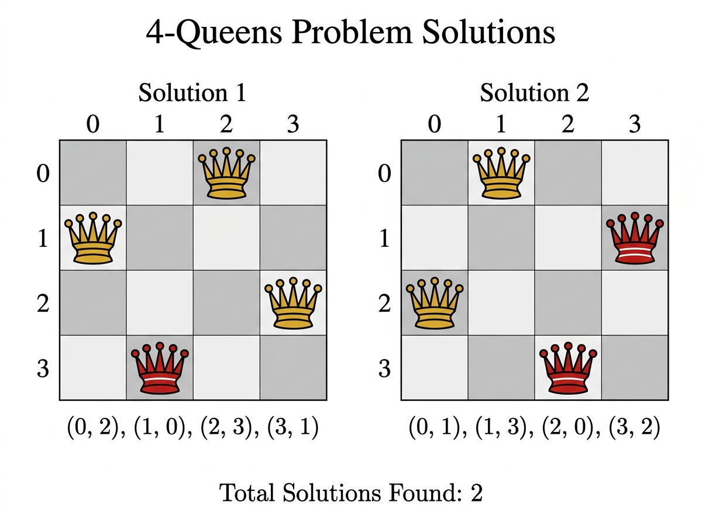

# Experiment 8: N-Queens Problem

## Aim

To solve the N-Queens problem using backtracking — placing N queens on an N×N board so no two queens share a row, column, or diagonal.

## Algorithm

1. Start from column 0.
2. For each row, check if placing a queen is safe:
   - No queen in the same row to the left.
   - No queen on upper-left or lower-left diagonal.
3. If safe, place queen and recurse to next column.
4. If all columns filled, record the solution.
5. Backtrack: remove queen and try next row.

## Procedure

1. Navigate to the experiment folder.
2. Run: `python nqueen.py`
3. The program solves the 4-Queens problem (N=4).
4. Observe all valid board configurations.

## Source Code

Refer to file: `nqueen.py`

## Output




### Solution 1

```
    Col:  0   1   2   3
         +---+---+---+---+
Row 0:   | . | . | Q | . |
         +---+---+---+---+
Row 1:   | Q | . | . | . |
         +---+---+---+---+
Row 2:   | . | . | . | Q |
         +---+---+---+---+
Row 3:   | . | Q | . | . |
         +---+---+---+---+

Queen positions: (0,2)  (1,0)  (2,3)  (3,1)
```

### Solution 2

```
    Col:  0   1   2   3
         +---+---+---+---+
Row 0:   | . | Q | . | . |
         +---+---+---+---+
Row 1:   | . | . | . | Q |
         +---+---+---+---+
Row 2:   | Q | . | . | . |
         +---+---+---+---+
Row 3:   | . | . | Q | . |
         +---+---+---+---+

Queen positions: (0,1)  (1,3)  (2,0)  (3,2)
```

### Terminal Output

```
Solving 4-Queens Problem...

Total solutions found: 2

Solution 1:
. . Q .
Q . . .
. . . Q
. Q . .

Solution 2:
. Q . .
. . . Q
Q . . .
. . Q .
```
