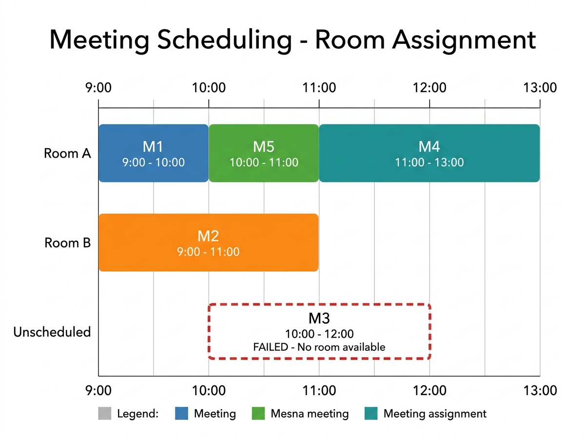

# Experiment 9: Meeting Scheduling

## Aim

To implement a Meeting Scheduling system using a greedy constraint satisfaction approach, assigning meetings to rooms while avoiding time conflicts.

## Algorithm

1. Sort meetings by end time (greedy criterion).
2. For each meeting, try each room in order:
   - Two meetings conflict if: max(s1, s2) < min(e1, e2).
   - Assign to first available room.
3. If no room available, log as unscheduled.
4. Return final schedule.

## Procedure

1. Navigate to the experiment folder.
2. Run: `python meeting_scheduler.py`
3. The program schedules 5 meetings into 2 rooms.
4. Observe scheduled meetings and which one could not be placed.

## Source Code

Refer to file: `meeting_scheduler.py`

## Output




### Meeting Input Table

```
 Meeting | Start | End   | Duration
---------|-------|-------|----------
   M1    |  9:00 | 10:00 | 1 hour
   M2    |  9:00 | 11:00 | 2 hours
   M3    | 10:00 | 12:00 | 2 hours
   M4    | 11:00 | 13:00 | 2 hours
   M5    | 10:00 | 11:00 | 1 hour
```

### Sorted by End Time

```
M1 (ends 10) -> M5 (ends 11) -> M2 (ends 11) -> M3 (ends 12) -> M4 (ends 13)
```

### Assignment Process

```
M1 (9-10)  -> Room A   [OK]
M5 (10-11) -> Room A   [OK, no overlap with M1]
M2 (9-11)  -> Room B   [Room A conflict with M5]
M3 (10-12) -> FAIL     [Room A conflict, Room B conflict] -> UNSCHEDULED
M4 (11-13) -> Room A   [OK, no overlap with M5]
```

### Final Gantt Chart

```
Time:     09:00     10:00     11:00     12:00     13:00
           |         |         |         |         |
Room A:   [ M1  ]  [ M5  ]  [     M4         ]
Room B:   [      M2      ]
Failed:             [    M3    ]   <- No room available
```

### Terminal Output

```
Scheduling Meetings...
Could not schedule meeting M3 due to room unavailability.

Final Schedule:
Room A:
  M1 from 9:00 to 10:00
  M5 from 10:00 to 11:00
  M4 from 11:00 to 13:00
Room B:
  M2 from 9:00 to 11:00
```
