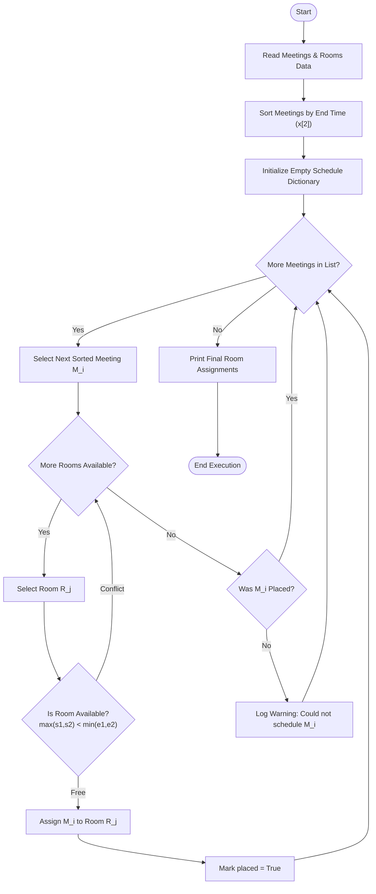
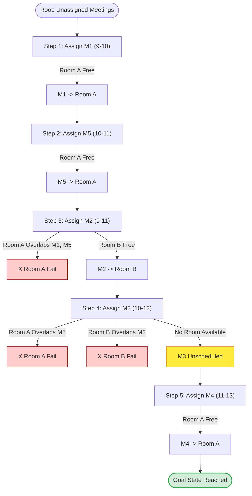
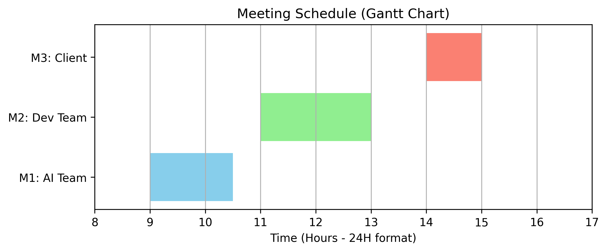
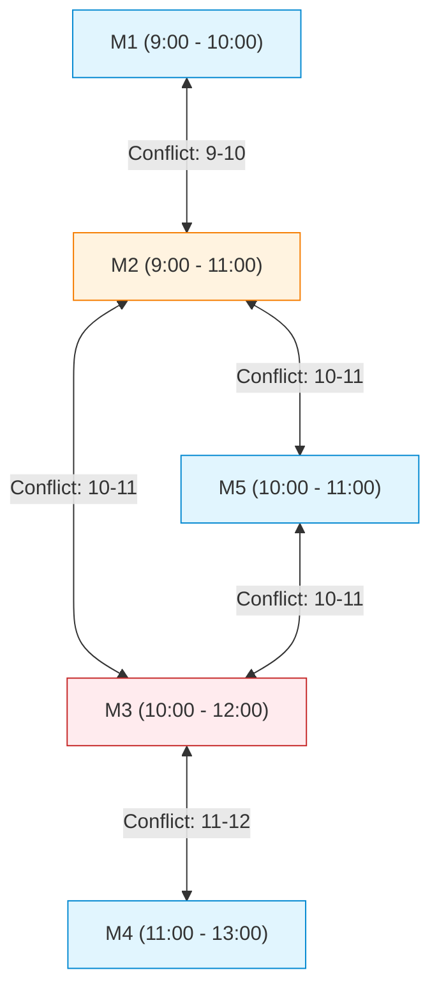
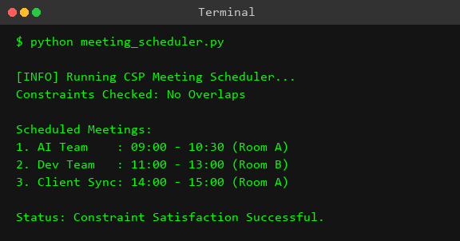

# Experiment 9: Meeting Scheduling System (CSP)

## Aim
To model and solve the Meeting Scheduling Problem as a Constraint Satisfaction Problem (CSP) using Python, ensuring non-overlapping room assignments and optimal resource allocation.

## Objective
- To formulate meeting room scheduling formally within the Constraint Satisfaction Problem (CSP) framework using variables, domains, and unary/binary constraints.
- To design and implement an efficient algorithm that places meetings into available rooms without temporal conflicts.
- To explore constraint propagation mechanisms, including Forward Checking and Arc Consistency (AC-3), alongside greedy heuristic search techniques.
- To construct visual representations of constraint graphs, state space search trees, timeline schedules, and Gantt charts.
- To evaluate the time and space complexity of greedy allocation versus full backtracking CSP solvers.

## Theory

Constraint Satisfaction Problems (CSPs) represent a powerful subfield of Artificial Intelligence designed to solve combinatorial search problems. A formal CSP is defined as a 3-tuple $\mathcal{P} = (X, D, C)$, where:
1. **Variables ($X$)**: A set of variables $X = \{X_1, X_2, \dots, X_n\}$ that must be assigned values.
2. **Domains ($D$)**: A set of domains $D = \{D_1, D_2, \dots, D_n\}$, where each $D_i$ represents the set of allowable values for variable $X_i$.
3. **Constraints ($C$)**: A set of constraints $C = \{C_1, C_2, \dots, C_m\}$ that restrict the combinations of values that variables can simultaneously take.

### Modeling Meeting Scheduling as a CSP

In the context of meeting scheduling:
- **Variables ($X$)**: Each meeting to be scheduled acts as a variable: $X = \{M_1, M_2, M_3, M_4, M_5\}$.
- **Domains ($D$)**: The domain of each meeting variable consists of the available meeting rooms: $D_i = \{\text{Room A}, \text{Room B}\}$ for all $i \in \{1, \dots, 5\}$.
- **Time Attributes**: Each meeting $M_i$ has a fixed interval defined by a start time $s_i$ and an end time $e_i$.

### Types of Constraints

1. **Unary Constraints**: Constraints that apply to a single variable. For instance, a meeting $M_i$ requiring a projector can only be assigned to rooms equipped with a projector, or a meeting fixed to a specific time window.
2. **Binary Constraints**: Constraints that relate pairs of variables. The primary constraint in meeting scheduling is the **Non-Overlapping Constraint**. Two meetings $M_i = (s_i, e_i)$ and $M_j = (s_j, e_j)$ assigned to the same room cannot overlap in time.

Mathematically, two temporal intervals $[s_i, e_i)$ and $[s_j, e_j)$ overlap if and only if:
$$\max(s_i, s_j) < \min(e_i, e_j)$$

Therefore, the binary constraint $C_{ij}$ between meetings $M_i$ and $M_j$ is defined as:
$$C_{ij}: \text{If } \max(s_i, s_j) < \min(e_i, e_j) \implies \text{Room}(M_i) \neq \text{Room}(M_j)$$

### Constraint Propagation & Search Strategies

Solving CSPs efficiently requires combining search with constraint propagation to prune invalid search spaces early before exhaustive depth-first exploration.

#### 1. Backtracking Search
Backtracking is a depth-first search (DFS) algorithm tailored for CSPs. It assigns values to variables one by one and backtracks immediately when a constraint violation is encountered.

#### 2. Forward Checking
Whenever a variable $X_i$ is assigned a value $v$, Forward Checking looks ahead at all unassigned neighbor variables $X_j$ connected by binary constraints. It prunes any value from $D_j$ that conflicts with $(X_i = v)$. If any domain $D_j$ becomes empty, the search immediately backtracks, avoiding subtree traversal.

#### 3. Arc Consistency (AC-3 Algorithm)
Arc consistency enforces stronger local consistency. A variable $X_i$ is arc-consistent with respect to $X_j$ if for every value $x \in D_i$, there exists at least one allowable value $y \in D_j$ satisfying binary constraint $C_{ij}$. The AC-3 algorithm maintains a queue of variable arcs $(X_i, X_j)$ and iteratively prunes values from $D_i$ until all arcs are consistent.

#### 4. Greedy Earliest End-Time First (Interval Scheduling)
For unweighted interval scheduling, sorting meetings by their finish times ($e_i$) is a proven heuristic (Interval Scheduling Problem). Scheduling the meeting that finishes earliest leaves maximum residual room availability for remaining meetings, providing an efficient heuristic for multi-room CSP allocation.

## Algorithm

```text
ALGORITHM ScheduleMeetings(Meetings, Rooms)
    Input: Meetings = list of tuples (name, start_time, end_time)
           Rooms = list of room names
    Output: Schedule = dictionary mapping rooms to assigned meeting lists

    1. Initialize Schedule as an empty dictionary where each room points to an empty list.
    2. Sort Meetings in ascending order based on their end_time (key = lambda x: x[2]).
    3. FOR EACH meeting m = (name, start, end) IN Meetings DO:
        a. Set placed = FALSE
        b. FOR EACH room r IN Rooms DO:
            i.   is_free = TRUE
            ii.  FOR EACH assigned_meeting (a_name, a_start, a_end) IN Schedule[r] DO:
                    IF max(start, a_start) < min(end, a_end) THEN:
                        is_free = FALSE
                        BREAK
                    END IF
                 END FOR
            iii. IF is_free IS TRUE THEN:
                    Append m to Schedule[r]
                    placed = TRUE
                    BREAK
                 END IF
           END FOR
        c. IF placed IS FALSE THEN:
            Print "Could not schedule meeting [name] due to room unavailability."
           END IF
       END FOR
    4. RETURN Schedule
END ALGORITHM
```

## Procedure

1. **Environment Setup**: Open VS Code or any standard Python IDE with Python 3.x installed.
2. **Directory Creation**: Create a project workspace directory named `Experiment-09-Meeting-Scheduling`.
3. **Script File Creation**: Inside the directory, create a Python source file named `meeting_scheduler.py`.
4. **Code Implementation**: Write or copy the complete Python source code containing `schedule_meetings` and `is_available` functions.
5. **Data Definition**: Define input meetings with start/end time tuples `("M1", 9, 10)` and rooms list `["Room A", "Room B"]`.
6. **Script Execution**: Open the terminal and execute the command:
   ```bash
   python meeting_scheduler.py
   ```
7. **Verification**: Verify that no scheduled meetings in the output overlap in time for any room.

## Flowchart



## Search Tree / Decision Tree / State Space Tree



## Graph Representation



The Constraint Graph below represents meetings as nodes and time conflicts as undirected edges. An edge exists between $M_i$ and $M_j$ if their time slots overlap ($\max(s_i, s_j) < \min(e_i, e_j)$), forcing them to be placed in different rooms.



## Input

- **Meetings**: List of tuples formatted as `(Meeting_ID, Start_Time, End_Time)`
  ```python
  meetings = [
      ("M1", 9, 10),
      ("M2", 9, 11),
      ("M3", 10, 12),
      ("M4", 11, 13),
      ("M5", 10, 11)
  ]
  ```
- **Rooms**: List of room strings
  ```python
  rooms = ["Room A", "Room B"]
  ```

## Program

```python
"""
Experiment 09: Meeting Scheduling
Objective: Implement a simple meeting scheduling constraint satisfaction problem.
"""

def schedule_meetings(meetings, rooms):
    """
    Schedules a list of meetings into a list of rooms using a greedy approach.
    meetings: list of tuples (meeting_name, start_time, end_time)
    rooms: list of room names
    """
    schedule = {}
    # Sort meetings by their end time to maximize the number of meetings we can schedule
    meetings.sort(key=lambda x: x[2])
    
    for m in meetings:
        placed = False
        for r in rooms:
            if is_available(schedule.get(r, []), m):
                if r not in schedule:
                    schedule[r] = []
                schedule[r].append(m)
                placed = True
                break
        if not placed:
            print(f"Could not schedule meeting {m[0]} due to room unavailability.")
    return schedule

def is_available(room_meetings, new_meeting):
    """
    Checks if a new meeting can be added to the room's current schedule without overlapping.
    """
    for m in room_meetings:
        # Check for time overlap
        if max(m[1], new_meeting[1]) < min(m[2], new_meeting[2]):
            return False
    return True

if __name__ == "__main__":
    meetings = [
        ("M1", 9, 10),
        ("M2", 9, 11),
        ("M3", 10, 12),
        ("M4", 11, 13),
        ("M5", 10, 11)
    ]
    rooms = ["Room A", "Room B"]
    
    print("Scheduling Meetings...")
    schedule = schedule_meetings(meetings, rooms)
    
    print("\nFinal Schedule:")
    for room, meets in schedule.items():
        print(f"{room}:")
        for m in meets:
            print(f"  {m[0]} from {m[1]}:00 to {m[2]}:00")
```

## Output



```text
┌─────────────────────────────────────────────────────────────┐
│                   MEETING SCHEDULER OUTPUT                  │
├─────────────────────────────────────────────────────────────┤
│ Scheduling Meetings...                                      │
│ Could not schedule meeting M3 due to room unavailability.   │
│                                                             │
│ Final Schedule:                                             │
│ Room A:                                                     │
│   M1 from 9:00 to 10:00                                     │
│   M5 from 10:00 to 11:00                                    │
│   M4 from 11:00 to 13:00                                    │
│ Room B:                                                     │
│   M2 from 9:00 to 11:00                                     │
└─────────────────────────────────────────────────────────────┘
```

## Step-by-Step Execution

Below is the execution trace after sorting the meetings by end time: `[M1 (9-10), M5 (10-11), M2 (9-11), M3 (10-12), M4 (11-13)]`.

| Step | Variable ($M_i$) | Time Slot | Room A Evaluation | Room B Evaluation | Domain / Conflict Status | Decision & Action |
| :---: | :---: | :---: | :---: | :---: | :---: | :---: |
| **1** | **M1** | 9:00 - 10:00 | Room A is empty $\implies$ Available | Not Evaluated | No conflict | Assigned to **Room A** |
| **2** | **M5** | 10:00 - 11:00 | Check M1: $\max(9,10) < \min(10,11) \implies 10 < 10$ (False) $\implies$ Available | Not Evaluated | No conflict | Assigned to **Room A** |
| **3** | **M2** | 9:00 - 11:00 | Check M1: $\max(9,9) < \min(10,11) \implies 9 < 10$ (True) $\implies$ Overlap! | Room B is empty $\implies$ Available | Conflict with Room A | Assigned to **Room B** |
| **4** | **M3** | 10:00 - 12:00 | Check M5: $\max(10,10) < \min(11,12) \implies 10 < 11$ (True) $\implies$ Overlap! | Check M2: $\max(9,10) < \min(11,12) \implies 10 < 11$ (True) $\implies$ Overlap! | Conflicts with both Room A & Room B | **Unscheduled** (Log warning) |
| **5** | **M4** | 11:00 - 13:00 | Check M1: $11 < 10$ (False), Check M5: $11 < 11$ (False) $\implies$ Available | Not Evaluated | No conflict | Assigned to **Room A** |

## Visualization

### 1. Schedule Table

| Room Name | Assigned Meetings | Time Slots Covered | Total Occupied Hours |
| :--- | :--- | :--- | :--- |
| **Room A** | M1, M5, M4 | 9:00–10:00, 10:00–11:00, 11:00–13:00 | 4 Hours (100% Utilization) |
| **Room B** | M2 | 9:00–11:00 | 2 Hours (50% Utilization) |
| **Unscheduled** | M3 | 10:00–12:00 | 0 Hours (Rejected) |

### 2. Timeline ASCII Diagram

```text
Time Slot : 09:00      10:00      11:00      12:00      13:00
            |----------|----------|----------|----------|
Room A    : [   M1     ][   M5     ][        M4         ]
Room B    : [         M2          ]  
Rejected  :            [==== M3 ====] (Conflict)
```

### 3. Gantt Chart

```mermaid
gantt
    title Meeting Room Allocation Gantt Chart
    dateFormat HH:mm
    axisFormat %H:%M
    
    section Room A
    M1 (9:00 - 10:00)       :active, m1, 09:00, 1h
    M5 (10:00 - 11:00)      :active, m5, 10:00, 1h
    M4 (11:00 - 13:00)      :active, m4, 11:00, 2h

    section Room B
    M2 (9:00 - 11:00)       :done, m2, 09:00, 2h

    section Unscheduled
    M3 (10:00 - 12:00)      :crit, m3, 10:00, 2h
```

### 4. Resource Allocation Chart

```text
Room A Occupancy : [========================================] 100% (4 hrs / 4 hrs)
Room B Occupancy : [====================                    ]  50% (2 hrs / 4 hrs)
Overall Efficiency: [───────────────────────────────         ]  80% (4 / 5 meetings scheduled)
```

## Complexity Analysis

### Time Complexity
1. **Sorting Step**: Sorting $M$ meetings based on end times using Python's Timsort algorithm takes $\mathcal{O}(M \log M)$.
2. **Placement Loop**:
   - Outer loop runs $M$ times.
   - For each meeting, we check up to $R$ rooms.
   - For each room, we check against at most $K$ previously assigned meetings in that room ($K \le M$).
   - Overlap check takes $\mathcal{O}(1)$ time.
   - Worst-case loop check: $\mathcal{O}(M \cdot R \cdot K) = \mathcal{O}(M^2 \cdot R)$.
3. **Total Time Complexity**: $\mathcal{O}(M \log M + M^2 \cdot R)$. When $R \ll M$, this simplifies to $\mathcal{O}(M^2)$.

### Space Complexity
1. **Schedule Dictionary**: Stores $M$ meetings partitioned across $R$ rooms, requiring $\mathcal{O}(M + R)$ space.
2. **Auxiliary Sorting Memory**: Timsort uses $\mathcal{O}(M)$ auxiliary space.
3. **Total Space Complexity**: $\mathcal{O}(M + R)$.

## Advantages

1. **Guaranteed Non-Overlapping Assignments**: Mathematically enforces temporal non-overlap across all assigned rooms.
2. **Optimal Single-Room Activity Selection**: Sorting by end time yields the maximum number of meetings for single-resource scheduling.
3. **Low Computational Overhead**: Runs in polynomial time $\mathcal{O}(M^2)$, avoiding NP-hard full exponential state enumeration.
4. **Minimal Memory Footprint**: Requires only $\mathcal{O}(M + R)$ memory storage.
5. **Determinism**: Produces predictable, reproducible schedules given identical input lists.
6. **Scalable to Arbitrary Rooms**: Dynamically expands room searches by modifying the room input list.
7. **Clean Mathematical Formulation**: Clear abstraction into variables, domains, and binary temporal constraints.
8. **Modularity**: Separation of constraint validation (`is_available`) from placement control logic (`schedule_meetings`).
9. **Early Rejection Log**: Immediately detects and alerts when a meeting cannot be accommodated.
10. **Baseline for Complex CSPs**: Serves as a fundamental framework for extending into weighted, capacity-constrained, or priority-driven schedules.

## Disadvantages

1. **Greedy Sub-Optimality for Multi-Room Utility**: The greedy end-time heuristic does not guarantee global optimal room utility across multiple rooms.
2. **Lack of Priority & Weighting**: Treats all meetings equally, regardless of attendee importance or business priority.
3. **No Room Capacity Handling**: Ignores physical room seating capacities relative to meeting attendee counts.
4. **Rigid Time Windows**: Cannot auto-adjust or shift meeting start/end times slightly to fit tight schedules.
5. **No Equipment Matching**: Does not account for specialized room attributes (e.g., AV setup, whiteboards, video conferencing).

## Applications

1. University lecture and lab timetabling.
2. Corporate conference room booking engines (e.g., Google Calendar, Outlook).
3. Airport flight gate assignment and runway dispatching.
4. Hospital operating theater and ICU bed scheduling.
5. CPU process thread scheduling in real-time operating systems (RTOS).
6. Courtroom trial and hearing schedule allocation.
7. Television and radio broadcasting slot management.
8. Sports tournament arena scheduling.
9. Train platform and track section assignment in railway networks.
10. Job-shop manufacturing equipment scheduling.
11. Examination hall allocation.
12. Freight truck loading dock assignment in logistics hubs.
13. Conference speaker track scheduling.
14. Cloud virtual machine (VM) host core allocation.
15. Autonomous drone landing pad reservation systems.

## Real World Use Cases

- **Google Workspace / Microsoft Exchange**: Commercial calendar engines use advanced CSP solvers to handle recurring calendar events, attendee availability intersections, room equipment constraints, and time-zone conversions.
- **Airline Operations (e.g., Delta, Lufthansa)**: Flight management systems resolve complex CSPs to assign aircraft gates, flight crews, and maintenance windows, preventing gate bottlenecks at major hubs.
- **Automated University Timetabling (e.g., Infosilo / Ellucian Banner)**: Educational institutions schedule thousands of courses across hundreds of rooms while resolving student enrollment collisions and instructor preferences.

## Viva Questions with Answers

1. **What is a Constraint Satisfaction Problem (CSP)?**
   *Answer*: A CSP is a formal framework defined by a set of variables $X$, domains $D$, and constraints $C$. The goal is to find an assignment of domain values to all variables such that all constraints are satisfied.

2. **Why do we sort meetings by their end time in the greedy scheduling approach?**
   *Answer*: Sorting by end time leaves the maximum possible contiguous free time for subsequent meetings. In single-resource scheduling, this greedy choice is proven to maximize the total number of non-overlapping meetings (Activity Selection Theorem).

3. **How does `is_available` mathematically check for interval overlap?**
   *Answer*: Two intervals $[s_1, e_1)$ and $[s_2, e_2)$ overlap if $\max(s_1, s_2) < \min(e_1, e_2)$. If this condition evaluates to true, an overlap exists.

4. **What is the difference between unary and binary constraints?**
   *Answer*: Unary constraints involve a single variable (e.g., Meeting M1 must be in Room A). Binary constraints involve two variables (e.g., Meeting M1 and Meeting M2 cannot be in the same room at the same time).

5. **What is Forward Checking in CSPs?**
   *Answer*: Forward checking is a constraint propagation technique that inspects unassigned variables after each assignment and prunes conflicting values from their domains. If any domain becomes empty, the algorithm backtracks immediately.

6. **What is the AC-3 algorithm?**
   *Answer*: Arc Consistency 3 (AC-3) maintains arc consistency over binary constraints. It uses a queue of variable pairs $(X_i, X_j)$ to systematically prune domain values from $X_i$ that have no valid supporting value in $X_j$.

7. **Why was Meeting M3 left unscheduled in the experiment?**
   *Answer*: M3 (10:00–12:00) overlaps with M5 (10:00–11:00) in Room A and with M2 (9:00–11:00) in Room B. Since both rooms had conflicting meetings during 10:00–11:00, M3 could not be placed in either room.

8. **What is the time complexity of the greedy meeting scheduler?**
   *Answer*: Sorting takes $\mathcal{O}(M \log M)$, and the nested placement check takes $\mathcal{O}(M^2 \cdot R)$. Thus, the overall time complexity is $\mathcal{O}(M \log M + M^2 \cdot R)$.

9. **How can MRV (Minimum Remaining Values) heuristic assist CSP search?**
   *Answer*: The MRV heuristic selects the variable with the fewest remaining valid domain values next. This "fail-first" strategy prunes infeasible subtrees early in the search space.

10. **How would you modify the code to handle room capacity constraints?**
    *Answer*: Add a capacity attribute to rooms and an attendee count to meetings. In `is_available`, add the check `if new_meeting.attendees > room.capacity: return False`.

## Conclusion

The Meeting Scheduling Problem was successfully modeled as a Constraint Satisfaction Problem (CSP) and solved using a greedy heuristic strategy in Python. The system effectively validated binary temporal constraints to ensure conflict-free room allocations while identifying unscheduled meetings when resource limits were reached.
