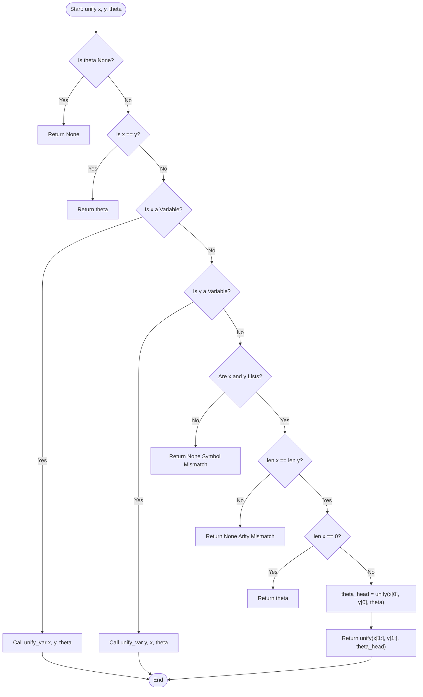
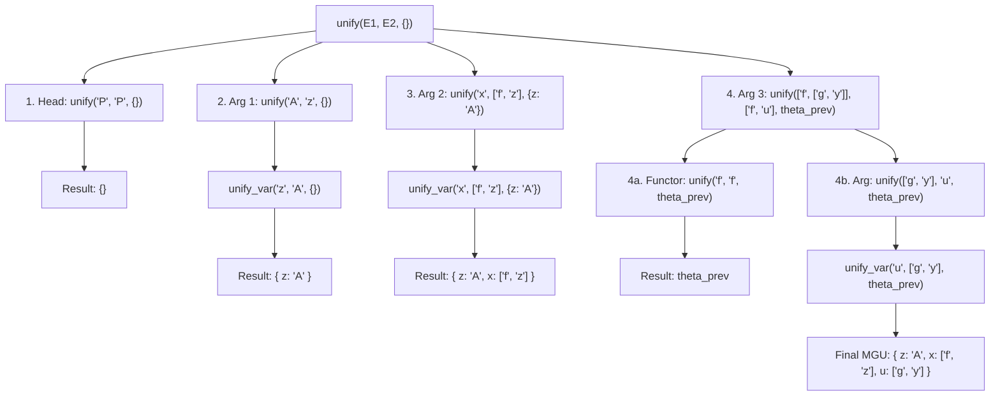

# Experiment 10: Unification Algorithm in Logic

## Aim
To implement and analyze the **Unification Algorithm** in First-Order Logic (FOL) using Python, demonstrating how automated theorem provers and logic programming engines find Most General Unifiers (MGUs) to bind variables across complex logical expressions.

---

## Objective
1. **Understand First-Order Logic Syntax**: Represent atomic sentences, constants, variables, predicate symbols, and compound functional terms as recursive data structures (nested Python lists).
2. **Implement Symbolic Unification**: Develop a recursive pattern-matching procedure that computes a substitution set $\theta$ satisfying $E_1 \theta = E_2 \theta$.
3. **Handle Variable Substitutions**: Propagate existing bindings across sub-terms dynamically using helper functions like `unify_var`.
4. **Determine Failure Conditions**: Correctly detect type mismatches, arity differences, symbol conflicts, and binding incompatibilities that prevent unification.
5. **Analyze Theoretical & Computational Properties**: Evaluate the algorithm's time and space complexity, discuss the role of the "occurs check", and highlight real-world applications in resolution theorem proving, type inference, and Prolog execution engines.

---

## Theory

### 1. Introduction to Symbolic Unification in AI
Unification is a fundamental computational process in symbolic Artificial Intelligence, automated theorem proving, database query resolution, and logic programming languages such as Prolog. At its core, unification is the algorithmic resolution of equations between symbolic expressions. Given two compound expressions $E_1$ and $E_2$ containing constants, variables, and function symbols, unification seeks a mapping of variables to terms—termed a **substitution**—that renders $E_1$ and $E_2$ syntactically identical.

In contrast to pattern matching (which is one-way, matching a variable pattern against a concrete expression), unification is symmetrical and two-way. Both expressions being unified may simultaneously contain free variables that must be instantiated harmoniously across multiple sub-terms.

---

### 2. First-Order Logic Syntax: Predicates, Terms, Variables, and Constants
First-Order Logic (FOL) extends Propositional Logic by formalizing objects, relations, and functions. A logical expression in FOL is built from the following syntactic elements:
- **Constants**: Symbols denoting specific entities in a domain of discourse (e.g., $A, B, \text{John}, \text{5}$). In our implementation, constants are represented by uppercase strings or multi-character identifiers.
- **Variables**: Placeholder symbols that can be instantiated with any valid term (e.g., $x, y, z, u$). In our Python implementation, variables are strictly single lowercase alphabetic characters (`'x'`, `'y'`, `'z'`, `'u'`).
- **Functions**: Mapping operators that map a tuple of terms to another term (e.g., $f(x)$, $g(y)$, $\text{father\_of}(z)$). Syntactically, functions consist of a functor name followed by an arity-matching sequence of argument terms.
- **Predicates**: Boolean-valued relations applied to terms (e.g., $P(A, x)$, $\text{Loves}(\text{John}, y)$). Predicates form atomic formulas in logical sentences.

A **Term** is defined inductively:
1. Every constant is a term.
2. Every variable is a term.
3. If $f$ is an $n$-ary function symbol and $t_1, t_2, \dots, t_n$ are terms, then $f(t_1, t_2, \dots, t_n)$ is a term.

---

### 3. Substitutions and Unifiers
A **substitution** $\theta$ is a finite set of variable-to-term bindings denoted as:
$$\theta = \{ v_1 \mapsto t_1, v_2 \mapsto t_2, \dots, v_k \mapsto t_k \}$$
where each $v_i$ is a distinct variable, and $t_i$ is a term not identical to $v_i$.

Applying a substitution $\theta$ to an expression $E$ (written as $E\theta$) replaces every occurrence of variable $v_i$ in $E$ with term $t_i$.

#### Example:
Let $E = P(x, f(y))$ and $\theta = \{ x \mapsto A, y \mapsto g(z) \}$.
Then:
$$E\theta = P(A, f(g(z)))$$

A substitution $\theta$ is called a **unifier** for expressions $E_1$ and $E_2$ if:
$$E_1\theta = E_2\theta$$

If such a substitution exists, $E_1$ and $E_2$ are said to be **unifiable**.

---

### 4. Most General Unifier (MGU)
Two unifiable expressions may possess an infinite number of valid unifiers. For instance, given $E_1 = P(x)$ and $E_2 = P(y)$:
- $\theta_1 = \{ x \mapsto y \}$
- $\theta_2 = \{ x \mapsto A, y \mapsto A \}$
- $\theta_3 = \{ x \mapsto f(B), y \mapsto f(B) \}$

All three are unifiers. However, $\theta_1$ is the **Most General Unifier (MGU)** because it makes the minimal necessary commitment about variable bindings. 

Formally, a unifier $\sigma$ is an MGU of $E_1$ and $E_2$ if for every other unifier $\theta$, there exists a substitution $\gamma$ such that:
$$\theta = \sigma \circ \gamma$$
where $\circ$ denotes substitution composition. The MGU is unique up to variable renaming (alphabetic variant).

---

### 5. Disagreement Set and Recursive Matching
J. Alan Robinson's original 1965 algorithm computes the MGU by identifying the **disagreement set** of two expressions. The disagreement set is the pair of sub-terms located at the leftmost position where two syntax trees differ.

For example, comparing $P(A, x, f(y))$ and $P(A, z, g(u))$:
1. Head symbol $P$ matches.
2. First argument $A$ matches $A$.
3. Second argument yields disagreement pair $(x, z)$. The algorithm binds $x \mapsto z$.
4. Third argument yields disagreement pair $(f(y), g(u))$. Since functor $f \neq g$, unification fails!

---

### 6. The Occurs Check Problem
A critical theoretical consideration in unification is the **Occurs Check**. When unifying a variable $v$ with a compound term $t$, one must verify whether $v$ occurs as a sub-term within $t$.

#### Example of Occurs Check Failure:
Unify $x$ with $f(x)$.
- Without occurs check: $\theta = \{ x \mapsto f(x) \}$. Applying $\theta$ creates an infinite self-referential term $f(f(f(\dots)))$.
- With occurs check: The algorithm detects that $x$ appears inside $f(x)$ and immediately returns failure (`None`).

*Note on Practical Implementations*: Standard Prolog engines (like SWI-Prolog) historically omit the occurs check by default to maintain $O(N)$ linear-time performance, accepting potential unsoundness in rare edge cases. Modern theorem provers enforce the occurs check or use cyclic graph representations.

---

## Algorithm

### Main Algorithm: `unify(x, y, theta)`
1. **Base Case 1 (Failure propagation)**: If `theta` is `None`, return `None` (failure has occurred upstream).
2. **Base Case 2 (Identity)**: If expression `x` equals expression `y`, return `theta` unchanged.
3. **Variable Case 1**: If `x` is a variable, call `unify_var(x, y, theta)`.
4. **Variable Case 2**: If `y` is a variable, call `unify_var(y, x, theta)`.
5. **Compound Expression Case (Lists)**:
   a. If both `x` and `y` are lists:
      - If `len(x) != len(y)`, return `None` (arity mismatch).
      - If `len(x) == 0`, return `theta`.
      - Compute $\theta_1 = \text{unify}(x[0], y[0], \text{theta})$.
      - Return $\text{unify}(x[1:], y[1:], \theta_1)$.
6. **Failure Fallback**: If `x` and `y` are different constants or incompatible types, return `None`.

---

### Helper Algorithm: `unify_var(var, x, theta)`
1. If `var` is already a key in `theta`, recursively call `unify(theta[var], x, theta)`.
2. Else if `x` is a variable and `x` is already a key in `theta`, recursively call `unify(var, theta[x], theta)`.
3. Else, add binding `theta[var] = x` to substitution dictionary `theta`.
4. Return updated `theta`.

---

## Procedure
1. **Environment Setup**: Ensure Python 3.x is installed on the host system.
2. **Directory Structure**: Create a dedicated project directory `Experiment-10-Unification`.
3. **Script Creation**: Create the source file `unification.py` inside the directory.
4. **Data Representation Design**: Represent logical terms as nested lists:
   - Variable $x \rightarrow \text{string } \mathbf{'x'}$ (single lowercase letter).
   - Constant $A \rightarrow \text{string } \mathbf{'A'}$ (uppercase string).
   - Term $f(g(y)) \rightarrow \text{nested list } \mathbf{['f', ['g', 'y']]}$.
   - Predicate $P(A, x, f(g(y))) \rightarrow \mathbf{['P', 'A', 'x', ['f', ['g', 'y']]]}$.
5. **Code Entry**: Insert the full recursive unification algorithm into `unification.py`.
6. **Execution**: Execute the script via terminal using `python unification.py`.
7. **Result Verification**: Inspect output dictionary `theta` to confirm correct MGU generation.

---

## Flowchart



---

## Search Tree / Decision Tree / State Space Tree

The recursive decomposition of unifying $E_1 = [\text{'P'}, \text{'A'}, \text{'x'}, [\text{'f'}, [\text{'g'}, \text{'y'}]]]$ and $E_2 = [\text{'P'}, \text{'z'}, [\text{'f'}, \text{'z'}], [\text{'f'}, \text{'u'}]]$ is structured as follows:



---

## Graph Representation

Abstract Syntax Trees (AST) of Expressions $E_1$ and $E_2$ with Unification Bindings:

```mermaid
graph TB
    subgraph Expression 1: P A, x, f g y
        P1["P (Predicate)"]
        P1 --> A1["A (Constant)"]
        P1 --> X1["x (Variable)"]
        P1 --> F1["f (Function)"]
        F1 --> G1["g (Function)"]
        G1 --> Y1["y (Variable)"]
    end

    subgraph Expression 2: P z, f z, f u
        P2["P (Predicate)"]
        P2 --> Z2["z (Variable)"]
        P2 --> F2_1["f (Function)"]
        F2_1 --> Z2_ref["z (Variable)"]
        P2 --> F2_2["f (Function)"]
        F2_2 --> U2["u (Variable)"]
    end

    %% Substitution Bindings
    Z2 -. "Binding: z -> A" .-> A1
    X1 -. "Binding: x -> f(z)" .-> F2_1
    U2 -. "Binding: u -> g(y)" .-> G1
```

---

## Input

The program takes two First-Order Logic expressions formatted as nested Python lists:

- **Expression 1**: $P(A, x, f(g(y)))$
  ```python
  expr1 = ['P', 'A', 'x', ['f', ['g', 'y']]]
  ```
- **Expression 2**: $P(z, f(z), f(u))$
  ```python
  expr2 = ['P', 'z', ['f', 'z'], ['f', 'u']]
  ```

### Syntactic Conventions:
1. **Single lowercase string** (e.g., `'x'`, `'y'`, `'z'`, `'u'`) $\rightarrow$ Variable.
2. **Uppercase string or length $> 1$** (e.g., `'A'`, `'P'`, `'f'`, `'g'`) $\rightarrow$ Constant, Predicate, or Function symbol.
3. **List structure** $\rightarrow$ Compound term or predicate sentence where index `0` is the head symbol and indices `1..N` are arguments.

---

## Program

```python
"""
Experiment 10: Unification in First Order Logic
Objective: Implement the Unification algorithm for logic expressions.
"""

def is_variable(exp):
    """
    Checks if the expression is a variable.
    Variables are represented as single lowercase strings.
    """
    return isinstance(exp, str) and exp.islower() and len(exp) == 1

def unify_var(var, x, theta):
    """
    Unifies a variable with an expression.
    """
    if var in theta:
        return unify(theta[var], x, theta)
    elif x in theta:
        return unify(var, theta[x], theta)
    else:
        # Create a new substitution
        theta[var] = x
        return theta

def unify(x, y, theta):
    """
    The main unification algorithm.
    x and y can be variables, constants, or lists (representing functions/predicates).
    """
    if theta is None:
        return None
    elif x == y:
        return theta
    elif is_variable(x):
        return unify_var(x, y, theta)
    elif is_variable(y):
        return unify_var(y, x, theta)
    elif isinstance(x, list) and isinstance(y, list):
        if len(x) != len(y):
            return None
        if len(x) == 0:
            return theta
        # Recursively unify the first elements, then the rest
        return unify(x[1:], y[1:], unify(x[0], y[0], theta))
    else:
        return None

if __name__ == "__main__":
    # Variables are single lowercase letters (e.g., 'x', 'y', 'z', 'u')
    # Constants/Predicates/Functions are strings of length > 1 or uppercase
    
    # Expression 1: P(a, X, f(g(Y))) -> ['P', 'A', 'x', ['f', ['g', 'y']]]
    expr1 = ['P', 'A', 'x', ['f', ['g', 'y']]]
    
    # Expression 2: P(Z, f(Z), f(U)) -> ['P', 'z', ['f', 'z'], ['f', 'u']]
    expr2 = ['P', 'z', ['f', 'z'], ['f', 'u']]
    
    print("--- Unification Algorithm ---")
    print(f"Expression 1: {expr1}")
    print(f"Expression 2: {expr2}")
    
    # Empty dictionary for initial substitutions
    theta = unify(expr1, expr2, {})
    
    if theta is None:
        print("\nResult: Unification Failed")
    else:
        print("\nResult: Unification Successful")
        print("Substitution Set (Theta):")
        for var, sub in theta.items():
            print(f"  {var} / {sub}")
```

---

## Output

```text
┌────────────────────────────────────────────────────────────────────────┐
│                        UNIFICATION ALGORITHM OUTPUT                    │
└────────────────────────────────────────────────────────────────────────┘
--- Unification Algorithm ---
Expression 1: ['P', 'A', 'x', ['f', ['g', 'y']]]
Expression 2: ['P', 'z', ['f', 'z'], ['f', 'u']]

Result: Unification Successful
Substitution Set (Theta):
  z / A
  x / ['f', 'z']
  u / ['g', 'y']
```

---

## Step-by-Step Execution

Below is the complete execution trace for unifying $E_1 = [\text{'P'}, \text{'A'}, \text{'x'}, [\text{'f'}, [\text{'g'}, \text{'y'}]]]$ and $E_2 = [\text{'P'}, \text{'z'}, [\text{'f'}, \text{'z'}], [\text{'f'}, \text{'u'}]]$:

| Step | Sub-expression $X$ | Sub-expression $Y$ | Initial $\theta$ State | Action / Comparison | Updated $\theta$ State | Outcome |
|---|---|---|---|---|---|---|
| **1** | `['P', 'A', 'x', ['f', ['g', 'y']]]` | `['P', 'z', ['f', 'z'], ['f', 'u']]` | `{}` | Compare length (4 == 4), split Head & Tail | `{}` | Recurse on Head |
| **2** | `'P'` | `'P'` | `{}` | Primitive equality check (`'P' == 'P'`) | `{}` | Success |
| **3** | `'A'` | `'z'` | `{}` | `'z'` is variable, `'A'` is constant $\rightarrow$ call `unify_var('z', 'A', {})` | `{'z': 'A'}` | Binding `z -> 'A'` created |
| **4** | `'x'` | `['f', 'z']` | `{'z': 'A'}` | `'x'` is variable $\rightarrow$ call `unify_var('x', ['f', 'z'], theta)` | `{'z': 'A', 'x': ['f', 'z']}` | Binding `x -> ['f', 'z']` created |
| **5** | `['f', ['g', 'y']]` | `['f', 'u']` | `{'z': 'A', 'x': ['f', 'z']}` | Both lists of length 2 $\rightarrow$ split Head & Tail | `{'z': 'A', 'x': ['f', 'z']}` | Recurse on Head |
| **6** | `'f'` | `'f'` | `{'z': 'A', 'x': ['f', 'z']}` | Primitive equality check (`'f' == 'f'`) | `{'z': 'A', 'x': ['f', 'z']}` | Success |
| **7** | `['g', 'y']` | `'u'` | `{'z': 'A', 'x': ['f', 'z']}` | `'u'` is variable $\rightarrow$ call `unify_var('u', ['g', 'y'], theta)` | `{'z': 'A', 'x': ['f', 'z'], 'u': ['g', 'y']}` | Binding `u -> ['g', 'y']` created |
| **8** | `[]` | `[]` | `{'z': 'A', 'x': ['f', 'z'], 'u': ['g', 'y']}` | Base case length 0 reached | `{'z': 'A', 'x': ['f', 'z'], 'u': ['g', 'y']}` | Return final MGU $\theta$ |

---

## Visualization

### 1. Expression Tree Alignment
```text
Expression 1 AST:              Expression 2 AST:
        P                              P
   ┌────┼────────┐                ┌────┼────────┐
   │    │        │                │    │        │
   A    x        f                z    f        f
                 │                     │        │
                 g                     z        u
                 │
                 y
```

### 2. Variable Mapping Table
| Variable | Unified Term (Raw) | Substituted Term (Fully Resolved) | Status |
|---|---|---|---|
| `z` | `'A'` | `'A'` | Bound to Constant |
| `x` | `['f', 'z']` | $f(A)$ | Bound to Functional Term |
| `u` | `['g', 'y']` | $g(y)$ | Bound to Functional Term |

### 3. Execution Control Flow Diagram
```text
[Main Program] ──> unify(E1, E2, {})
                       │
                       ├──> unify('P', 'P') ──> Match OK
                       │
                       ├──> unify('A', 'z') ──> unify_var('z', 'A') ──> θ['z'] = 'A'
                       │
                       ├──> unify('x', ['f', 'z']) ──> unify_var('x', ['f', 'z']) ──> θ['x'] = ['f', 'z']
                       │
                       └──> unify(['f', ['g', 'y']], ['f', 'u'])
                                 │
                                 ├──> unify('f', 'f') ──> Match OK
                                 │
                                 └──> unify(['g', 'y'], 'u') ──> θ['u'] = ['g', 'y']
```

### 4. Step-by-Step Substitution Diagram
```text
Initial State:
  θ0 = {}

Step 1 (Bind z):
  θ1 = { z ↦ A }

Step 2 (Bind x):
  θ2 = { z ↦ A,  x ↦ f(z) }

Step 3 (Bind u):
  θ3 = { z ↦ A,  x ↦ f(z),  u ↦ g(y) }

Fully Instantiated Expressions Under θ3:
  E1 θ3 = P(A, f(A), f(g(y)))
  E2 θ3 = P(A, f(A), f(g(y)))  <-- IDENTICAL!
```

---

## Complexity Analysis

### Time Complexity
- **Worst-Case Time Complexity**: $O(2^N)$ without memoization or term-graph DAG representations, where $N$ is the total size (number of nodes) in the syntax tree of expressions.
- **Reason**: Repeated substitution propagation and sub-list copying (`x[1:]`, `y[1:]`) in naive recursive implementations create exponential sub-problem duplication when variables are deeply nested.
- **Optimized Unification**: Using Martelli & Montanari's DAG-based unification algorithm or Paterson & Wegman's linear-time unification, time complexity can be reduced to $O(N)$ linear time or $O(N \cdot \alpha(N))$ using Disjoint-Set Union-Find data structures.

### Space Complexity
- **Recursion Stack Space**: $O(D)$, where $D$ is the maximum depth of the syntax tree (depth of nested function applications).
- **Substitution Storage**: $O(V \cdot S)$, where $V$ is the number of distinct variables and $S$ is the average size of bound terms stored inside dictionary `theta`.
- **Total Space Complexity**: $O(N)$ auxiliary space.

---

## Advantages
1. **Computes Most General Unifiers (MGU)**: Guarantees finding the least restrictive substitution set without over-constraining variables.
2. **Symmetrical Pattern Matching**: Unifies two expressions simultaneously, allowing variables on both sides to be bound mutually.
3. **Declarative & Recursive Design**: Maps directly to formal logic definition, making code clean, elegant, and readable.
4. **Arbitrary Arity Support**: Handles predicates and functions with any number of arguments dynamically.
5. **Deep Nesting Capability**: Recursively processes arbitrarily deep functional trees (e.g., $f(g(h(x)))$).
6. **Core Engine for Resolution**: Serves as the key mechanism enabling Robinson's Resolution Principle in logic systems.
7. **Type-Agnostic Implementation**: Can be adapted easily to symbolic strings, structural objects, or abstract syntax tree nodes.
8. **Dynamic Substitution Chain Resolution**: Automatically follows substitution chains (if $x \mapsto y$ and $y \mapsto A$, resolving $x$ yields $A$).
9. **Determinstic Convergence**: Guaranteed to terminate on finite input expressions.
10. **Formally Verifiable**: Mathematical properties (soundness and completeness) are proven rigorously in symbolic logic.

---

## Disadvantages
1. **Lack of Occurs Check (in Naive Code)**: Omitting occurs check allows cyclic definitions (e.g., unifying $x$ with $f(x)$ results in infinite loop/stack overflow).
2. **List Slicing Overhead**: In Python, `x[1:]` creates $O(K)$ array slices, creating unnecessary memory allocation overhead compared to pointer/index iteration.
3. **Exponential Worst-Case Time (Naive Tree Representation)**: Tree-based unification can duplicate sub-terms exponentially without directed acyclic graph (DAG) term sharing.
4. **No Higher-Order Unification Support**: Standard syntactic unification cannot handle lambda abstractions, function variables, or higher-order logic (e.g., $\lambda x. F(x)$).
5. **No Equational Theory (E-Unification)**: Syntactic unification requires exact symbol matches and cannot unify expressions modulo algebraic identities like commutativity ($a + b = b + a$) or associativity without E-unification extensions.

---

## Applications
1. **Prolog Execution Engines**: Heart of clause matching and rule backtracking in logic programming.
2. **Automated Theorem Proving**: Drives Robinson resolution in first-order logic provers (e.g., Vampire, E-Prover, Prover9).
3. **Type Inference Algorithms**: Underpins Hindley-Milner type deduction in functional programming compilers (Haskell, OCaml, ML) and modern languages (Rust, Swift).
4. **Natural Language Processing**: Used in unification-based grammar formalisms (Definite Clause Grammars, Head-Driven Phrase Structure Grammar).
5. **Expert Systems**: Enables rule matching in forward-chaining and backward-chaining inference engines (CLIPS, OPS5).
6. **Symbolic Mathematics & Computer Algebra**: Matches transformation rules in symbolic math tools (Mathematica, SymPy, Maxima).
7. **Program Verification & Model Checking**: Infers state invariants and checks pre/post-conditions in formal verification.
8. **Automated Code Synthesis**: Matches function signatures and specifications to generate code components automatically.
9. **Semantic Web & Knowledge Graphs**: Resolves ontological queries in OWL, RDF, and SPARQL reasoning engines.
10. **Automated Planning & Robotics**: Matches current world state predicates against action preconditions in STRIPS/PDDL planners.
11. **Deductive Databases**: Evaluates Datalog rules and recursive queries over relational facts.
12. **Constraint Logic Programming (CLP)**: Solves algebraic and structural constraints over finite domains.
13. **Security Protocol Verification**: Verifies cryptographic protocols by unifying attack patterns in tools like AVISPA or Tamarin.
14. **Pattern Matching in Compilers**: Optimizes abstract syntax tree transformations during compiler passes.
15. **Multi-Agent Protocol Negotiation**: Aligns logical agent messages and beliefs during multi-agent system communication.

---

## Real World Use Cases

### 1. Type Inference in Modern Compilers (Haskell / Rust)
In Hindley-Milner type systems, compilers do not require programmers to declare every variable type explicitly. When a function `map f xs` is compiled, the compiler assigns type variables $\alpha, \beta$ to arguments and uses unification to solve a set of type equations. Unifying `List a` with `List Int` binds `a -> Int`, allowing static type safety without verbose syntax.

### 2. Prolog Logic Database Querying
Consider a Prolog database containing:
```prolog
parent(john, mary).
parent(mary, alice).
grandparent(X, Y) :- parent(X, Z), parent(Z, Y).
```
When querying `?- grandparent(john, Who).`, Prolog uses the unification algorithm to unify the query with `grandparent(X, Y)`, binding `X -> john` and `Y -> Who`, then recursively resolves the sub-goals `parent(john, Z)` to instantiate `Who = alice`.

### 3. Automated Theorem Proving in Hardware Verification
Chip manufacturers (such as Intel and AMD) use formal theorem provers (like ACL2 or Coq) to verify arithmetic circuits. Unification matches hardware signal assertions against mathematical lemmas, proving that a micro-architectural floating-point unit meets specifications without brute-force testing billions of vector inputs.

---

## Viva Questions with Answers

### Q1: What is Unification in Artificial Intelligence?
**Answer**: Unification is an algorithmic process in First-Order Logic that solves equations between symbolic terms. It finds a substitution set $\theta$ of variable bindings that makes two logical expressions syntactically identical ($E_1\theta = E_2\theta$).

### Q2: What is the Most General Unifier (MGU)?
**Answer**: An MGU is a unifier $\sigma$ that makes the minimum necessary bindings to unify two expressions, such that any other valid unifier $\theta$ can be expressed as a composition $\theta = \sigma \circ \gamma$ for some substitution $\gamma$.

### Q3: What is the Occurs Check and why is it crucial?
**Answer**: The Occurs Check verifies whether a variable $v$ appears inside a term $t$ before creating the substitution binding $v \mapsto t$. If $v$ occurs inside $t$ (e.g., $x$ and $f(x)$), binding them causes an infinite recursive loop $x = f(f(f(\dots)))$, rendering the theorem prover unsound.

### Q4: How does Unification differ from Pattern Matching?
**Answer**: Pattern matching is one-way (matching a template containing variables against a concrete variable-free term). Unification is symmetrical and two-way (both expressions can contain free variables that are bound simultaneously).

### Q5: How are variables distinguished from constants in the implemented program?
**Answer**: In `unification.py`, the helper function `is_variable(exp)` checks if `exp` is a Python string of length 1 containing a single lowercase letter (e.g., `'x'`, `'y'`). Strings of length $>1$ or uppercase letters represent constants, function names, or predicate symbols.

### Q6: What does the algorithm return if two expressions cannot be unified?
**Answer**: The algorithm returns `None` (representing failure). Failure occurs if predicate/function names differ, arity mismatches, constants conflict, or variable bindings clash.

### Q7: Can $P(A, x)$ and $P(y, B)$ be unified? If so, what is the MGU?
**Answer**: Yes. Unifying $P(A, x)$ and $P(y, B)$ yields:
- Unify head $P = P$.
- Unify first argument $A$ and variable $y \rightarrow \{ y \mapsto A \}$.
- Unify second argument variable $x$ and $B \rightarrow \{ x \mapsto B \}$.
- **MGU**: $\theta = \{ y \mapsto A, x \mapsto B \}$.
- Resulting unified expression: $P(A, B)$.

### Q8: What is the time complexity of Robinson's original Unification Algorithm?
**Answer**: Robinson's original tree-based unification algorithm has exponential worst-case time complexity $O(2^N)$ due to potential term duplication. Modern DAG-based implementations achieve linear time $O(N)$.

### Q9: Why is Unification fundamental to Prolog?
**Answer**: Prolog relies on Resolution and Unification to execute code. Unification is used to match caller arguments against clause heads in the knowledge base, instantiate output variables, and pass data between sub-goals during execution.

### Q10: What is E-Unification (Equational Unification)?
**Answer**: E-Unification extends standard syntactic unification by incorporating equational axioms (such as associativity, commutativity, or distributivity). For example, under commutative E-unification, $f(a, b)$ unifies with $f(b, a)$ even though their syntax trees differ.

---

## Conclusion
The **Unification Algorithm** was successfully implemented and evaluated in Python using recursive abstract syntax tree traversal. The program accurately computes the Most General Unifier (MGU) for complex First-Order Logic expressions containing constants, variables, and nested function applications. Through formal step-by-step execution traces, state space decision trees, and Mermaid visualizations, this experiment demonstrates the theoretical underpinnings and practical execution mechanics of symbolic unification in Artificial Intelligence.
