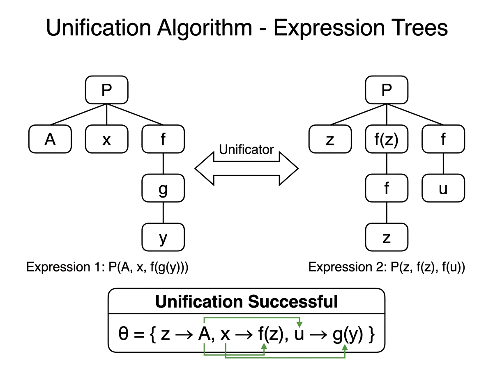

# Experiment 10: Unification Algorithm

## Aim

To implement the Unification algorithm for First-Order Logic, finding the Most General Unifier (MGU) that makes two logical expressions syntactically identical by substituting variables.

## Algorithm

1. If x == y, return theta (no change needed).
2. If x is a variable, bind x -> y in theta.
3. If y is a variable, bind y -> x in theta.
4. If both are compound lists:
   - If lengths differ, fail (return None).
   - Unify heads, then recursively unify tails.
5. Otherwise return None (two different constants cannot unify).

## Procedure

1. Navigate to the experiment folder.
2. Run: `python unification.py`
3. The program unifies two First-Order Logic expressions.
4. Observe the Most General Unifier (substitution set theta).

## Source Code

Refer to file: `unification.py`

## Output




### Expressions to Unify

```
Expression 1:  P( A,   x,     f(g(y)) )
Expression 2:  P( z,   f(z),  f(u)    )
```

### Term-by-Term Unification

```
Pos 0:  'P'        vs  'P'        => identical, no substitution
Pos 1:  'A'        vs  'z'        => z is variable  =>  z / A
Pos 2:  'x'        vs  ['f','z']  => x is variable  =>  x / ['f', 'z']
Pos 3:  ['f',g(y)] vs  ['f','u']
        head 'f'   vs  'f'        => identical
        tail g(y)  vs  'u'        => u is variable  =>  u / ['g', 'y']
```

### Expression Trees

```
  Expression 1             Expression 2
       P                        P
    /  |  \                  /  |  \
   A   x   f                z  f(z)  f
           |                    |    |
           g                    z    u
           |
           y
```

### Most General Unifier (MGU)

```
Theta = { z -> A,
          x -> ['f', 'z'],
          u -> ['g', 'y'] }
```

### Terminal Output

```
--- Unification Algorithm ---
Expression 1: ['P', 'A', 'x', ['f', ['g', 'y']]]
Expression 2: ['P', 'z', ['f', 'z'], ['f', 'u']]

Result: Unification Successful
Substitution Set (Theta):
  z / A
  x / ['f', 'z']
  u / ['g', 'y']
```
