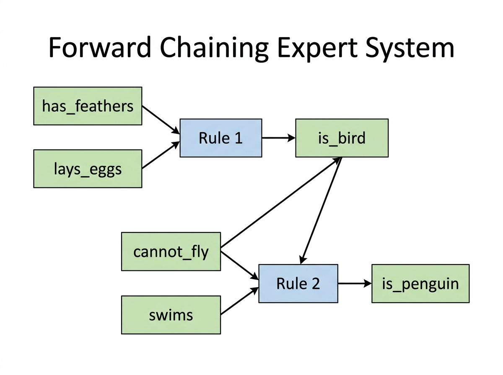

# Experiment 11: Knowledge Base System (Expert System)

## Aim

To implement a rule-based expert system using forward chaining inference — automatically deriving new facts from an initial knowledge base by applying IF-THEN rules until no new facts can be inferred.

## Algorithm

1. Initialize facts set with initial observations.
2. Repeat:
   a. For each rule: IF all conditions in facts AND conclusion not yet known:
      - Add conclusion to facts.
   b. Stop when no new facts are added in a full pass.
3. Return final facts set.

## Procedure

1. Navigate to the experiment folder.
2. Run: `python expert_system.py`
3. Initial facts: has_feathers, lays_eggs, cannot_fly, swims.
4. Forward chaining fires rules to infer is_bird then is_penguin.
5. Observe inference iterations and final knowledge base.

## Source Code

Refer to file: `expert_system.py`

## Output




### Knowledge Base Rules

```
Rule 1: IF [has_feathers, lays_eggs]        THEN is_bird
Rule 2: IF [is_bird, cannot_fly, swims]     THEN is_penguin
Rule 3: IF [is_bird, can_fly]               THEN is_sparrow
Rule 4: IF [has_hair, gives_milk]           THEN is_mammal
```

### Initial Facts

```
+------------------+
| has_feathers     |
| lays_eggs        |
| cannot_fly       |
| swims            |
+------------------+
```

### Forward Chaining Inference Chain

```
Iteration 1:
  Rule 1: has_feathers [Y] + lays_eggs [Y]           => FIRE => infer: is_bird
  Rule 2: is_bird [Y] + cannot_fly [Y] + swims [Y]   => FIRE => infer: is_penguin
  Rule 3: can_fly [N]                                => SKIP
  Rule 4: has_hair [N]                               => SKIP

Iteration 2:
  All rules: conclusions already known or conditions missing => STOP
```

### Inference Diagram

```
has_feathers --+
               +--> [ Rule 1 ] --> is_bird --+
lays_eggs    --+                             |
                                             +--> [ Rule 2 ] --> is_penguin
cannot_fly ------------------------------- -+
swims      --------------------------------+
```

### Terminal Output

```
Initializing Knowledge Base...

Initial Facts: {'cannot_fly', 'swims', 'has_feathers', 'lays_eggs'}

--- Inference Iteration 1 ---
Rule Matched: IF ['has_feathers', 'lays_eggs'] THEN is_bird
-> Inferred new fact: 'is_bird'
Rule Matched: IF ['is_bird', 'cannot_fly', 'swims'] THEN is_penguin
-> Inferred new fact: 'is_penguin'

--- Inference Iteration 2 ---
No new facts inferred. Inference complete.

Final Knowledge Base Facts:
- cannot_fly
- has_feathers
- is_bird
- is_penguin
- lays_eggs
- swims
```
