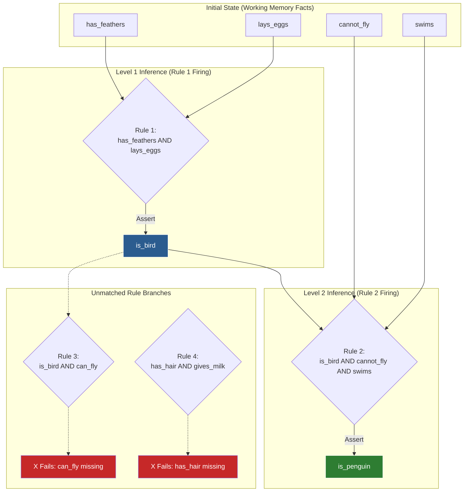
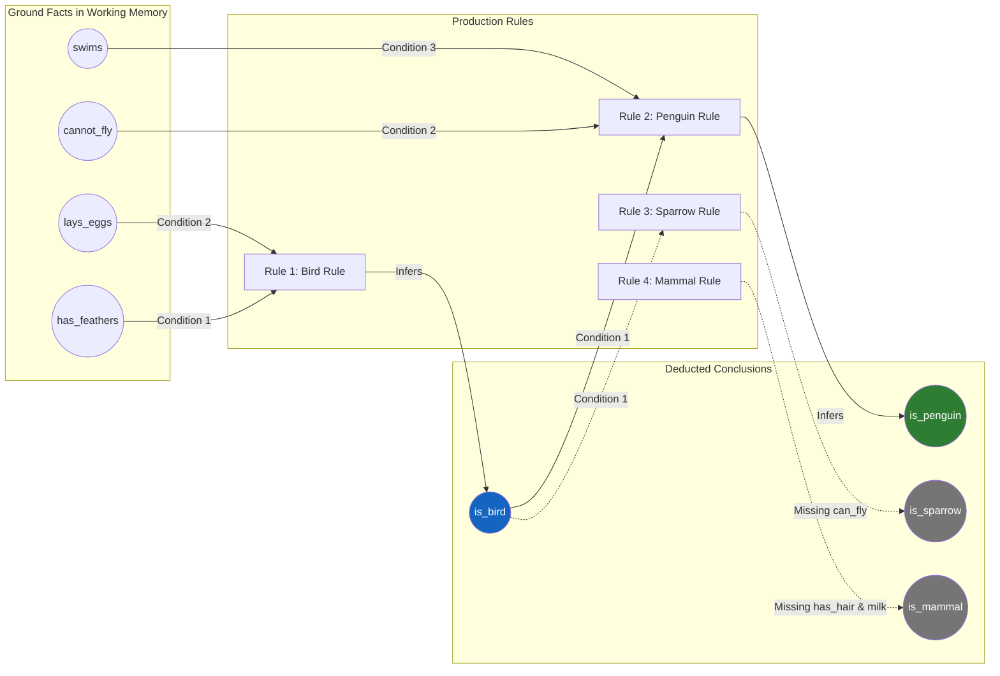
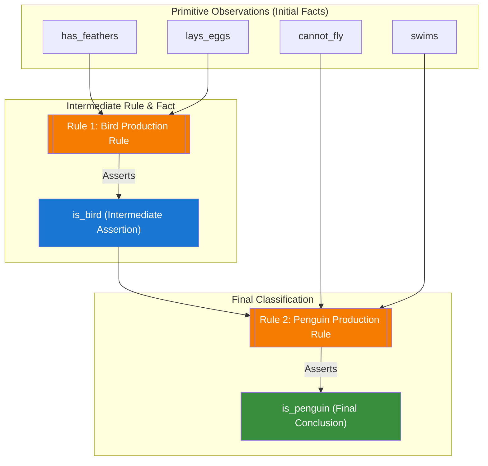
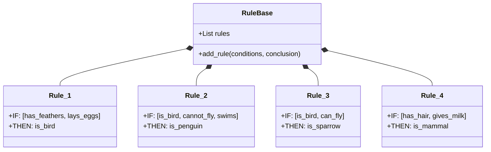
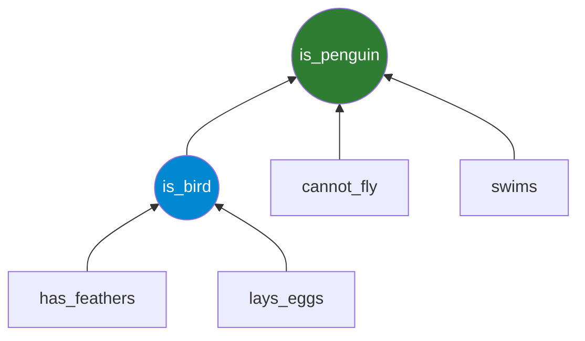
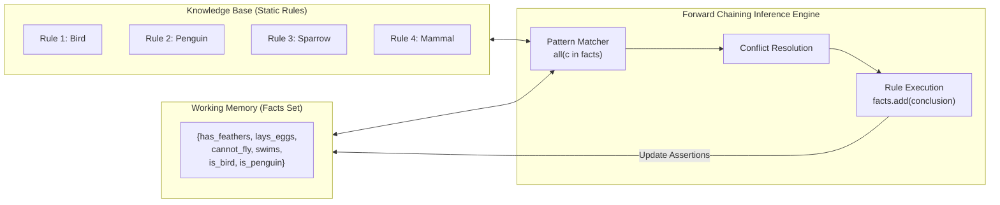

# Experiment 11: Knowledge Base System (Expert System)

## Aim
To design, implement, and analyze a rule-based **Expert System** using a **Knowledge Base** and a **Forward Chaining** inference engine in Python to infer new facts from initial domain assertions.

---

## Objective
1. **Understand Knowledge-Based Systems (KBS)**: Comprehend the core components of Expert Systems, including the Knowledge Base, Working Memory, and Inference Engine.
2. **Implement Production Rules**: Represent domain knowledge using IF-THEN conditional rules.
3. **Design Forward Chaining Inference**: Implement data-driven reasoning that iteratively evaluates rule antecedents against Working Memory facts to deduce new conclusions.
4. **Trace Execution Dynamics**: Construct a step-by-step execution log and tabular breakdown of pattern matching and rule firing.
5. **Visualize Domain Reasoning**: Render Knowledge Graphs, Rule Base Diagrams, Inference Trees, and System Architecture models using Mermaid diagrams.
6. **Analyze Computational Complexity**: Evaluate time and space complexity metrics for rule matching and working memory updates.

---

## Theory

### 1. Introduction to Expert Systems
An **Expert System** is a branch of Artificial Intelligence designed to emulate the decision-making ability of a human expert in a specific domain. Unlike conventional software systems that execute rigid procedural algorithms, Expert Systems process domain-specific knowledge expressed declaratively as facts and rules to solve complex problems through heuristic search and logical deduction.

```
+-----------------------------------------------------------------------+
|                         EXPERT SYSTEM ARCHITECTURE                    |
|                                                                       |
|  +--------------------+     +--------------------------------------+  |
|  |     User Interface | <-> |          Explanation Facility        |  |
|  +--------------------+     +--------------------------------------+  |
|            ^                                   ^                      |
|            |                                   |                      |
|            v                                   v                      |
|  +-----------------------------------------------------------------+  |
|  |                        INFERENCE ENGINE                         |  |
|  |     (Pattern Matching -> Conflict Resolution -> Execution)      |  |
|  +-----------------------------------------------------------------+  |
|            ^                                   ^                      |
|            |                                   |                      |
|            v                                   v                      |
|  +--------------------+     +--------------------------------------+  |
|  |   Working Memory   |     |            Knowledge Base            |  |
|  |    (Fact Base)     |     |       (Production Rules IF-THEN)     |  |
|  +--------------------+     +--------------------------------------+  |
+-----------------------------------------------------------------------+
```

### 2. Core Architectural Components

#### A. Knowledge Base (KB)
The Knowledge Base is the declarative repository of the system. It contains domain knowledge represented primarily in the form of **Production Rules** (IF-THEN clauses):

$$\text{Rule } R_i: \text{IF } P_1 \wedge P_2 \wedge \dots \wedge P_k \implies \text{THEN } C$$

Where:
- $P_1, P_2, \dots, P_k$ are **antecedents** or **conditions** (premises).
- $C$ is the **consequent** or **conclusion** (inferred fact).

#### B. Working Memory (Fact Base)
Working Memory holds the current state of known facts during reasoning. It represents the global dynamic database of assertions $F = \{f_1, f_2, \dots, f_m\}$.
- **Initial Facts**: Ground truths provided prior to execution.
- **Derived Facts**: Conclusions dynamically generated when production rules trigger and fire.
- **Monotonic Property**: In standard forward chaining systems, facts added to Working Memory remain asserted throughout execution (monotonic reasoning).

#### C. Inference Engine
The Inference Engine is the brain of the Expert System. It matches the facts in Working Memory against the rules in the Knowledge Base to deduce new knowledge. Its core loop consists of three phases:
1. **Pattern Matching**: Identifies all candidate rules whose antecedents are completely satisfied by the current Working Memory facts.
2. **Conflict Resolution**: Selects a single rule or an ordered subset of rules from the candidate set (conflict set) to fire based on strategies like priority, recency, or specificity.
3. **Rule Execution / Firing**: Executes the rule's consequent by asserting its conclusion into Working Memory.

---

### 3. Inference Strategies: Forward Chaining vs. Backward Chaining

Logical reasoning in rule-based systems is driven by two fundamental control strategies:

```
FORWARD CHAINING (Data-Driven)
Initial Facts  ===>  Apply Rules  ===>  Deduce New Facts  ===>  Reach Goal

BACKWARD CHAINING (Goal-Driven)
Target Goal    <===  Sub-goals     <===  Find Rules       <===  Verify Initial Facts
```

#### Forward Chaining (Data-Driven Reasoning)
- **Direction**: Bottom-up / Data-driven.
- **Mechanism**: Begins with a set of known initial facts in Working Memory and applies rules repeatedly to infer new facts until no further rules can fire (quiescence) or a target conclusion is reached.
- **Suitability**: Ideal for monitoring, diagnosis, classification, design synthesis, and real-time event processing where all input facts are available upfront.

#### Backward Chaining (Goal-Driven Reasoning)
- **Direction**: Top-down / Goal-driven.
- **Mechanism**: Begins with a target hypothesis or goal $G$. It inspects the Knowledge Base for rules whose consequents match $G$. The premises of these matching rules become new sub-goals. The system recursively attempts to satisfy these sub-goals against Working Memory or by asking the user.
- **Suitability**: Ideal for troubleshooting, medical diagnostic inquiries, and verification tasks where testing every rule would be inefficient.

#### Comparative Summary Matrix

| Attribute | Forward Chaining | Backward Chaining |
| :--- | :--- | :--- |
| **Reasoning Direction** | Data $\rightarrow$ Conclusions (Forward) | Goal $\rightarrow$ Data/Premises (Backward) |
| **Starting Point** | Known Initial Facts | Target Goal / Hypothesis |
| **Search Strategy** | Breadth-First / Data-Driven Expansion | Depth-First / Goal-Directed Reduction |
| **Efficiency Scope** | High when data is limited and goals are unknown | High when goals are few and data is vast |
| **Primary Use Cases** | Configuration, Synthesis, Monitoring, Classification | Medical Diagnosis, Debugging, Fault Isolation |
| **Conflict Handling** | Requires Conflict Resolution Strategy | Requires Backtracking over Sub-goals |

---

## Algorithm

### Forward Chaining Inference Algorithm

```text
Algorithm: FORWARD_CHAINING(KnowledgeBase Rules R, WorkingMemory Facts F)
Input: 
  - R: Set of production rules R_i = (Conditions_i, Conclusion_i)
  - F: Set of asserted initial facts
Output:
  - F: Updated Working Memory containing initial and deduced facts

1. Initialize flag new_facts_inferred <- TRUE
2. Initialize iteration counter <- 1

3. WHILE new_facts_inferred IS TRUE DO:
     a. Set new_facts_inferred <- FALSE
     b. Log ("--- Inference Iteration " + iteration + " ---")
     
     c. FOR EACH rule (Conditions, Conclusion) IN R DO:
          i. Check if ALL conditions in Conditions exist in F:
             satisfied <- TRUE
             FOR EACH c IN Conditions DO:
               IF c NOT IN F THEN
                 satisfied <- FALSE
                 BREAK
               END IF
             END FOR
          
          ii. IF satisfied IS TRUE AND Conclusion NOT IN F THEN:
                Assert Conclusion into F (F <- F U {Conclusion})
                Set new_facts_inferred <- TRUE
                Log ("Rule Matched: IF " + Conditions + " THEN " + Conclusion)
                Log ("-> Inferred new fact: " + Conclusion)
              END IF
        END FOR
     
     d. IF new_facts_inferred IS FALSE THEN:
          Log ("No new facts inferred. Inference complete.")
        END IF
     
     e. Increment iteration <- iteration + 1
   END WHILE

4. RETURN F
```

---

## Procedure

1. **Class Definition & State Initialization**:
   - Define class `ExpertSystem` containing instance variables `self.rules` (a list of `(conditions, conclusion)` tuples) and `self.facts` (a `set` storing unique string assertions).

2. **Rule Base Population**:
   - Invoke `add_rule(conditions, conclusion)` to register production rules into `self.rules`:
     - Rule 1: `IF ["has_feathers", "lays_eggs"] THEN "is_bird"`
     - Rule 2: `IF ["is_bird", "cannot_fly", "swims"] THEN "is_penguin"`
     - Rule 3: `IF ["is_bird", "can_fly"] THEN "is_sparrow"`
     - Rule 4: `IF ["has_hair", "gives_milk"] THEN "is_mammal"`

3. **Fact Base Initialization**:
   - Invoke `add_fact(fact)` to insert initial ground truths into `self.facts`:
     - Assert `"has_feathers"`, `"lays_eggs"`, `"cannot_fly"`, `"swims"`.

4. **Inference Loop Execution**:
   - Call `infer()` to trigger the Forward Chaining loop.
   - **Iteration 1**:
     - Evaluate Rule 1: `has_feathers` $\in F$ and `lays_eggs` $\in F$. Both true. Assert `"is_bird"` into $F$. Set `new_facts_inferred = True`.
     - Evaluate Rule 2: `is_bird` $\in F$ (newly asserted), `cannot_fly` $\in F$, `swims` $\in F$. All true. Assert `"is_penguin"` into $F$. Set `new_facts_inferred = True`.
     - Evaluate Rule 3 & 4: Antecedents not satisfied (`can_fly`, `has_hair` missing).
   - **Iteration 2**:
     - Evaluate Rules 1-4 again. Conclusions `"is_bird"` and `"is_penguin"` are already present in $F$. No new facts added. `new_facts_inferred` remains `False`.
   - **Loop Termination**:
     - System terminates due to quiescence (`new_facts_inferred == False`).

5. **Final Output Display**:
   - Print all facts in `self.facts` in lexicographical order.

---

## Flowchart

```mermaid
flowchart TD
    Start([Start Expert System]) --> Init[Initialize ExpertSystem Instance<br/>rules = [ ], facts = { }]
    Init --> AddRules[Add Production Rules to Knowledge Base<br/>R1: feathers + eggs -> bird<br/>R2: bird + cannot_fly + swims -> penguin<br/>R3: bird + can_fly -> sparrow<br/>R4: hair + milk -> mammal]
    AddRules --> AddFacts[Assert Initial Facts into Working Memory<br/>has_feathers, lays_eggs, cannot_fly, swims]
    AddFacts --> StartInfer[Call infer Engine]
    StartInfer --> InitLoop[Set new_facts_inferred = True<br/>iteration = 1]
    
    InitLoop --> LoopCondition{new_facts_inferred == True?}
    LoopCondition -- Yes --> ResetFlag[Set new_facts_inferred = False<br/>Log Iteration Header]
    ResetFlag --> RuleLoop[Iterate through Rules in Knowledge Base]
    
    RuleLoop --> CheckRule{All Conditions in facts?<br/>AND<br/>Conclusion NOT in facts?}
    CheckRule -- Yes --> FireRule[Log Rule Matched<br/>Add Conclusion to facts<br/>Set new_facts_inferred = True]
    FireRule --> NextRule{More Rules?}
    CheckRule -- No --> NextRule
    
    NextRule -- Yes --> RuleLoop
    NextRule -- No --> IncIter[iteration = iteration + 1]
    IncIter --> LoopCondition
    
    LoopCondition -- No --> PrintComplete[Log: No new facts inferred.<br/>Inference complete.]
    PrintComplete --> OutputFacts[Sort and Print Final Knowledge Base Facts]
    OutputFacts --> End([End Execution])
```

---

## Search Tree / Decision Tree / State Space Tree



---

## Graph Representation



---

## Input

### Production Rule Base Configuration
- **Rule 1**: `IF ["has_feathers", "lays_eggs"] THEN "is_bird"`
- **Rule 2**: `IF ["is_bird", "cannot_fly", "swims"] THEN "is_penguin"`
- **Rule 3**: `IF ["is_bird", "can_fly"] THEN "is_sparrow"`
- **Rule 4**: `IF ["has_hair", "gives_milk"] THEN "is_mammal"`

### Initial Assertions (Working Memory)
- `"has_feathers"`
- `"lays_eggs"`
- `"cannot_fly"`
- `"swims"`

---

## Program

```python
"""
Experiment 11: Knowledge Base System (Expert System)
Objective: Implement a rule-based expert system using forward chaining.
"""

class ExpertSystem:
    def __init__(self):
        self.rules = []
        self.facts = set()

    def add_rule(self, conditions, conclusion):
        """
        Adds a rule to the knowledge base.
        conditions: A list of strings representing facts that must be true.
        conclusion: A string representing the inferred fact.
        """
        self.rules.append((conditions, conclusion))

    def add_fact(self, fact):
        """
        Adds a known fact to the knowledge base.
        """
        self.facts.add(fact)

    def infer(self):
        """
        Runs the forward chaining inference engine to deduce new facts.
        """
        new_facts_inferred = True
        iteration = 1
        
        while new_facts_inferred:
            new_facts_inferred = False
            print(f"\n--- Inference Iteration {iteration} ---")
            
            for conditions, conclusion in self.rules:
                # If all conditions are present in the current facts, and the conclusion is not
                if all(c in self.facts for c in conditions) and conclusion not in self.facts:
                    print(f"Rule Matched: IF {conditions} THEN {conclusion}")
                    self.facts.add(conclusion)
                    new_facts_inferred = True
                    print(f"-> Inferred new fact: '{conclusion}'")
            
            if not new_facts_inferred:
                print("No new facts inferred. Inference complete.")
            iteration += 1

if __name__ == "__main__":
    es = ExpertSystem()
    
    # Adding rules to the knowledge base
    es.add_rule(["has_feathers", "lays_eggs"], "is_bird")
    es.add_rule(["is_bird", "cannot_fly", "swims"], "is_penguin")
    es.add_rule(["is_bird", "can_fly"], "is_sparrow")
    es.add_rule(["has_hair", "gives_milk"], "is_mammal")
    
    # Adding initial known facts
    print("Initializing Knowledge Base...")
    es.add_fact("has_feathers")
    es.add_fact("lays_eggs")
    es.add_fact("cannot_fly")
    es.add_fact("swims")
    
    print("\nInitial Facts:", es.facts)
    
    # Run the inference engine
    es.infer()
    
    print("\nFinal Knowledge Base Facts:")
    for f in sorted(es.facts):
        print(f"- {f}")
```

---

## Output

```text
┌────────────────────────────────────────────────────────────────────────────────────────┐
│                        KNOWLEDGE BASE EXPERT SYSTEM OUTPUT                            │
├────────────────────────────────────────────────────────────────────────────────────────┤
│ Initializing Knowledge Base...                                                         │
│                                                                                        │
│ Initial Facts: {'has_feathers', 'lays_eggs', 'cannot_fly', 'swims'}                    │
│                                                                                        │
│ --- Inference Iteration 1 ---                                                          │
│ Rule Matched: IF ['has_feathers', 'lays_eggs'] THEN is_bird                            │
│ -> Inferred new fact: 'is_bird'                                                        │
│ Rule Matched: IF ['is_bird', 'cannot_fly', 'swims'] THEN is_penguin                    │
│ -> Inferred new fact: 'is_penguin'                                                     │
│                                                                                        │
│ --- Inference Iteration 2 ---                                                          │
│ No new facts inferred. Inference complete.                                             │
│                                                                                        │
│ Final Knowledge Base Facts:                                                            │
│ - cannot_fly                                                                           │
│ - has_feathers                                                                         │
│ - is_bird                                                                              │
│ - is_penguin                                                                           │
│ - lays_eggs                                                                            │
│ - swims                                                                                │
└────────────────────────────────────────────────────────────────────────────────────────┘
```

---

## Step-by-Step Execution

| Iteration | Working Memory Facts Before Iteration | Rule Evaluated | Antecedent Condition Check | Action / Fired Rule | Inferred Fact | Working Memory Facts After Step |
| :---: | :--- | :--- | :--- | :---: | :---: | :--- |
| **1** | `{cannot_fly, has_feathers, lays_eggs, swims}` | **Rule 1**: `IF [has_feathers, lays_eggs] THEN is_bird` | `has_feathers` $\in WM$ AND `lays_eggs` $\in WM$ (True), `is_bird` $\notin WM$ | **Fired** | `is_bird` | `{cannot_fly, has_feathers, is_bird, lays_eggs, swims}` |
| **1** | `{cannot_fly, has_feathers, is_bird, lays_eggs, swims}` | **Rule 2**: `IF [is_bird, cannot_fly, swims] THEN is_penguin` | `is_bird` $\in WM$, `cannot_fly` $\in WM$, `swims` $\in WM$ (True), `is_penguin` $\notin WM$ | **Fired** | `is_penguin` | `{cannot_fly, has_feathers, is_bird, is_penguin, lays_eggs, swims}` |
| **1** | `{cannot_fly, has_feathers, is_bird, is_penguin, lays_eggs, swims}` | **Rule 3**: `IF [is_bird, can_fly] THEN is_sparrow` | `is_bird` $\in WM$, but `can_fly` $\notin WM$ (False) | Skipped | None | `{cannot_fly, has_feathers, is_bird, is_penguin, lays_eggs, swims}` |
| **1** | `{cannot_fly, has_feathers, is_bird, is_penguin, lays_eggs, swims}` | **Rule 4**: `IF [has_hair, gives_milk] THEN is_mammal` | `has_hair` $\notin WM$, `gives_milk` $\notin WM$ (False) | Skipped | None | `{cannot_fly, has_feathers, is_bird, is_penguin, lays_eggs, swims}` |
| **2** | `{cannot_fly, has_feathers, is_bird, is_penguin, lays_eggs, swims}` | **Rule 1**: `IF [has_feathers, lays_eggs] THEN is_bird` | `is_bird` $\in WM$ (Already inferred) | Skipped | None | `{cannot_fly, has_feathers, is_bird, is_penguin, lays_eggs, swims}` |
| **2** | `{cannot_fly, has_feathers, is_bird, is_penguin, lays_eggs, swims}` | **Rule 2**: `IF [is_bird, cannot_fly, swims] THEN is_penguin` | `is_penguin` $\in WM$ (Already inferred) | Skipped | None | `{cannot_fly, has_feathers, is_bird, is_penguin, lays_eggs, swims}` |
| **2** | `{cannot_fly, has_feathers, is_bird, is_penguin, lays_eggs, swims}` | **Rule 3**: `IF [is_bird, can_fly] THEN is_sparrow` | `can_fly` $\notin WM$ (False) | Skipped | None | `{cannot_fly, has_feathers, is_bird, is_penguin, lays_eggs, swims}` |
| **2** | `{cannot_fly, has_feathers, is_bird, is_penguin, lays_eggs, swims}` | **Rule 4**: `IF [has_hair, gives_milk] THEN is_mammal` | `has_hair` $\notin WM$ (False) | Skipped | None | `{cannot_fly, has_feathers, is_bird, is_penguin, lays_eggs, swims}` |
| **3** | `{cannot_fly, has_feathers, is_bird, is_penguin, lays_eggs, swims}` | Loop Condition Check | `new_facts_inferred == False` | **Terminate** | None | Final Set: `{cannot_fly, has_feathers, is_bird, is_penguin, lays_eggs, swims}` |

---

## Visualization

### 1. Knowledge Graph Diagram
Shows the interconnected relationship between primitive observations, rules, intermediate classifications, and ultimate species categorization.



### 2. Rule Base Diagram
Structural representation of all rules defined in the Expert System Knowledge Base.



### 3. Inference Tree Diagram
Hierarchical tree mapping how basic attributes combine to yield derived hypotheses.



### 4. Expert System Architecture Diagram
High-level overview of components and data flow during inference execution.



---

## Complexity Analysis

### Time Complexity

Let:
- $|R|$ = Total number of rules in the Knowledge Base (here, $|R| = 4$).
- $|F|$ = Total number of facts in Working Memory (here, $|F|_{initial} = 4, |F|_{final} = 6$).
- $k$ = Maximum number of conditions (antecedents) per rule (here, $k \le 3$).
- $N$ = Number of inference passes/iterations until quiescence (here, $N = 2$).

#### Naive Implementation Analysis (Present Code):
1. **Rule Evaluation Cost**: In each pass, the engine iterates over all $|R|$ rules. For each rule, checking `all(c in self.facts for c in conditions)` takes $O(k \cdot 1) = O(k)$ time using Python hash set lookup $O(1)$.
2. **Iteration Cost**: Each iteration checks $|R|$ rules, taking $O(|R| \cdot k)$ time.
3. **Worst-Case Iterations**: In the worst-case scenario where each iteration fires exactly 1 rule, the loop runs $|R| + 1$ times.
4. **Total Worst-Case Time Complexity**:

$$\mathcal{T}_{worst} = O(|R|^2 \cdot k)$$

5. **Best-Case Time Complexity**: If no new facts can be inferred in pass 1, the loop runs twice:

$$\mathcal{T}_{best} = O(|R| \cdot k)$$

#### Optimized Rete Algorithm Complexity:
By constructing a alpha/beta memory network (Rete algorithm), fact changes propagate directly to candidate rules without re-scanning unchanged rules:
- Rete Time Complexity: $\mathcal{O}(\Delta F \cdot R_{affected})$ where $\Delta F$ is the number of newly asserted facts.

---

### Space Complexity

1. **Rule Base Storage**: Storing $|R|$ rules with an average of $k$ antecedents takes $O(|R| \cdot k)$ space.
2. **Working Memory Storage**: Storing $|F|$ unique string assertions in Python `set` takes $O(|F|)$ space.
3. **Execution Stack**: Python call stack cost is $O(1)$ since the inference engine runs an iterative `while` loop without recursion.
4. **Total Space Complexity**:

$$\mathcal{S} = O(|R| \cdot k + |F|)$$

---

## Advantages

1. **Permanent Domain Expertise**: Captures and preserves human expert knowledge indefinitely, mitigating loss due to retirement or personnel turnover.
2. **High Logical Consistency**: Deductions are made strictly according to formal rules, eliminating human fatigue, oversight, or emotional bias.
3. **Full Explanation Capability**: Provides clear audit trails and rationale for why a conclusion was drawn by tracing fired rule sequences.
4. **Modular Maintenance**: Production rules are decoupled from the inference engine logic, allowing easy addition, modification, or removal of rules without code refactoring.
5. **Rapid Inference & High Speed**: Evaluates complex rule sets within milliseconds, outperforming human decision speed in structured domains.
6. **Multi-Domain Adaptability**: The same core inference engine can power medical diagnostics, legal reasoning, system configuration, or financial risk analysis simply by swapping the Knowledge Base.
7. **Monotonic Assertion Integrity**: In standard forward chaining systems, facts asserted are guaranteed mathematically consistent within the asserted scope.
8. **Handling Hazardous Environments**: Deployed in dangerous environments (e.g., nuclear power monitoring, toxic chemical plants) where human inspection is hazardous.
9. **Reduced Operational Cost**: Decreases reliance on expensive human domain specialists for routine diagnostics and advisory tasks.
10. **Scalable Knowledge Base**: Easily expands from small prototype rule-sets (10 rules) to enterprise scale (10,000+ rules) using RETE pattern matching.

---

## Disadvantages

1. **Knowledge Acquisition Bottleneck**: Extracting tacit, unstructured human expert knowledge and translating it into rigid IF-THEN rules is difficult, time-consuming, and prone to misinterpretation.
2. **Lack of Common Sense & Intuition**: Expert systems operate strictly within defined domain rules and fail completely on simple tasks outside their explicit knowledge base ("brittleness").
3. **Inability to Learn Dynamically**: Standard rule-based expert systems cannot adapt or learn autonomously from data like neural networks; rules must be manually updated by knowledge engineers.
4. **Conflict Resolution Overhead**: As rule count grows into thousands, managing overlapping, contradictory, or redundant rules requires complex priority scoring.
5. **Inflexible handling of Ambiguity / Uncertainty**: Basic production systems use binary logic (`True`/`False`) and struggle with fuzzy, incomplete, or probabilistic real-world evidence without fuzzy/Bayesian extensions.

---

## Applications

1. **Medical Diagnostic Systems**: Assisting clinicians in identifying rare diseases and recommending antibiotic therapy (e.g., MYCIN, INTERNIST-I).
2. **Computer System Configuration**: Automating complex hardware/software assembly orders based on customer requirements (e.g., XCON / R1).
3. **Geological Prospecting & Mineral Exploration**: Analyzing soil, rock, and seismic data to identify rich ore deposits (e.g., PROSPECTOR).
4. **Chemical Structure Elucidation**: Analyzing mass spectrometry data to infer molecular structures of organic compounds (e.g., DENDRAL).
5. **Financial Credit & Loan Approval**: Evaluating applicant credit scores, income, debt-to-income ratios, and risk factors to automate loan decisions.
6. **Fraud Detection & Anti-Money Laundering**: Monitoring banking transaction streams in real-time against rule bases to flag suspicious activities.
7. **Plant Disease & Agricultural Advisory**: Helping farmers diagnose crop blights, pest infestations, and nutrient deficiencies based on leaf symptoms.
8. **Automated Circuit Design & Verification**: Diagnostic rule bases for verifying integrated circuit layouts and detecting logic hazards.
9. **Airline Scheduling & Flight Gate Management**: Dynamic reallocation of airport gates, flight crews, and aircraft maintenance windows.
10. **Customer Support Chatbots & Helpdesks**: Automated troubleshooting trees for broadband, software, and consumer hardware issues.
11. **Tax Compliance & Legal Risk Advisory**: Assessing corporate financial records against complex statutory codes to ensure tax compliance.
12. **Network Intrusion Detection Systems (NIDS)**: Matching incoming server traffic signatures against security rules to detect zero-day exploits.
13. **Manufacturing Process Supervision**: Real-time monitoring of industrial assembly lines to trigger corrective actions when parameters drift.
14. **Automotive Diagnostics**: Diagnostic equipment used by mechanics to decode engine fault codes (OBD-II) and isolate component failures.
15. **Nuclear Power Plant Safety Monitoring**: Continuous assessment of reactor temperature, pressure, and coolant flow to prevent core meltdowns.

---

## Real World Use Cases

### 1. MYCIN (Medical Diagnosis Expert System)
- **Domain**: Infectious Blood Diseases & Antimicrobial Selection.
- **Developer**: Stanford University (1970s).
- **Architecture**: Contained approximately 600 production rules using Backward Chaining with Certainty Factors (CF) to handle medical uncertainty.
- **Impact**: Demonstrated diagnostic accuracy (~65-70%) matching or exceeding human infectious disease specialists of the era.

### 2. XCON / R1 (Computer Hardware Configuration)
- **Domain**: Automated VAX Computer System Configuration.
- **Developer**: Carnegie Mellon University & Digital Equipment Corporation (DEC).
- **Architecture**: Built using the OPS5 expert system shell with Forward Chaining across 10,000+ rules.
- **Impact**: Saved DEC an estimated $40 million annually by preventing component ordering errors and speeding up manufacturing delivery.

### 3. PROSPECTOR (Geological Prospecting)
- **Domain**: Mineral Deposit Discovery.
- **Developer**: SRI International.
- **Architecture**: Combined rule-based inference with Bayesian decision networks to evaluate geological survey data.
- **Impact**: Successfully predicted the location of an unmined $100 million molybdenum ore deposit in British Columbia, Canada.

### 4. DENDRAL (Mass Spectrometry Analysis)
- **Domain**: Organic Chemistry Structure Identification.
- **Developer**: Stanford University (Edward Feigenbaum, Joshua Lederberg).
- **Architecture**: First operational knowledge-based system; combined algorithmic data reduction with heuristic rules derived from organic chemists.
- **Impact**: Established Knowledge Engineering as a legitimate discipline in Artificial Intelligence.

---

## Viva Questions with Answers

### Q1: What is an Expert System and what are its three fundamental components?
**Answer**: An Expert System is an AI computer program that emulates the decision-making ability of a human expert in a specific domain. Its three core components are:
1. **Knowledge Base (KB)**: Stores declarative domain knowledge as production rules (IF-THEN clauses).
2. **Working Memory (Fact Base)**: Maintains the current state of initial and inferred facts.
3. **Inference Engine**: Executes pattern matching, conflict resolution, and rule firing to derive new knowledge.

### Q2: Differentiate between Forward Chaining and Backward Chaining.
**Answer**: 
- **Forward Chaining** is a data-driven approach starting from known facts in Working Memory and applying rules iteratively to infer new facts until a goal or quiescence is reached.
- **Backward Chaining** is a goal-driven approach starting from a target hypothesis and working backward to find rules whose consequents match the goal, converting missing premises into sub-goals.

### Q3: What is the significance of the RETE algorithm in rule-based systems?
**Answer**: The RETE algorithm is an efficient pattern-matching algorithm designed by Charles Forgy. It constructs a directed acyclic graph (DAG) network of rule conditions to avoid redundant rule re-evaluations, reducing rule matching complexity from $O(|R|^2)$ to near $O(1)$ per fact assertion.

### Q4: What is Monotonic vs. Non-Monotonic Reasoning?
**Answer**: 
- **Monotonic Reasoning**: Once a fact is asserted into Working Memory, it remains true indefinitely; adding new facts never invalidates previously derived conclusions.
- **Non-Monotonic Reasoning**: Allows facts to be retracted or revised when new contradictory evidence is introduced (e.g., default logic, truth maintenance systems).

### Q5: What is a Conflict Set and Conflict Resolution?
**Answer**: 
- A **Conflict Set** is the collection of all production rules whose premises are currently satisfied by Working Memory facts in a given iteration.
- **Conflict Resolution** is the strategy used by the Inference Engine to select which rule from the Conflict Set to fire first (e.g., using rule priority, recency of facts, or rule specificity).

### Q6: How does the current Python code prevent infinite loops during inference?
**Answer**: The code maintains a boolean flag `new_facts_inferred`. During each pass, it sets `new_facts_inferred = False`. A rule only fires and asserts a conclusion if `conclusion not in self.facts`. If a full iteration completes without asserting any new fact, `new_facts_inferred` remains `False`, terminating the `while` loop.

### Q7: What are Certainty Factors (CF)?
**Answer**: Certainty Factors are numerical values (typically between -1.0 and +1.0) introduced in systems like MYCIN to quantify expert confidence, uncertainty, or probabilistic belief in rules and facts.

### Q8: What is the Knowledge Acquisition Bottleneck?
**Answer**: It refers to the difficulty of extracting tacit human domain knowledge, heuristics, and expert intuition from domain experts and converting them into structured, error-free formal rules for the Knowledge Base.

### Q9: Why is a `set` data structure used for Working Memory in the Python code?
**Answer**: A Python `set` provides $O(1)$ average-time complexity for membership tests (`c in self.facts`) and insertion (`self.facts.add(conclusion)`), ensuring that duplicate facts are automatically ignored and facts can be checked efficiently.

### Q10: Can an Expert System function without an Explanation Facility?
**Answer**: Yes, functionally the inference engine will still derive valid conclusions. However, an Explanation Facility (answering "HOW" or "WHY" a conclusion was reached) is vital for user trust, verification, debugging, and clinical/legal transparency.

---

## Conclusion
In this experiment, a rule-based **Expert System** was successfully implemented in Python using a **Forward Chaining** inference engine. The experiment demonstrated how primitive facts (`has_feathers`, `lays_eggs`, `cannot_fly`, `swims`) can be processed through production rules to derive higher-level taxonomy (`is_bird`) and ultimate species classification (`is_penguin`). The system effectively models data-driven logical deduction, pattern matching, working memory updates, and quiescence termination.
