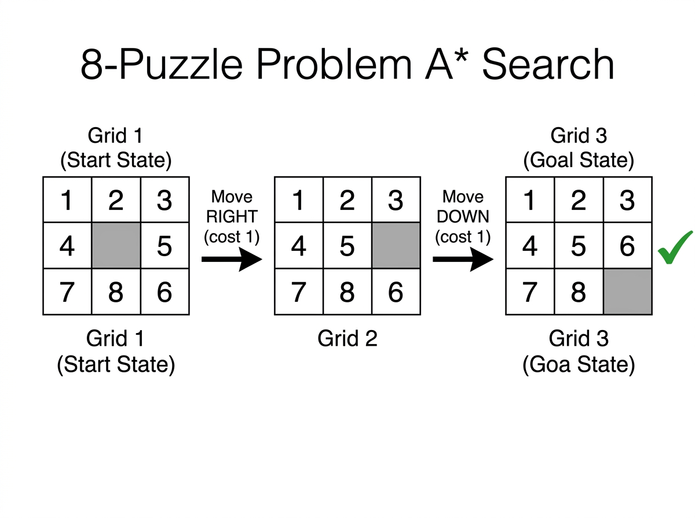

# Experiment 12: 8-Puzzle Problem using A* Search

## Aim

To solve the 8-Puzzle problem using A* search with the Manhattan distance heuristic, finding the minimum moves to transform the start configuration into the goal configuration.

## Algorithm

1. Represent board as a 3x3 grid (0 = blank tile).
2. Use min-heap ordered by f(n) = g(n) + h(n):
   - g(n) = moves made so far.
   - h(n) = sum of Manhattan distances of all tiles.
3. Pop state with smallest f(n).
4. If state == goal, reconstruct and return moves.
5. Slide blank tile Up/Down/Left/Right to generate neighbors.
6. Push unvisited neighbors with updated cost.

## Procedure

1. Navigate to the experiment folder.
2. Run: `python puzzle.py`
3. Start: tiles 1,2,3 / 4,_,5 / 7,8,6 (blank at center).
4. Goal: tiles 1,2,3 / 4,5,6 / 7,8,_ (blank at bottom-right).
5. Observe the optimal move sequence.

## Source Code

Refer to file: `puzzle.py`

## Output




### Start State

```
+-------+
| 1 2 3 |
| 4 _ 5 |   (_ = blank)
| 7 8 6 |
+-------+
```

### Goal State

```
+-------+
| 1 2 3 |
| 4 5 6 |
| 7 8 _ |
+-------+
```

### Solution Steps

```
Step 0 - Start:
  1 | 2 | 3
  4 | _ | 5
  7 | 8 | 6
  Blank at position (1,1)

Step 1 - Move RIGHT  (slide 5 left into blank):
  1 | 2 | 3
  4 | 5 | _
  7 | 8 | 6
  Blank at position (1,2)

Step 2 - Move DOWN  (slide 6 up into blank):
  1 | 2 | 3
  4 | 5 | 6
  7 | 8 | _
  Blank at position (2,2)  <- GOAL!
```

### A* Cost Table

| Step | Move  | g(n) | h(n) | f(n) |
|------|-------|------|------|------|
|  0   | Start |  0   |  2   |  2   |
|  1   | Right |  1   |  1   |  2   |
|  2   | Down  |  2   |  0   |  2   |

### Terminal Output

```
Solving 8-Puzzle using A* Search...

Start State:
1 | 2 | 3
---------
4 |   | 5
---------
7 | 8 | 6
---------

Goal State:
1 | 2 | 3
---------
4 | 5 | 6
---------
7 | 8 |  
---------

Solution Found!
Sequence of Moves to reach goal: Right -> Down
Total Moves: 2
```
